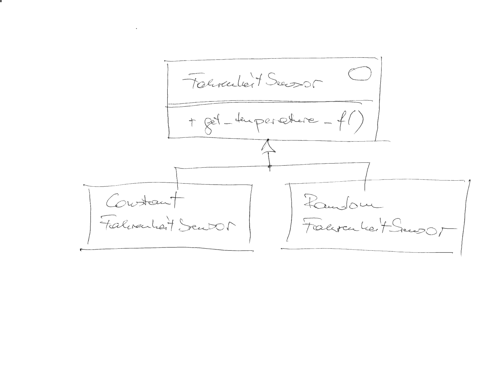

.. include:: <mmlalias.txt>

Adapter
=======

.. contents::
   :local:

Problem
-------

The sensor hierarchy of our company covers many different
sensors. However, management has decided that it is not broad enough,
and some sensors of another company need to be added. That company has
software implementations for those sensors that we could technically
use. Naturally, those software implementations do not fit into our
hierarchy [#impedance_mismatch]_.

What they have, though, is a similar hierarchy (one interface for all
their sensors), with the only apparent difference being that they
measure in degrees Fahrenheit.

.. literalinclude:: /trainings/material/soup/cxx/cxx-code/design-patterns-adapter/sensors-fahrenheit/sensor-fahrenheit.h
   :caption: :download:`/trainings/material/soup/cxx/cxx-code/design-patterns-adapter/sensors-fahrenheit/sensor-fahrenheit.h`
   :language: c++

Solution: Adaptation
--------------------

Seems like we could be able to integrate all of their sensors in one
swoop, *easily*.

.. image:: fahrenheit-adapter.png
   :scale: 40%

.. note::

   Convert Fahrenheit to Celsius using the following formula:

   .. math::

      C = (F - 32) * 5 / 9

Exercise
--------

Implement such an adapter class into our sensor hierarchy, such that
the following tests are satisfied. Implement one by one, and take your
time.

Basic Adaptation
................

.. literalinclude:: /trainings/material/soup/cxx/cxx-code/design-patterns-adapter/tests/adapter-suite-basic.cpp
   :caption: :download:`/trainings/material/soup/cxx/cxx-code/design-patterns-adapter/tests/adapter-suite-basic.cpp`
   :language: c++

Adapter Must *Be-A* ``Sensor``
..............................

.. literalinclude:: /trainings/material/soup/cxx/cxx-code/design-patterns-adapter/tests/adapter-suite-adapter--is-a--sensor.cpp
   :caption: :download:`/trainings/material/soup/cxx/cxx-code/design-patterns-adapter/tests/adapter-suite-adapter--is-a--sensor.cpp`
   :language: c++

Adaptee Can *Be-Any* ``ASensor``
................................

.. literalinclude:: /trainings/material/soup/cxx/cxx-code/design-patterns-adapter/tests/adapter-suite-adapter--knows--an-a-sensor.cpp
   :caption: :download:`/trainings/material/soup/cxx/cxx-code/design-patterns-adapter/tests/adapter-suite-adapter--knows--an-a-sensor.cpp`
   :language: c++

Adapter Is Doing Real Measurements
..................................

Make sure that the adapter is really doing *measurement* (i.e. *use*
the adaptee) when being asked for its temperature.

.. literalinclude:: /trainings/material/soup/cxx/cxx-code/design-patterns-adapter/tests/adapter-suite-adapter-definitely-knows--a-sensor--HELL.cpp
   :caption: :download:`/trainings/material/soup/cxx/cxx-code/design-patterns-adapter/tests/adapter-suite-adapter-definitely-knows--a-sensor--HELL.cpp`
   :language: c++

.. rubric:: Footnotes
.. [#impedance_mismatch] They sure don't share our ``Sensor``
                         interface. That interface is only internal to
                         our company.
