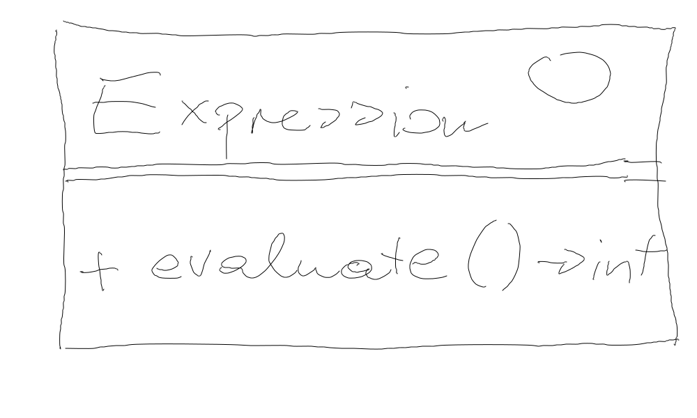

.. include:: <mmlalias.txt>

Exercise: Arithmetic Expression Interpreter
===========================================

.. contents::
   :local:

Motivation
----------

Create an Abstract Syntax Tree (AST), like compilers do (albeit much
more sophisticated), to represent and evaluate expressions.

.. list-table::
   :align: left
   :widths: auto
   :header-rows: 1

   * * Type
     * Expression
     * Object structure
   * * Literal
     * ``42``
     * .. image:: interpreter-literal.png
          :scale: 10%
   * * Arithmetic expression tree
     * ``(7+3)*(3-1)``
     * .. image:: interpreter-expression-tree.png
          :scale: 30%

``Expression`` Interface
------------------------

For simplicity, all expressions evaluate to integer types.

Literals
--------

In programming languages, a literal is a value that is written as-is, such as

.. code-block:: c++

   42

In itself, a literal does not make much sense. It is used in
combinatin with operators to form larger expressions, such as ``42 +
5``. A literal is an expression, though, because it evaluates to a
value.

.. list-table::
   :align: left
   :widths: auto

   * * .. literalinclude:: /trainings/material/soup/cxx/cxx-code/design-patterns-interpreter/tests/interpreter-suite-literal.cpp
          :caption: :download:`/trainings/material/soup/cxx/cxx-code/design-patterns-interpreter/tests/interpreter-suite-literal.cpp`
          :language: c++

     * .. image:: interpreter-literal-class.png
          :scale: 50%

Arithmetic (Binary) Expressions
-------------------------------

* Binary arithmetic expressions come next: ``+``, ``-``, ``*``, ``/``
* Here's a test, and a class diagram for ``Addition``

  .. list-table::
     :align: left
     :widths: auto
  
     * * .. literalinclude:: /trainings/material/soup/cxx/cxx-code/design-patterns-interpreter/tests/interpreter-suite-addition.cpp
            :caption: :download:`/trainings/material/soup/cxx/cxx-code/design-patterns-interpreter/tests/interpreter-suite-addition.cpp`
            :language: c++
  
       * .. image:: interpreter-addition-class.png
            :scale: 50%

* ``Subtraction``

  .. literalinclude:: /trainings/material/soup/cxx/cxx-code/design-patterns-interpreter/tests/interpreter-suite-subtraction.cpp
     :caption: :download:`/trainings/material/soup/cxx/cxx-code/design-patterns-interpreter/tests/interpreter-suite-subtraction.cpp`
     :language: c++

* ``Multiplication``

  .. literalinclude:: /trainings/material/soup/cxx/cxx-code/design-patterns-interpreter/tests/interpreter-suite-multiplication.cpp
     :caption: :download:`/trainings/material/soup/cxx/cxx-code/design-patterns-interpreter/tests/interpreter-suite-multiplication.cpp`
     :language: c++

* ``Division``

  .. literalinclude:: /trainings/material/soup/cxx/cxx-code/design-patterns-interpreter/tests/interpreter-suite-division.cpp
     :caption: :download:`/trainings/material/soup/cxx/cxx-code/design-patterns-interpreter/tests/interpreter-suite-division.cpp`
     :language: c++

Check: Combined Arithmetic Expressions
--------------------------------------

``Literal``, and all of the arithemetic operators, *are-a*
``Expression``. The arithemetic operators *use-two* ``Expression``
objects, so it should be possible to create expression trees like,

.. list-table::
   :align: left
   :widths: auto
   :header-rows: 1

   * * Test
     * Expression
     * Tree
   * * .. literalinclude:: /trainings/material/soup/cxx/cxx-code/design-patterns-interpreter/tests/interpreter-suite-combined-arith.cpp
          :caption: :download:`/trainings/material/soup/cxx/cxx-code/design-patterns-interpreter/tests/interpreter-suite-combined-arith.cpp`
	  :language: c++
     * ``(7+3)*(3-1) = 20``
     * .. image:: interpreter-expression-tree.png
          :scale: 30%

And Variables?
--------------

Variables in programming languages live in a *context* - usually
global or local scope (with their own lookup rules). Assignment to a
variable drops a value into that variable's context/scope.

For example, the following C function carries a local variable,
``i``. Assignment to ``i`` write the assigned value into the memory
location (the address) of ``i``. The *context* of ``i`` is said to be
the *stack frame* of the ``function()`` invocation.

.. code-block:: c++

   void function()
   {
       int i;
       i = 42;
   }

No Uninitialized Variables!!
----------------------------

Lets say, our variable are always initialized - without ever assigning
to them, they have a defined value: ``0``.

.. literalinclude:: /trainings/material/soup/cxx/cxx-code/design-patterns-interpreter/tests/interpreter-suite-variable-not-set.cpp
   :caption: :download:`/trainings/material/soup/cxx/cxx-code/design-patterns-interpreter/tests/interpreter-suite-variable-not-set.cpp`
   :language: c++

Assigning To Variables
----------------------

In the C analogy above, assigning to ``i`` write the assigned value
into the variable's context/scope. Additionally, we implement C's
"assignment has a value" semantics,

.. code-block:: c++

   int assignment_value;
   int i;

   assignment_value = i = 42;

I.e., the assignment ``i = 42`` is an expression whose value is
``42``.

.. literalinclude:: /trainings/material/soup/cxx/cxx-code/design-patterns-interpreter/tests/interpreter-suite-variable-assignment.cpp
   :caption: :download:`/trainings/material/soup/cxx/cxx-code/design-patterns-interpreter/tests/interpreter-suite-variable-assignment.cpp`
   :language: c++

Using Variables As Expressions
------------------------------

Obviously, in programming languages, variables can be used as
expressions themselves.

.. code-block:: c++

   int i = 42;
   int j = i;  // <--- i used as expression whose value is assigned to j

.. literalinclude:: /trainings/material/soup/cxx/cxx-code/design-patterns-interpreter/tests/interpreter-suite-variable-used-as-expression.cpp
   :caption: :download:`/trainings/material/soup/cxx/cxx-code/design-patterns-interpreter/tests/interpreter-suite-variable-used-as-expression.cpp`
   :language: c++
