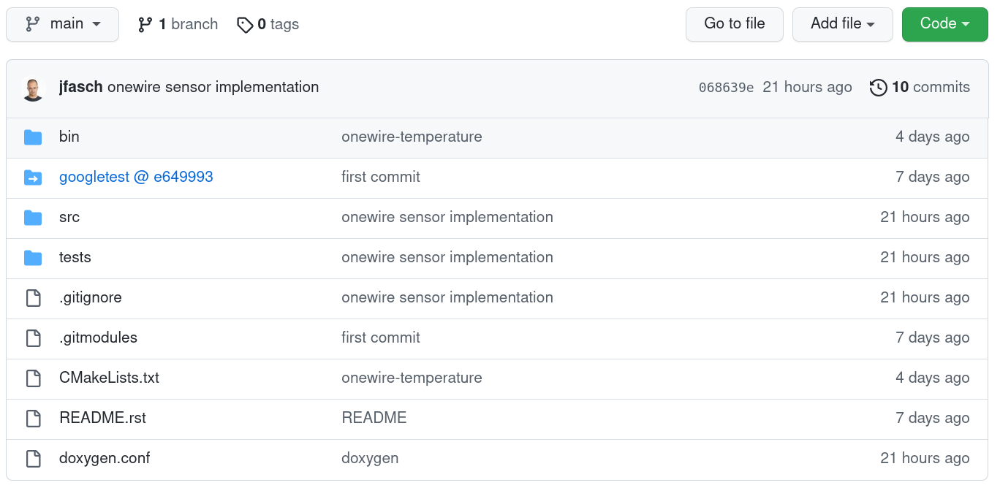

.. include:: <mmlalias.txt>

Exercise (FH): Introducing a Sensor Class
=========================================

.. contents::
   :local:

Github Project
--------------

* https://github.com/jfasch/FH-ECE20

Structure
.........

* `bin/ <https://github.com/jfasch/FH-ECE20/tree/main/bin>`__

  * `onewire-temperature.c
    <https://github.com/jfasch/FH-ECE20/blob/main/bin/onewire-temperature.c>`__

* `src/ <https://github.com/jfasch/FH-ECE20/tree/main/src>`__

  * `sensors/
    <https://github.com/jfasch/FH-ECE20/tree/main/src/sensors>`__

    * `w1-sensor.h
      <https://github.com/jfasch/FH-ECE20/blob/main/src/sensors/w1-sensor.h>`__
    * `w1-sensor.cpp
      <https://github.com/jfasch/FH-ECE20/blob/main/src/sensors/w1-sensor.cpp>`__

* `tests/ <https://github.com/jfasch/FH-ECE20/tree/main/tests>`__

  * `w1-sensor-suite.cpp
    <https://github.com/jfasch/FH-ECE20/blob/main/tests/w1-sensor-suite.cpp>`__

CMake Build
...........

The project is built just the same as we used to build our previous
toy projects - its just that the project structure is a bit more
involved. Each directory that participates in the build contains a
``CMakeLists.txt`` file,

.. code-block:: console

   FH-ECE20
   ├── bin
   │   └── CMakeLists.txt
   ├── CMakeLists.txt
   ├── googletest
   │   ├── CMakeLists.txt
   │   └── googletest
   │       ├── CMakeLists.txt
   ├── src
   │   ├── CMakeLists.txt
   │   ├── c++-school
   │   │   └── CMakeLists.txt
   │   └── sensors
   │       └── CMakeLists.txt
   └── tests
       └── CMakeLists.txt
   
   

Dependencies/Usage Relationships
................................

* Executables: ``ADD_EXECUTABLE()``
* Libraries: ``ADD_LIBRARY()``
* Dependency relationship: ``TARGET_LINK_LIBRARIES()``

.. graphviz::

   digraph foo {
       "onewire-temperature" -> "sensors";
       "run-tests" -> "sensors";
   }

Onewire Sensor Usage: Example/Unit-Test
---------------------------------------

From `w1-sensor-suite.cpp
<https://github.com/jfasch/FH-ECE20/blob/main/tests/w1-sensor-suite.cpp>`__:

.. code-block:: c++

   #include <w1-sensor.h>

   ...

   std::string filename = "/sys/bus/w1/devices/28-02131d959eaa/temperature"; // for example
   W1Sensor sensor{filename};                     // instantiate W1Sensor
   double temperature = sensor.get_temperature(); // ask it to read temperature

Requirement
-----------

Step 1: Preparation
...................

* Clone the Github project (see `instructions on main page (scroll
  to bottom) <https://github.com/jfasch/FH-ECE20>`__)
* Create a new subdirectory ``firstname.lastname``
  (e.g. ``joerg.faschingbauer``) of the toplevel project directory
* Modify the toplevel ``CMakeLists.txt`` to descend into that new
  subdirectory (you'll find out how that is done by looking at the
  ``CMakeLists.txt`` file)
* In your subdirectory ...

  * create a file
    ``onewire-temperature-<firstname>-<lastname>.cpp``, which is a
    copy of `bin/onewire-temperature.c
    <https://github.com/jfasch/FH-ECE20/blob/main/bin/onewire-temperature.c>`__
  * Add a ``CMakeLists.txt`` file that builds that into an executable
    ``onewire-temperature-<firstname>-<lastname>``

Step 2: Modify ``onewire-temperature-<firstname>-<lastname>.cpp`` To Use ``class W1Sensor``
...........................................................................................
   
* Rip everything out that implements the reading of the sensor file
* Use ``class W1Sensor`` instead:

  * Look into `w1-sensor-suite.cpp
    <https://github.com/jfasch/FH-ECE20/blob/main/tests/w1-sensor-suite.cpp>`__
  * See how ``W1Sensor`` is *instantiated*
  * See how ``W1Sensor`` is *used* to read the temperature
  * Do the same in your program: use ``W1Sensor`` to implement what
    you just ripped out
  * As you go, modify the program's output to show real
    floatingpoint degrees in Celsius (and not integer
    millidegrees). You simply say,

    .. code-block:: c++

	  #include <iostream>
	  ...
	  std::cout << temperature << std::endl;

.. note::

   ``W1Sensor`` is defined in `src/sensors/
   <https://github.com/jfasch/FH-ECE20/tree/main/src/sensors>`__. Look
   into that directory's ``CMakeLists.txt`` file: it builds a
   (static) library ``sensors``.

   Your program uses ``W1Sensor``, so you will have to link your
   program against the ``sensors`` library, by using CMake's
   ``target_link_libraries()`` function. See `tests/CMakeLists.txt
   <https://github.com/jfasch/FH-ECE20/blob/main/tests/CMakeLists.txt>`__
   for an example.

Step 3: Answer A Question
.........................

*Has the program become more readable?*

