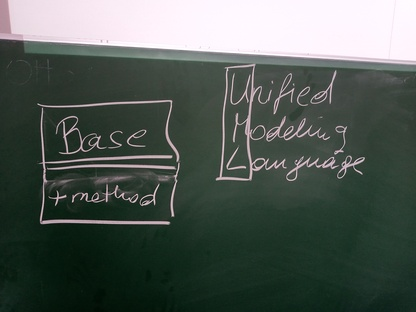
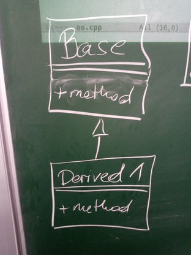

.. ot-topic:: cxx03.inheritance_oo.basics
   :dependencies: cxx03.data_encapsulation.classes_objects

.. include:: <mmlalias.txt>

Inheritance Basics
==================

.. contents::
   :local:

Plain (Base) Class
------------------

* A plain class ``Base``, with a ``method`` (simply announcing itself
  on ``stdout``)
* No surprise

.. literalinclude:: code/inher-oo-base.cpp
   :caption: :download:`code/inher-oo-base.cpp`
   :language: c++

.. code-block:: console

   $ ./inher-basics-base 
   Base::method()

Inheriting (Deriving) From Base
-------------------------------

.. note::

   Here we use only ``public`` inheritance. See
   :doc:`private-protected` for more.

.. literalinclude:: code/inher-oo-derived-novirtual.cpp
   :caption: :download:`code/inher-oo-derived-novirtual.cpp`
   :language: c++

.. code-block:: console

   $ ./inher-basics-derived-novirtual 
   Base::method()
   Derived::method()

**News**

* ``Derived`` **is-a** base (though the usage of an is-a relationship
  is not at all clear yet)
* Given an instance of ``Base``, ``Base::method()`` is called
* Given an instance of ``Derived``, ``Derived::method()`` is called

**Question**

* When ``d`` is of type ``Derived``, but also (*is-a*) of type
  ``Base``, is it true that I can use ``d`` as a ``Base``?
* If I use a ``Derived`` object as-a ``Base``, what is the effect of
  calling ``method()`` on it?

``Derived`` *is-a* ``Base``?
----------------------------

.. literalinclude:: code/inher-oo-derived-novirtual-base-conversion.cpp
   :caption: :download:`code/inher-oo-derived-novirtual-base-conversion.cpp`
   :language: c++

.. code-block:: console

   $ ./inher-basics-derived-novirtual-base-conversion 
   Base::method()

**Answer**

* I can convert a ``Derived`` into a ``Base`` by assigning a
  ``Derived*`` to a ``Base*``.
* C++ does that automatically; **I don't need to use a type cast**.
* But still, I cannot *use* the actual object (remember, ``Derived
  d``) through that ``Base* b``

