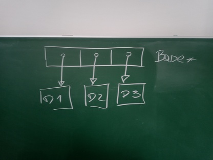

.. ot-topic:: cxx03.inheritance_oo.polymorphism
   :dependencies: cxx03.inheritance_oo.virtual_method

.. include:: <mmlalias.txt>

*Polymorphic* Usage Of Objects
==============================

.. contents:: 
   :local:

What Larger Systems Want
------------------------

**What we have**

* Automatic conversion from ``Derived`` to ``Base``
* ``virtual`` |longrightarrow| call ``Derived::method()`` through
  ``Base*``

**What we want**

* Have multiple objects of different *concrete* types (say,
  ``Derived1``, ``Derived2``) in a system
* Access them through their base types
* |longrightarrow| *interfaces* (but there are gotchas - see
  :doc:`interface`)
* |longrightarrow| *polymorphic usage* of objects

**Why do we want this?**

* System must not *depend* on one concrete type out of many

.. literalinclude:: code/inher-oo-polymorphic.cpp
   :caption: :download:`code/inher-oo-polymorphic.cpp`
   :language: c++

.. code-block:: console

   $ ./inher-oo-polymorphic 
   Derived1::method()
   Derived2::method()

Pitfall |longrightarrow| *Pure Virtual Methods*
-----------------------------------------------

**Problem**

* ``Base::method()`` is there (has an implementation that can be
  invoked)
* Used when a derived class does not override it
* |longrightarrow| Countless source of errors; e.g.

  * Developer goes out for coffee before implementing ``Derived3::method()``
  * Comes back, not knowing where she left off
  * Everything compiles |longrightarrow| false expectation of
    correctness
  * ``Base::method()`` used |longrightarrow| **Bug!!**

.. literalinclude:: code/inher-oo-polymorphic-not-pure.cpp
   :caption: :download:`code/inher-oo-polymorphic-not-pure.cpp`
   :language: c++

.. code-block:: console

   $ ./inher-oo-polymorphic-not-pure 
   Derived1::method()
   Derived2::method()
   Base::method()                # <--- BUG!

Pure Virtual Method
-------------------

**Solution**

* Pure virtual method
* ``virtual Base::method() const = 0;``

.. literalinclude:: code/inher-oo-polymorphic-pure.cpp
   :caption: :download:`code/inher-oo-polymorphic-pure.cpp`
   :language: c++

.. code-block:: console

   inher-oo-polymorphic-pure.cpp:39:14: error: cannot declare variable ‘d3’ to be of abstract type ‘Derived3’
      39 |     Derived3 d3;
         |              ^~
   inher-oo-polymorphic-pure.cpp:28:7: note:   because the following virtual functions are pure within ‘Derived3’:
      28 | class Derived3 : public Base
         |       ^~~~~~~~
   inher-oo-polymorphic-pure.cpp:7:18: note:     ‘virtual void Base::method() const’
       7 |     virtual void method() const = 0;
         |                  ^~~~~~
