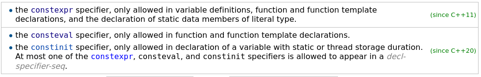

.. ot-group:: cxx11.new_language_features.const_expr_init_eval

``const``, ``constexpr``, ``constinit``, ``consteval``
======================================================

.. contents::
   :local:

Topics
------

From `cppreference
<https://en.cppreference.com/w/cpp/language/declarations>`__:

.. toctree::
   :maxdepth: 1

   const
   constexpr
   consteval
   constinit

Links
-----

* `Back to Basics: const and constexpr - Rainer Grimm - CppCon 2021
  <https://youtu.be/tA6LbPyYdco?si=SpgwMtS6leB_F3XI>`__

  .. raw:: html

     <iframe width="560" height="315" 
             src="https://www.youtube.com/embed/tA6LbPyYdco?si=AeEwRKaoSDR4hp2Y" 
	     title="YouTube video player" 
	     frameborder="0" 
	     allow="accelerometer; autoplay; clipboard-write; encrypted-media; gyroscope; picture-in-picture; web-share" 
	     referrerpolicy="strict-origin-when-cross-origin" 
	     allowfullscreen>
     </iframe>

* `CppCon 2015: Scott Schurr "constexpr: Applications"
  <https://www.youtube.com/watch?v=qO-9yiAOQqc>`__

  .. raw:: html

     <iframe 
         width="560" height="315" 
	  src="https://www.youtube.com/embed/qO-9yiAOQqc" 
	  title="YouTube video player" 
	  frameborder="0" 
	  allow="accelerometer; autoplay; clipboard-write; encrypted-media; gyroscope; picture-in-picture" 
	  allowfullscreen>
     </iframe>

* `Your New Mental Model of constexpr - Jason Turner - CppCon 2021
  <https://youtu.be/MdrfPSUtMVM?si=94tOqGfyAdqPFO1G>`__

  .. raw:: html

     <iframe width="560" height="315" 
             src="https://www.youtube.com/embed/MdrfPSUtMVM?si=XBc4_SPn5GzA3rJ9" 
	     title="YouTube video player" 
	     frameborder="0" 
	     allow="accelerometer; autoplay; clipboard-write; encrypted-media; gyroscope; picture-in-picture; web-share" 
	     referrerpolicy="strict-origin-when-cross-origin" 
	     allowfullscreen>
     </iframe>

Group Description
-----------------
	      
.. ot-graph::
   :entries: cxx11.new_language_features.const_expr_init_eval
