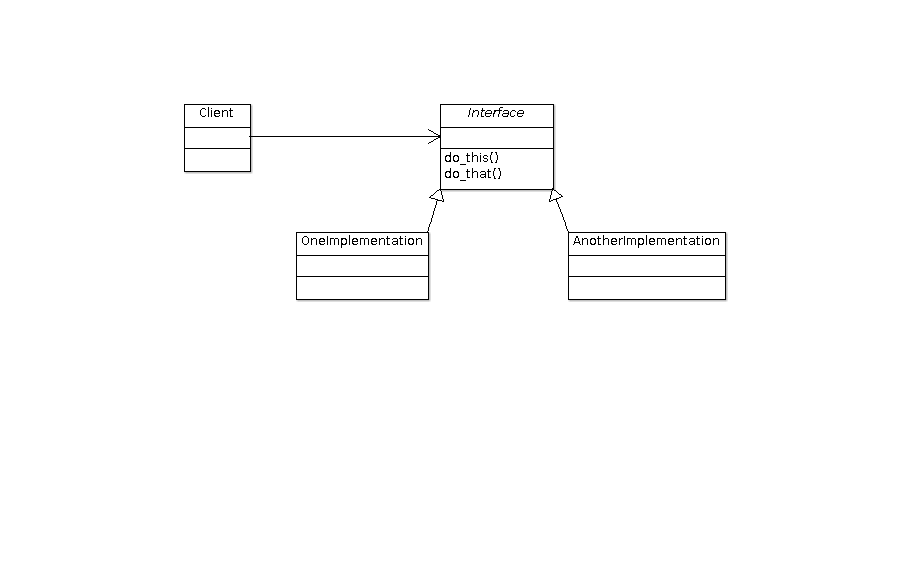

.. include:: <mmlalias.txt>

.. ot-topic:: cxx11.functions_functions.function
   :dependencies: cxx11.functions_functions.bind

``std::function``
=================

.. contents::
   :local:

Classic Polymorphism
--------------------

**Back to classic Object Oriented Design ...**

* **Interfaces** *define* what methods have to be available on an object
* **Implementations** *provide* those methods
* **Clients** *use* **interfaces**

.. literalinclude:: Code/classic-polymorphism.cc
   :caption: :download:`Code/classic-polymorphism.cc`

Classic Polymorphism: Upsides
-----------------------------

**Polymorphism** is well understood:

* *Late binding*: client does not know the exact type that is being
  used
* *Interfaces* describe relationships in almost human language - *if done right*
* *Software Architecture* - *if done right* - is almost
  self-explanatory
* *Design Patterns* are described (and mostly implemented as well) in
  such a way
* Also available in other languages

  * For example Java explicitly distinguishes between *interface* and *implementation*

Classic Polymorphism: Technical Downsides
-----------------------------------------

**There are purely technical downsides** (in C++ at least)

* Runtime overhead

  * Not knowing the exact type implies *indirect call* (function
    pointer/trampoline)

* Code size

  * If one writes ``virtual``, a whole bunch of code is generated
    (Runtime Type Information - RTTI)
  * Type is not POD (*plain old data*) anymore

Classic Polymorphism: More Downsides
------------------------------------

**Metaphysical downsides** are harder to come by: **readability**
again

* Provided that logging has no architectural relevance ...
* I have two functions which are similar in purpose, but otherwise
  unrelated. How can I arrange for client code to use these
  interchangeably?

  * Why can't I *just use* them?
  * I don't want to instantiate client code from a template!
  * Do I really want to craft an interface for client code to use?

* I have a class that has similar purpose as the functions

  * Client code wants to just call it

* I want to *adapt* all these!
* Sound like the solution is ``std::bind``
* |longrightarrow| Wrong: ``std::bind`` objects don't share a type

.. literalinclude:: Code/classic-polymorphism-logger.cc
   :caption: :download:`Code/classic-polymorphism-logger.cc`

``std::function`` to the Rescue (1)
-----------------------------------

* **One type** to rule them all!
* |longrightarrow| *Any* callable with same signature

.. code-block:: c++
   :caption: Function object

   std::function<int(int, int)> foo_func;

.. code-block:: c++
   :caption: Trivial: plain function

   int foo(int a, int b) { ... }
   foo_func = foo;

``std::function`` to the Rescue (2)
-----------------------------------

.. code-block:: c++
   :caption: Any ``std::bind`` object

   struct bar {
       int foo(int a, int b) { ... }
   };
   foo_func = std::bind(&bar::foo, &bar,
          std::placeholders::_1, std::placeholders::_2);

.. code-block:: c++
   :caption: Lambda

   foo_func =  -> int { ... };

``std::function``: Last Words
-----------------------------

**Upsides**

* *Lightweight Polymorphism*: no code explosion
* Unlike *heavyweight polymorphism*, no dynamic allocation appropriate

  * Although a ``std::function`` object can hold polymorphic
    callables, it is always the same size

**Downsides**

* *Runtime overhead* due to indirect call

  * Processor support makes them just as fast as direct function calls
  * *But:* no inlining possible

* *Readability* again ...

  * This is not OO!
  * *Architectural intentions* not at all obvious through quick inline
    adaptations
