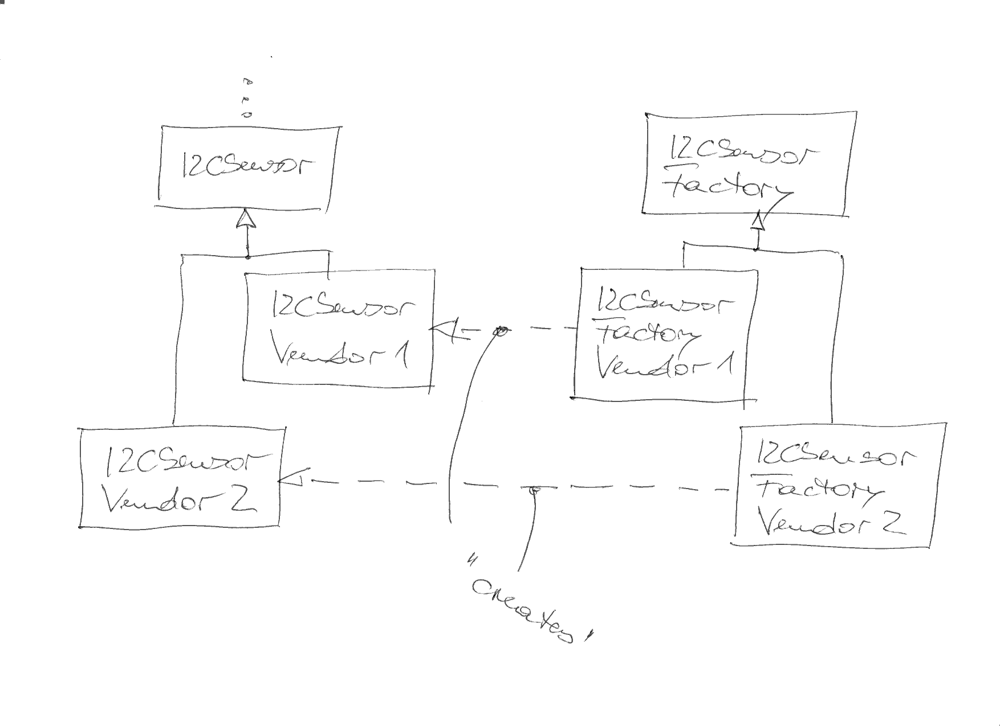

.. ot-topic:: design_patterns.abstract_factory
   :dependencies: design_patterns.singleton,
		  design_patterns.interfaces

.. include:: <mmlalias.txt>

Abstract Factory
================

.. contents::
   :local:

Problem
-------

Object instantiation should not make core code depend on a concrete
implementation. Instead, core code should depend on abstractions.

*Abstract Factory* is such a *dependency inversion* mechanism.

Solution
--------

Exercise
--------

:doc:`exercises/abstract-factory`

