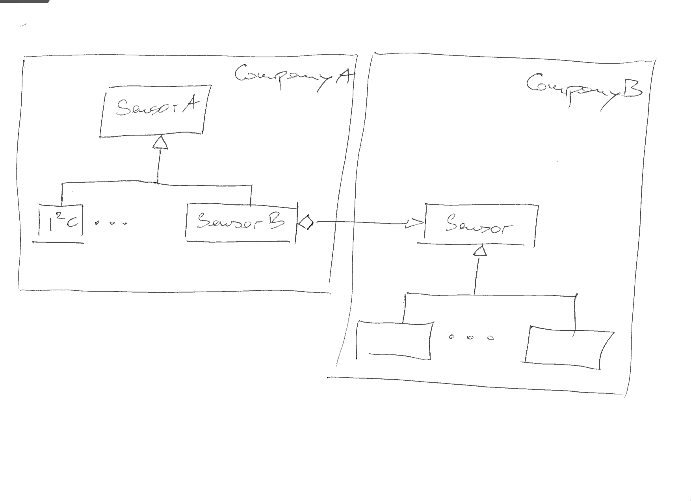

.. ot-topic:: design_patterns.adapter
   :dependencies: design_patterns.interfaces

.. include:: <mmlalias.txt>

Adapter
=======

.. contents::
   :local:

Problem
-------

* Company A has a large application, employing sensors that measure
  temperature in degrees Fahrenheit

  .. literalinclude:: exercises/code/library/sensor-A.h
     :caption: :download:`exercises/code/library/sensor-A.h`
     :language: c++

* Company B sells sensors that measure temperature, in degrees
  celsius. (The measurement method, by the way, is named the same as
  company A's: ``get_temperature()``.)

  .. literalinclude:: exercises/code/library/sensor.h
     :caption: :download:`exercises/code/library/sensor.h`
     :language: c++

* Company A wishes to make use of B's sensors, but does not want to
  rewrite their entire application.

Solution
--------

Exercise
--------

:doc:`exercises/adapter`

