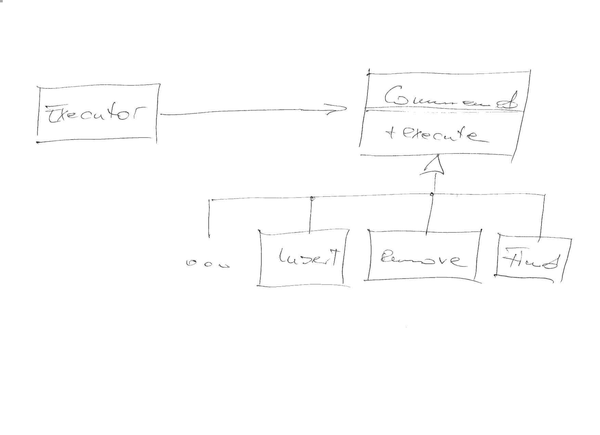

.. ot-topic:: design_patterns.command
   :dependencies: design_patterns.interfaces

.. include:: <mmlalias.txt>

Command
=======

.. contents::
   :local:

Problem
-------

There is a multitude of possible operations on an object, and a
possible an order in which one might want to invoke a sequence of such
operations. The executing entity is different from the originator of
the operations, and thus does not want to know about the particular
nature of those - it just wants to ``execute()`` them.

Solution
--------

Exercise
--------

:doc:`exercises/command`

