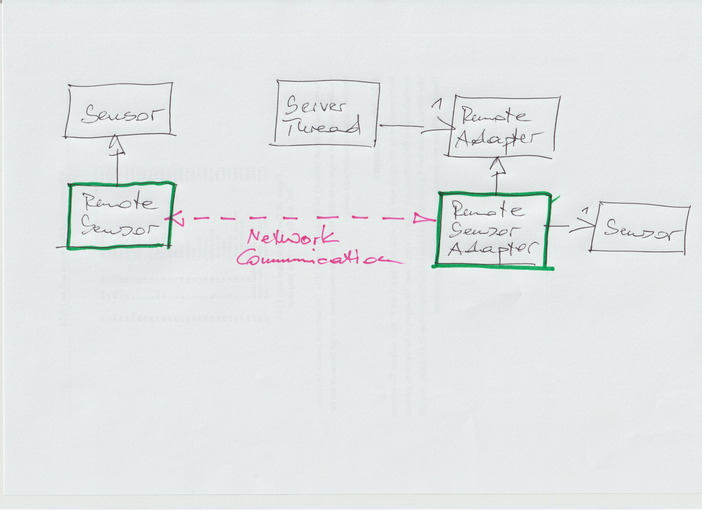

.. ot-exercise:: design_patterns.exercises.proxy_remote
   :dependencies: design_patterns.proxy,
		  design_patterns.exercises.adapter

Exercise: Proxy (Remote Thermometer)
====================================

.. contents::
   :local:

Network Communication
---------------------

Consider a ``Sensor`` instance that is reachable over a network. That
sensor sure lives outside the address space of a possible client, so a
network protocol must be invented to ask it for its value.

In this exercise, the "network" is represented by the communication
between a client thread and a "remote" thread in the same address
space, expressed in the following class definitions,

.. literalinclude:: code/server-thread.h
   :caption: :download:`code/server-thread.h`
   :language: c++

Requirements
------------

Use the "remote" form of the :doc:`Proxy design pattern <../proxy>` to
implement such a client, in the form of yet another ``Sensor``
implementation that fulfills the following requirements.

.. literalinclude:: code/proxy-remote-suite.cpp
   :caption: :download:`code/proxy-remote-suite.cpp`
   :language: c++

Implementation Hints
--------------------

The requirements (a.k.a. unit tests) above push you towards an
implementation that takes place in the following class diagram. It's
the green parts that need to be implemented.

Note that the ``RemoteAdapter`` is a specialized form of the
:doc:`Adapter pattern <../adapter>`: implementations of the
``RemoteAdapter`` interface are supposed to adapt to *something* by
implementing a protocol onto somthing that is already there. This is
not a requirement though - a simplistic implementation may not only
implement the protocol, but also the logic behind it.

