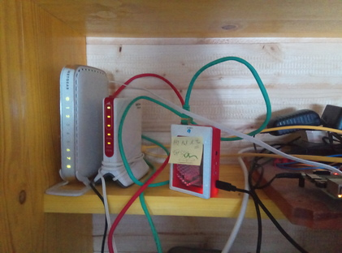

.. ot-exercise:: linux.basics.exercises.FH_SS2022_EXAM_01_G1
   :dependencies: linux.basics.shell.exercises.cp_mv_mkdir_rm.mkdir_p_rm_r,
		  linux.basics.shell.exercises.cp_mv_mkdir_rm.echo_create_files,
		  linux.basics.shell.cp,
		  linux.basics.shell.ls

Exam (ECE/SS2022/G1): Do A Lot With Files And Directories
=========================================================

.. sidebar::

   Originally created for :doc:`/about/site/work-in-progress/fh-joanneum/2020/ss2022`

.. contents::
   :local:

Precondition: Logged-In To Remote/Exam Computer
-----------------------------------------------

.. sidebar::

   * :doc:`/trainings/material/soup/linux/ssh/key-pair`

* Public key deployed to remote computer (see
  :doc:`/trainings/material/soup/linux/ssh/key-pair`)
* Logged in to remote computer

  .. code-block:: console

     $ ssh -p 2020 firstname.lastname@jfasch.bounceme.net

.. danger::

   **The exam must be done on the remote computer**

   Take care to not accidentally execute the following steps on your
   local machine!

Create Exam Skeleton (5 Points)
--------------------------------

.. sidebar::

   * :doc:`/trainings/material/soup/linux/basics/shell/file_dir_create_rm`

* In your home directory, create a subdirectory ``exam-01``. 
* In the ``~/exam-01`` directory, create an empty ("skeleton") tree as
  follows,

.. code-block:: console

   $ tree ~/exam-01/
   ~/exam-01/
   ├── credentials
   ├── private-place
   └── public-place

Create Credentials Files (10 Points)
------------------------------------

.. sidebar::

   * :doc:`/trainings/material/soup/linux/basics/shell/file_dir_create_rm`
   * :doc:`/trainings/material/soup/linux/basics/intro/login`

In the directory ``~/exam-01/credentials``, create a bunch of files as follows:

.. list-table::
   :align: left
   :widths: auto
   :header-rows: 1

   * * Filename
     * Content
   * * ``name``
     * Your UNIX username and user ID (UID), one line each; for
       example

       .. code-block:: console

	  $ cat ~/exam-01/credentials/name
	  joerg.faschingbauer
	  1020

   * * ``primary-group``
     * The name and group ID (GID) of your primary group, one line
       each; for example

       .. code-block:: console

	  $ cat ~/exam-01/credentials/primary-group
	  joerg.faschingbauer
	  1020

   * * ``supplementary-groups``
     * The name and ID of your supplementary groups, one line each;
       for example

       .. code-block:: console

	  $ cat ~/exam-01/credentials/supplementary-groups
	  joerg.faschingbauer 1020
	  ece20 1021

.. hint::

   See :doc:`/trainings/material/soup/linux/basics/intro/login` for
   how to find out who you are.

.. hint::

   You use the ``>>`` operator to *append* a line to an existing file
   (or to create that file if it doesn't exist):

   .. code-block:: console

      $ echo 8020 Graz >> somefile.txt

Public Place (10 Points)
------------------------

.. sidebar::

   * :doc:`/trainings/material/soup/linux/basics/permissions/basics`
   * `man -s 1 chmod <https://linux.die.net/man/1/chmod>`__
   * `man -s 1 chgrp <https://linux.die.net/man/1/chgrp>`__

Tune the permissions of the ``~/exam-01/public-place`` directory in a
way that

* You can

  * look and ``cd`` into it
  * create files in it
  * remove files from it

* Your fellow members of the ``ece20`` group

  * can look and ``cd`` into it (and thus see its contents)
  * can *not* create files in it
  * can *not* remove files from it

* Nobody else has any permissions in that directory

.. hint::

   You use the ``-d`` option (together with ``-l`` of course) to the
   ``ls`` command to view the permissions of the directory itself,
   *not* its contents.

   For example, this shows the initial - not-yet-tuned - permissions
   of the directory:

   .. code-block:: console

      $ pwd
      /home/joerg.faschingbauer/exam-01
      $ ls -ld public-place/
      drwxr-xr-x 2 joerg.faschingbauer joerg.faschingbauer 4096 Mar 24 07:00 public-place/

Private Place (10 Points)
-------------------------

Tune the permissions of the ``~/exam-01/private-place`` directory in a
way that

* You can 

  * look and ``cd`` into it
  * create files in it
  * remove files from it

* Nobody else can do any of the above

Shared File in Public Place (10 Points)
---------------------------------------

#. Create a file ``completely-open.txt`` in ``~/exam-01/public-place``
   in a way that

   * It contains the phrase "Hello teacher"
   
     .. code-block:: console
   
        $ cat ~/exam-01/public-place/completely-open.txt
        Hello teacher
   
   * You can modify/write that file
   * Your fellow members of ``ece20`` can only read it, but not write
     it

#. Create another file ``completely-open-removable.yesno`` in
   ``~/exam-01/public-place`` that contains either ``yes`` or ``no``,
   answering the following question:

   *Would any member of the* ``ece20`` *group be able to remove*
   ``completely-open.txt``?

Make A Backup Of ``~/exam-01`` (15 Points)
------------------------------------------

.. sidebar:: Documentation

   * :doc:`/trainings/material/soup/linux/ssh/scp`
   * `man -s 1 scp
     <https://man7.org/linux/man-pages/man1/scp.1.html>`__

**Goal**

* Transfer what you created (i.e. the entire contents of the remote
  ``~/exam-01`` directory) to your local machine.
* Use the ``scp`` command for this task
* **But read on! Do not start!!**

**Think**

* What would be the command to do this?
* Note that we were extremely picky to restrict permissions in most
  parts of the tree. How would you preserve those valuable permissions
  across the remote copy?

  (Hint: read the ``scp`` manual page, and find out about the ``-p``
  option.)

* Create a file ``backup-command.sh`` in ``~/exam-01/``
  containing that command.
* Make this file executable for *all users*, but otherwise preserve
  its default permissions that it had initially.
* **Finally, execute the** ``scp`` **command on your local machine**

Dependencies
------------

.. ot-graph::
   :entries: linux.basics.exercises.FH_SS2022_EXAM_01_G1

