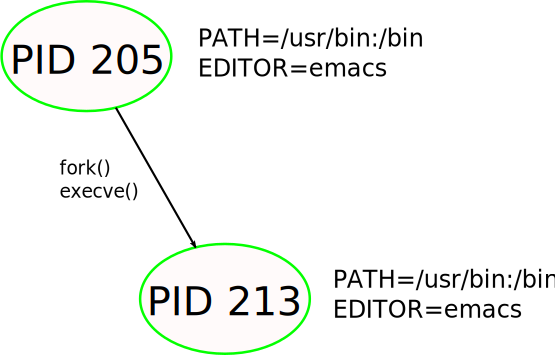
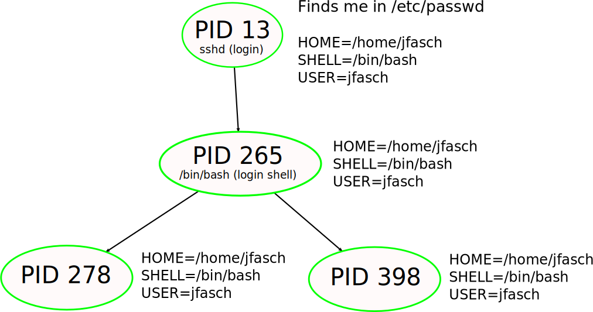

.. include:: <mmlalias.txt>

Environment (Variables)
=======================

.. sidebar::

   **Documentation**

   * `man -s 7 environ <https://man7.org/linux/man-pages/man7/environ.7.html>`__

.. contents::
   :local:

Environment
-----------

* Process attribute
* Inherited from parent to child process during creation
* An array of C strings of the form ``var=value``

Shell: Environment Variables, And Process Creation
--------------------------------------------------

In the shell, for example, you can see the value of the ``PATH``
environment variable like ...

.. code-block:: console

   $ echo $PATH
   /usr/local/bin:/usr/local/sbin:/usr/bin:/usr/sbin

You set the value of an environment variable

.. code-block:: console
   :caption: Prepend home to ``$PATH``, and create new variable ``MY_VARIABLE``

   $ PATH=$HOME/bin:$PATH
   $ MY_VARIABLE=hello

In case the variable is not exported, you export it [#export]_,

.. code-block:: console

   $ export PATH
   $ export MY_VARIABLE

Now the parent process (PID 1034184) has an environment variable
``PATH`` with value
``/home/jfasch/bin:/usr/local/bin:/usr/local/sbin:/usr/bin:/usr/sbin``:

.. code-block:: console

   $ echo $$
   1034184
   $ echo $PATH
   /home/jfasch/bin:/usr/local/bin:/usr/local/sbin:/usr/bin:/usr/sbin

In that shell, start a new shell. This looks like nothing happened
(the prompt is the same at least), but it has a new PID:

.. code-block:: console

   $ bash
   $ echo $$
   1035812

Popular Environment Variables: ``HOME``, ``SHELL``, ``USER``
------------------------------------------------------------

* Set at :doc:`login time <login>` (for example by ``sshd``)
* User's metadata, found in ``/etc/passwd``
* Made available to all processes in the *login session*
* |longrightarrow| simply by setting them early in the session's
  ancestor process

.. code-block:: console

   $ echo $HOME
   /home/jfasch
   $ echo $SHELL
   /bin/bash
   $ echo $USER
   jfasch

Popular Environment Variables: ``PATH``
---------------------------------------

.. sidebar::

   **Topics**

   * :doc:`../shell/configfiles`

* Set during shell startup
* From various configuration files that extend ``PATH`` incrementally

  * ``/etc/profile``: system wide
  * ``~/.bashrc``: per user

.. rubric:: Footnotes
.. [#export] In the shell, this is done to distinguish between normal
             variables (shell is a programming language too) and
             environment variables.

