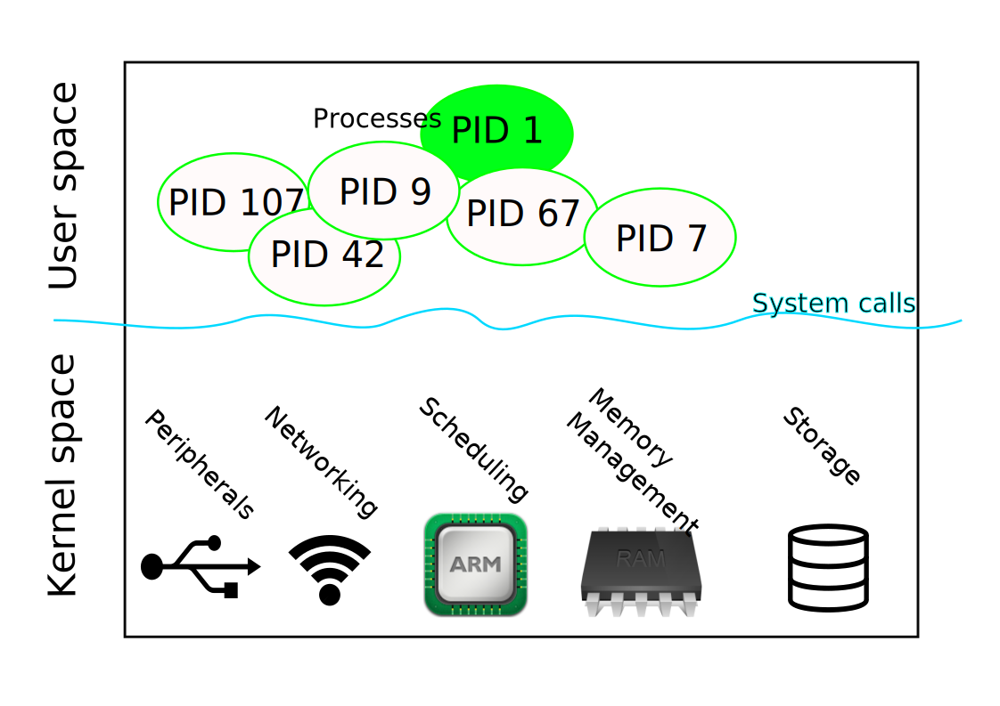

.. include:: <mmlalias.txt>

Overview
========

.. contents::
   :local:

User Space, Kernel Space?
-------------------------

* Clear distinction - *separation of concerns*
* User space *programs* use *services* provided by kernel - via
  *system calls*
* Programs (their programmers) use simple programming paradigms like
  *blocking* I/O |longrightarrow| transparent *waits*
* All heavy stuff is done by the kernel

User Space: *Abstractions*
--------------------------

.. sidebar:: See also

   * :doc:`/trainings/material/soup/linux/sysprog/blocking-io/blocking-io`

* No direct hardware access
* Per-process *linear address space*

  * **The Process Abstraction**
  * |longrightarrow| perception that I *own* all memory
  * *Virtual memory* - *virtualization* of physical memory

.. sidebar:: See also

   :doc:`process`

* *Scheduling*

  * |longrightarrow| perception that I *own* the CPU
  * *virtualization* of physical CPU

* File systems

  * Raw disks are not organized hierarchically, obviously
  * *File descriptors* for open files
  * *Blocking* I/O

* Networking

  * *Sockets*, represented by *file descriptors*
  * *Blocking* I/O

* (Many more)

Kernel: Where The Heavy Stuff Is
--------------------------------

.. sidebar:: 

   See :doc:`/trainings/repertoire/linux-prog/kernel-programming-basics` for a
   look under the surface.

* Interrupts from hardware devices
* Raw memory - *not* organized linearly
* Multiple CPUs
* One single address space

  * |longrightarrow| heavy parallelism
  * |longrightarrow| **Hard!!**

Booting a Computer
------------------

* Bootloader

  * Machine specific |longrightarrow| low level
  * Hardware initialization (RAM, basics peripherals like timers)
  * Loads (and starts) the *kernel* - in a variety of different ways

* Kernel

  * More hardware initialization (optional peripherals, mostly)
  * Subsystems initialization (memory management, storage, ...)
  * Starts userspace |longrightarrow| ``/sbin/init`` (usually), **PID
    1**

* PID 1

  * Starts "services" (``sshd``, graphical login screen, logging, ...)
  * (Grand-) parent of all other processes
