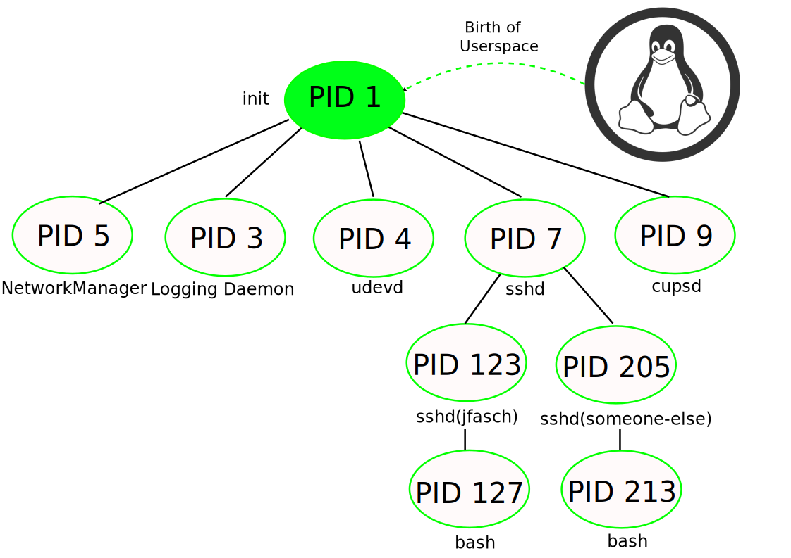

.. ot-topic:: linux.basics.intro.process_tree
   :dependencies: linux.basics.intro.process

.. include:: <mmlalias.txt>

Process Hierarchy (Parent, Child Process)
==========================================

.. contents::
   :local:

More Process Rules
------------------

.. sidebar::

   **See also**

   * :doc:`/trainings/material/soup/linux/sysprog/process/tree`

* Every process has a parent process

  * Inherits parent's attributes
  * E.g. shell starts command |longrightarrow| runs as the same user

* Except PID 1 

  * Started by the kernel during boot
  * First userspace process
  * |longrightarrow| "userspace is born"
  * Ancestor of all processes
  * Usually/historically called ``init`` (``/sbin/init``)
  * Nowadays ``systemd``, on most Linux distributions

* |longrightarrow| Process tree, starting at PID 1

Typical Process Tree
--------------------

.. code-block:: console
   :caption: Real world snapshot

   $ pstree
   systemd-+-ModemManager---3*[{ModemManager}]
           |-NetworkManager---2*[{NetworkManager}]
           |-3*[abrt-dump-journ]
           |-abrtd---2*[{abrtd}]
           |-auditd---{auditd}
           |-avahi-daemon---avahi-daemon
           |-bluetoothd
           |-cupsd
           |-dbus-broker-lau---dbus-broker
           |-dnsmasq---dnsmasq
           |-firewalld---{firewalld}
           |-fwupd---4*[{fwupd}]
           |-polkitd---11*[{polkitd}]
           |-sshd---sshd---sshd---bash
           ...

Services, ``init``
------------------

* PID 1 (``init``) starts *services*, usually

  * Background processes |longrightarrow| daemons (i.e. not bound to a
    terminal)
  * Login daemon on console
  * Secure login daemon on network (Secure Shell Daemon, ``sshd``)
  * Logging
  * Printing
  * ...

* Can be completely different though ...

  * "Applicances"
  * Embedded systems are sometimes very dedicated
  * Resource constrained (only a few MB of RAM, tiny flash memory)
  * |longrightarrow| PID 1 is the only process

