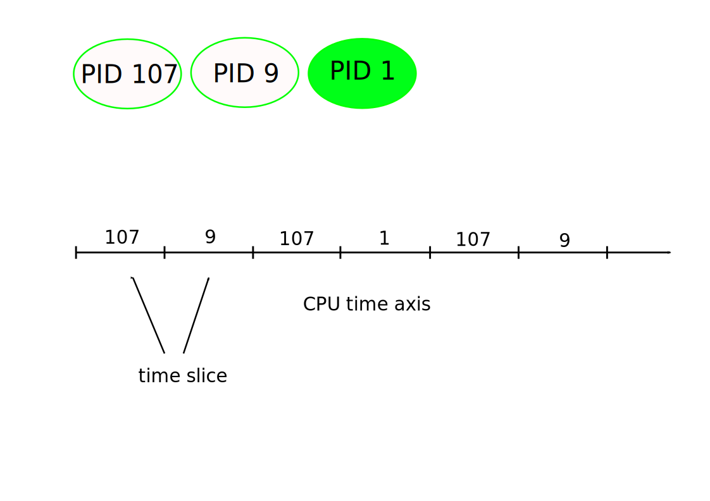

.. ot-topic:: linux.basics.intro.process
   :dependencies: linux.basics.intro.overview

.. include:: <mmlalias.txt>

Processes, Scheduling, Address Spaces
=====================================

.. contents::
   :local:

Problem: Owning the CPU?
------------------------

The following program is not sane. Why?

.. literalinclude:: infinite-loop.c
   :caption: :download:`infinite-loop.c`

Solution: Scheduling (Time Slices)
----------------------------------

* Owning the CPU?

  |longrightarrow| on an OS, nobody but **the kernel** (*the OS*) can own
  the CPU

* Scheduling
* Time slicing
* Even on a single CPU, many can given the illusion of CPU ownership
* |longrightarrow| the more infinite loops, the slower that illusion
  becomes, obviously
* |longrightarrow| best to not spin until an event happens, but rather
  *block on that event* (see :doc:`blocking-io/group`)

Problem: Owning all Memory?
---------------------------

The following program is also not sane. Why?

.. literalinclude:: array-overflow.c
   :caption: :download:`array-overflow.c`

Solution: Virtual Memory
------------------------

* Owning all Memory?

  |longrightarrow| on an OS nobody but **the kernel** can own all
  memory

* User space has an abstraction for that: *process*
* Every process has memory allocated to it

  * Kept track of by **the kernel**
  * Memory indirection, implemented in hardware: `MMU
    <https://en.wikipedia.org/wiki/Memory_management_unit>`__
  * Memory protection: *read*/*write*/*execute*

  .. image:: process/address-space.svg
     :scale: 50%

* Multiple address spaces

  * CPU is switched between processes |longrightarrow| *scheduling*
  * *Context switch*
  * Address space changed at context switch

  .. image:: process/virtual-memory.svg
     :scale: 50%

Process Attributes: User ID (UID)
---------------------------------

.. sidebar:: See also

   * :doc:`login`
   * :doc:`../permissions/basics`

* Processes run under a *user ID* - "as a user"

  .. code-block:: console

     $ id -u
     1000

  Defined in ``/etc/passwd`` (but not necessarily - can come from
  Kerberos/Active Directory)

  .. code-block:: console

     $ grep jfasch /etc/passwd
     jfasch:x:1000:1000:Joerg Faschingbauer:/home/jfasch:/bin/bash

* User ID ``0`` is special

  * ``root`` - "The Administrator"
  * Has permissions to do everything that a normal user cannot
  * Can format disk, can view/delete all your files, can be *unfair*
    if she wants

Process Attributes: Groups
--------------------------

.. sidebar:: See also

   * :doc:`login`
   * :doc:`../permissions/basics`

* Processes run under a *group ID* - the *primary group*
* Processes have supplementary groups (an addition/extension made at
  some point in history)

.. code-block:: console

   $ id
   uid=1000(jfasch) gid=1000(jfasch) groups=1000(jfasch),10(wheel),18(dialout)

* Primary group defined in ``/etc/passwd``

  .. code-block:: console

     $ grep jfasch /etc/passwd
     jfasch:x:1000:1000:Joerg Faschingbauer:/home/jfasch:/bin/bash

* Supplementary groups defined in ``/etc/group``

  .. code-block:: console

     $ grep jfasch /etc/group
     wheel:x:10:jfasch
     dialout:x:18:jfasch
     jfasch:x:1000:

Processes: More Attributes
--------------------------

* Current working directory (``cwd``)

  For example, the shell (which is a program like any other program)
  changes its CWD with the ``cd`` command:

  .. code-block:: console

     $ pwd       # "print working directory"
     /home/jfasch
     $ cd /etc
     $ pwd
     /etc

* Resource limits

  * Maximum stack usage (stacks grow dynamically)
  * File size
  * ...

  .. code-block:: console

     $ ulimit -a
     real-time non-blocking time  (microseconds, -R) unlimited
     core file size              (blocks, -c) unlimited
     data seg size               (kbytes, -d) unlimited
     scheduling priority                 (-e) 0
     file size                   (blocks, -f) unlimited
     pending signals                     (-i) 62715
     max locked memory           (kbytes, -l) 8192
     max memory size             (kbytes, -m) unlimited
     open files                          (-n) 1024
     pipe size                (512 bytes, -p) 8
     POSIX message queues         (bytes, -q) 819200
     real-time priority                  (-r) 0
     stack size                  (kbytes, -s) 8192
     cpu time                   (seconds, -t) unlimited
     max user processes                  (-u) 62715
     virtual memory              (kbytes, -v) unlimited
     file locks                          (-x) unlimited

* Open files
