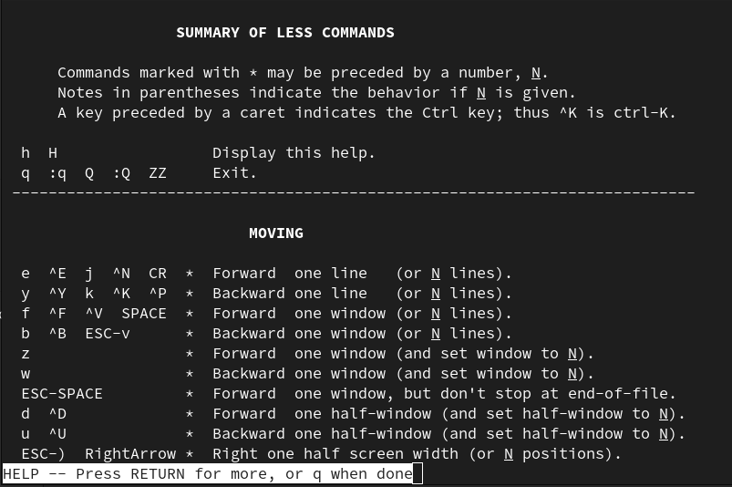

.. ot-topic:: linux.basics.text_tools.less
   :dependencies: linux.basics.text_tools.head_tail

.. include:: <mmlalias.txt>

``less``
========

.. contents::
   :local:

Paging Files Using ``less``
---------------------------

.. sidebar::

   **Documentation**

   * `man -s 1 less
     <https://man7.org/linux/man-pages/man1/less.1.html>`__

* Outputs text file page by page
* |longrightarrow| page size determined from terminal size
* Operation: page/line up/down
* Usage as in ``man`` (``less`` is ``man`` 's default pager)

Keyboard shortcuts ...

.. list-table::
   :align: left
   :widths: auto
   :header-rows: 1

   * * Key
     * Description
   * * ``h``
     * Help
   * * ``q``
     * Quit (either ``less``, or the help screen if that is active)
   * * ``g``
     * Jump to beginning
   * * ``G``
     * Jump to end
   * * ``/``
     * Search forward
   * * ``?``
     * Search backward
   * * ``n``
     * Jump to next search hit
   * * ``N``
     * Jump to previous search hit

Help Screen (Enter With ``h``)
------------------------------

