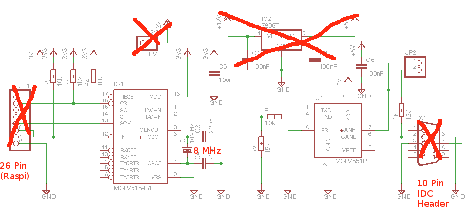

.. meta::
   :description: CAN Bus (using MCP2515)
   :keywords: linux, can bus, spi, raspberry pi, raspi

.. include:: <mmlalias.txt>

Hardware, Kernel
================

.. contents::
   :local:

MCP2515: Schematic
------------------

From http://lnxpps.de/can2udpe/openwrt/

MCP2515: Soldering
------------------

.. list-table::
   :align: left
   :widths: auto

   * * .. image:: mcp2515-top.jpg
     * .. image:: mcp2515-bottom.jpg

MCP2515: SPI
------------

.. list-table::
   :align: left
   :widths: auto

   * * * SPI: asymmetric (Master/Slave)

         * ``MOSI``, ``MISO``, ``SCLK``: SPI lines
         * *Chip Select* (*slave select*)

       * Notification to master

         * Interrupt
         * Arbitrary GPIO

     * .. image:: SPI_three_slaves.png

MCP2515: Raspberry
------------------

.. list-table::
   :align: left
   :widths: auto
      
   * * * Broadcom BCM2835

         * 2 SPI master, one available over 40-pin header
         * 2 chip select |longrightarrow| ``CE0`` ("Chip Enable")
         * Tons of GPIO |longrightarrow| ``GPIO25`` used as interrupt pin

       * Power supply

         * 3.3V for MCP2515
         * 5V for transceiver

     * .. image:: raspi-v2-p1-pinout-gimped.png
