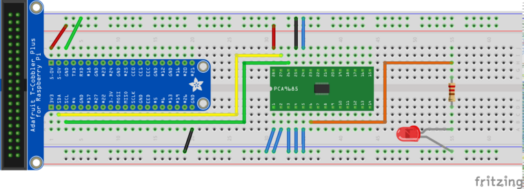
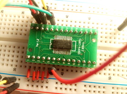

.. meta::
   :description: Linux PWM Userspace Interface
   :keywords: linux, pwm, PCA9685, raspberry pi, raspi, pulse width
              modulation, realtime, userspace

PWM Userspace Interface (using PCA9685)
=======================================

.. contents::
   :local:

Overview
--------

The value of the resistor that you use to protect an LED determines
its brightness. To change the brightness of the LED, you use a
potentiometer instead of a plain resistor. If you want to control LED
brightness from software though, you do Pulse Width Modulation (PWM)
on an IO pin which the LED is attached to.

Here in this topic we will be doing just that,

* Attach a `PCA9685
  <https://www.nxp.com/docs/en/data-sheet/PCA9685.pdf>`__ PWM
  controller to a `Raspberry Pi <https://www.raspberrypi.org/>`__.
* Connect an LED to the controller
* Control the LED brightness by adjusting PWM parameters
* Learn how to use the Linux userspace PWM interface. *We do not write
  one single line of code*.

Pulse Width Modulation (PWM)
----------------------------

Electronic engineers can come up with much better explanations of PWM
than I ever could. Please watch the following video if are not yet
familiar with PWM (you may skip the second half which is about
building a PWM circuit).

.. raw:: html

   <iframe
       width="560" 
       height="315" 
       src="https://www.youtube.com/embed/YmPziPfaByw" 
       frameborder="0" 
       allow="accelerometer; autoplay; encrypted-media; gyroscope; picture-in-picture" 
       allowfullscreen>
   </iframe>

Why An External PWM Controller?
-------------------------------

One can use a computer - an Arduino, or any other microcontroller, or
a PC - to drive the PWM signal by a program that runs on the CPU. But
the more PWM lines you have to drive, the more complex the program
will become:

* You need more elaborate timer management. Multiplex multiple PWM
  channels onto the same physical timer, for example, that is adjusted
  frequently as PWM parameters change.
* Other parts of the program may want to have their own share of the
  CPU. Correctness of those parts might suffer as they interfere with
  PWM timers.

Microcontrollers usually run some kind of realtime OS, or no OS at
all. Whether there are timer delays depends on the quality of the OS's
timer management, naturally, and all of the caveats above apply.

Linux is much more complex than any bare-metal OS that is usually used
for such applications. It has a network stack that operates in the
background, and a filesystem and block IO layer, and maybe a graphics
stack, other software such as remote login programs, a webserver, and
much more. There is much more contention for CPU resources. Linux's
contention management strategies are quite elaborate, and the
programmer is not always in control of every single piece of it.

Driving a PWM signal at a millisecond frequency means that the PWM
software would have to compete with a possibly unknown number of other
processes in the system - leading to glitches and hard-to-detect
errors. While Linux, as deployed on the Raspberry, has real-time
capabilities that try to give wakeup guarantees, this is a best-effort
approach. Turning Linux into a realtime OS that gives hard guarantees
`is no fun <https://rt.wiki.kernel.org/index.php/Main_Page>`__ is
rather hard. There is a version of a realtime preemption kernel for
the Pi, I recommend to go out of its way if this is possible.

Attaching a `PCA9685
<https://www.nxp.com/docs/en/data-sheet/PCA9685.pdf>`__ PWM controller
is really simple as the remainder of this topic will show, and to use
it from Linux is even simpler.

Wiring, And Checking Device Presence
------------------------------------

.. sidebar:: See also

   * :doc:`/trainings/material/soup/linux/hardware/i2c/topic`

That said, here's the wiring.

   :download:`Download Fritzing project <PCA9685-LED.fzz>`

   Adapter for SSOP packages

The PCA9685 is connected over I2C, which is a two-wire bus where each
device has a 7-bit address. Note we connect the address lines
``A0-A5`` to ground. According to the data sheet, the highest address
bit is ``1``, which gives an address value of ``0b1000000``, or
``0x40``. 

If everything is ok, we should be able to detect the chip at this
address. Enable I2C on the Raspberry, by editing ``/boot/config.txt``,
so that it contains the following line (that line is already there,
it's only commented out),

.. code-block:: console
   :caption: ``/boot/config.txt``

   dtparam=i2c_arm=on

Reboot. Now we see a filesystem representation of the I2C bus in
``/dev``. This is bus number 1 (as opposed to bus number 0 which is
used internally for the camera interface, and which is not exported to
userspace).

We are now in a position to probe that bus for devices, using the
``i2c-detect`` program. 

* First, make sure that the ``i2c-dev`` module is loaded (that module
  exposes I2C buses to userspace, which is where ``i2cdetect``
  operates).

  .. code-block:: console
     :caption: as root ...
  
     # modprobe i2c-dev

* See the ``i2c-1`` charactre device appear

 .. code-block:: console
 
    $ ls -l /dev/i2c*
    crw-rw---- 1 root i2c 89, 1 Aug 10 09:13 /dev/i2c-1

* Probe the bus

 .. code-block:: console
 
    $ i2cdetect -y 1
         0  1  2  3  4  5  6  7  8  9  a  b  c  d  e  f
    00:          -- -- -- -- -- -- -- -- -- -- -- -- -- 
    10: -- -- -- -- -- -- -- -- -- -- -- -- -- -- -- -- 
    20: -- -- -- -- -- -- -- -- -- -- -- -- -- -- -- -- 
    30: -- -- -- -- -- -- -- -- -- -- -- -- -- -- -- -- 
    40: 40 -- -- -- -- -- -- -- -- -- -- -- -- -- -- -- 
    50: -- -- -- -- -- -- -- -- -- -- -- -- -- -- -- -- 
    60: -- -- -- -- -- -- -- -- -- -- -- -- -- -- -- -- 
    70: 70 -- -- -- -- -- -- --                         

The addresses are in hexadecimal notation. We see address ``0x40``
which is what we expect from the wiring. The PCA has a second address,
``0x70``. That is something like the broadcast address to use when
there are multiple PCA's on the same bus, and which you want to give
commands simultaneously. We don't use this feature so we can ignore
that second address.

PCA9685 Kernel Driver 
---------------------

Ok, so the device is there. We do not want to talk to it "by hand",
using ``/dev/i2c-1`` (see :doc:`here
</trainings/material/soup/linux/hardware/i2c/topic>` for how to do
this). We could, see `here
<https://www.kernel.org/doc/Documentation/i2c/dev-interface>`__ for
how, but we won't. The Linux kernel has dedicated PWM subsystem that
is used to control PWM devices, regardless of their peculiarities such
as whether they are connected on a I2C bus, or SPI, or whatnot. There
is a driver for the PCA9685; enable that in ``/boot/config.txt``.

To learn how this is done, you browse through
``/boot/overlays/README`` which is a definitive list of devicetree
overlays available. Find the PCA9685's overlay which is responsible
for hardware initialization, and finally announces to the kernel that
there is a device that requires driver loading. For reference, here's
the corresponding snippet.

.. code-block:: console
   :caption: ``/boot/overlays/README``

   Name:   i2c-pwm-pca9685a
   Info:   Adds support for an NXP PCA9685A I2C PWM controller on i2c_arm
   Load:   dtoverlay=i2c-pwm-pca9685a,<param>=<val>
   Params: addr                    I2C address of PCA9685A (default 0x40)

Put that in ``/boot/config.txt``,

.. code-block:: console
   :caption: ``/boot/config.txt``

   dtoverlay=i2c-pwm-pca9685a,addr=0x40

Reboot.

Concluding the setup, we quickly check the list of modules loaded, and
see how the ones are in place that are relevant for our purposes.

.. code-block:: console

   $ lsmod
   Module                  Size  Used by
   ... lots omitted, leaving ours in place ...
   pwm_pca9685            16384  0
   regmap_i2c             16384  1 pwm_pca9685
   i2c_bcm2835            16384  0
   i2c_dev                16384  0

Strictly speaking, there is no need for ``i2c_dev``. It makes
``/dev/i2c-1`` available to userspace; we intend to use the PWM driver
``pwm_pca9685`` and the PWM userspace interface that *it*
provides. That driver does I2C communication with our PCA9685
*internally* in kernel space.

Finally, setup done; read on for how we do PWM *on the commandline*.

Talk to Chip Using the ``sysfs`` Interface
------------------------------------------

Now that we have everything in place, lets quickly see how to use the
``sysfs`` PWM interface [#pwm-sysfs-doc]_. The ``pwm_pca9685`` driver
exports the device in a directory under the ``sysfs`` tree,

.. code-block:: console

   $ ls -l /sys/class/pwm/
   total 0
   lrwxrwxrwx 1 root gpio 0 Aug 10 09:41 pwmchip0 -> ../../devices/platform/soc/3f804000.i2c/i2c-1/1-0040/pwm/pwmchip0

``/sys/class/pwm/pwmchip0`` is actually a symbolic link to a device
which obviously is located in an area in the ``sysfs`` tree that is
responsible for I2C. We do not care. Change the current working
directory into ``/sys/class/pwm/pwmchip0``, and see what's there.

.. code-block:: console

   $ cd /sys/class/pwm/pwmchip0
   $ ls -l
   total 0
   lrwxrwxrwx 1 root root    0 Aug 10 10:14 device -> ../../../1-0040
   --w------- 1 root root 4096 Aug 10 10:14 export
   -r--r--r-- 1 root root 4096 Aug 10 10:14 npwm
   drwxr-xr-x 2 root root    0 Aug 10 10:14 power
   lrwxrwxrwx 1 root root    0 Aug 10 10:14 subsystem -> ../../../../../../../../class/pwm
   -rw-r--r-- 1 root root 4096 Aug 10 09:41 uevent
   --w------- 1 root root 4096 Aug 10 10:14 unexport

PCA9685 metadata all over. Note that don't see any mention of PWM
channels. We connected the LED to the PCA's pin 6, which is PWM
channel 0. Export that to userspace, by writing ``0`` into the
``export`` file [#pwm-export]_.

.. code-block:: console

   $ echo 0 > export 
   $ ls -l 
   total 0
   ...
   drwxr-xr-x 3 root root    0 Aug 10 10:21 pwm0
   ...

Aha, that created a chip subdirectory, ``pwm0``. Shift butt into, and
see what's there.

.. code-block:: console

   $ ls -l
   total 0
   ...
   -rw-r--r-- 1 root root 4096 Aug 10 10:23 duty_cycle
   -rw-r--r-- 1 root root 4096 Aug 10 10:23 period
   ...

Sounds much like PWM. The files ``period`` and ``duty_cycle``, like
the ``export`` file above, are not persistent on any storage
media. Rather, they are actually provided by the kernel who sits under
the surface and intercepts any read/write operations on the files.

Lets configure PWM, by writing time periods (in nanoseconds) into
those files. First the PWM period,

.. code-block:: console

   $ echo 1000000 > period

This does nothing because the duty cycle is still 0,

.. code-block:: console

   $ cat duty_cycle 
   0

Bring LED to full brightness,

.. code-block:: console

   $ echo 1000000 > duty_cycle 

Dim it,

.. code-block:: console

   # echo 500000 > duty_cycle 
   # echo 400000 > duty_cycle 
   # echo 300000 > duty_cycle 
   ...

Fade it programmatically [#dim-not-linear]_,

.. code-block:: console

   $ for d in 1000000 800000 600000 400000 200000 100000 50000 0; do
   >    echo $d > duty_cycle
   >    sleep 0.5
   > done
   #

All that in a video, for ultimate visual experience. Manual focus on
the camera is not easy to have though, I apologize.

.. raw:: html

   <iframe
       width="560" 
       height="315" 
       src="https://www.youtube.com/embed/9eh-qCKh1jw" 
       frameborder="0" 
       allow="accelerometer; autoplay; encrypted-media; gyroscope; picture-in-picture" 
       allowfullscreen>
   </iframe>

Conclusion
----------

Linux has a nice way of integrating hardware interfaces like I2C, PWM,
GPIO, and much more. The interfaces that the kenel devlopers created
go together very well with the good old UNIX paradigm: *everything is
a file.*

The PWM interface is just one of those interfaces; as you explore what
else can be done with Linux, you will encounter many interfaces that
are designed in this way. For me as a trainer, it is always a great
pleasure to show how easy it is to write a working prototype in no
time, requiring as little code and hardware experience as possible.

.. rubric:: Footnotes

.. [#pwm-sysfs-doc] As always, there is more. Read it up in `the
                    kernel documentation
                    <https://www.kernel.org/doc/html/latest/driver-api/pwm.html#using-pwms-with-the-sysfs-interface>`__
.. [#pwm-export] Channels are not exported by default. This is to
                 avoid conflicts with kernel driver which might have
                 grabbed the channel for their own purposes.
.. [#dim-not-linear] The brightness is not quite linear with the duty
		     cycle, this is why the values might look a bit
		     odd.
