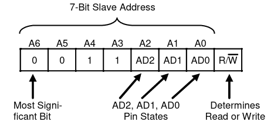

.. meta::
   :description: The Linux PWM Userspace Interface
   :keywords: linux, onewire, w1, DS18B20, DS2482, raspberry pi,
              raspi, userspace, hwmon, sysfs

Linux and OneWire (using DS18B20 Temperature Sensor as Slave)
=============================================================

.. ot-topic:: linux.hardware.w1

.. contents::
   :local:

Overview
--------

This article shows how you use Linux to communicate with `OneWire
<https://en.wikipedia.org/wiki/1-Wire>`__ devices. Cornerstones are:

* Master, Alternative 1: ``w1-gpio`` - bus master in software (unstable at
  times)
* Master, Alternative 2: `DS2482
  <https://www.maximintegrated.com/en/products/interface/controllers-expanders/DS2482-800.html>`__ -
  bus master in hardware, attached to the CPU via I2C
* Slave `DS18B20
  <https://www.maximintegrated.com/en/products/DS18B20>`__ OneWire
  temperature sensor as a slave device.
* Rasperry Pi because everything's easy there. This article's
  principles stand unmodified for other platforms that run Linux (more
  handwork might be needed though - Pi's ``/boot/config.txt`` is
  really cool, for example).

A `OneWire <https://en.wikipedia.org/wiki/1-Wire>`__ device has three
wires attached to it: data, ground, and power. Data and ground are
mandatory, obviously. Power is optional; if omitted, the device is
said to be operated in *parasitic mode*.

Master Device, Alterative 1: ``w1-gpio`` - OneWire Master in Software
---------------------------------------------------------------------

Lacking a hardware OneWire master (the Raspi does not have one
built-in), we use a software implementation of the OneWire protocol -
the ``w1-gpio`` kernel driver. You configure one GPIO to act as the
data line, and the kernel driver is then used to `bitbang
<https://en.wikipedia.org/wiki/Bit_banging>`__ the OneWire protocol in
and out of the CPU.

Configuration is easy: say you want to use GPIO 21 as data line. In
``/boot/config.txt`` you write,

.. code-block:: console

   dtoverlay=w1-gpio,gpiopin=21

.. note::

   Reboot the Pi, and the kernel will load the driver and configure
   the GPIO accordingly.

.. _bitbang-device:

Wiring: Attach OneWire Device to GPIO Pin
.........................................

.. note::

   Though not exactly necessary |:wink:|, it makes sense to halt and
   power off the Pi before connecting the sensor.

.. list-table::
   :align: left
   :header-rows: 1

   * * Professional Diagram
     * Decadent Pi Addon
     * Raspi Pinout
   * * .. image:: wiring.png
     * .. image:: wiring-photo.jpg
     * .. image:: ../common-images/raspi-pinout.png
          :scale: 100%

When done, reboot and see the device appear in ``sysfs``.

.. code-block:: console

   $ ls -l /sys/bus/w1/devices/
   total 0
   lrwxrwxrwx 1 root root 0 Oct 26 09:58 28-01144fe43baa -> ../../../devices/w1_bus_master8/28-01144fe43baa
   lrwxrwxrwx 1 root root 0 Oct 26 09:58 w1_bus_master1 -> ../../../devices/w1_bus_master1

.. note::

   Especially in breadboard setups, the bitbanging master appears to
   become unstable. Devices are not recognized at all, or appear as
   random garbage. Here's one exceptionally amazing crap that I once
   encountered - *one* device appearing as *two bogus* devices,

   .. code-block:: console

      $ ls -l /sys/bus/w1/devices
      total 0
      drwxr-xr-x 2 root root 0 Oct 25 17:56 .
      drwxr-xr-x 4 root root 0 Oct 25 17:56 ..
      lrwxrwxrwx 1 root root 0 Oct 26 08:02 00-400000000000 -> ../../../devices/w1_bus_master1/00-400000000000
      lrwxrwxrwx 1 root root 0 Oct 26 08:02 00-800000000000 -> ../../../devices/w1_bus_master1/00-800000000000
      lrwxrwxrwx 1 root root 0 Oct 25 17:56 w1_bus_master1 -> ../../../devices/w1_bus_master1

   See :ref:`below <error-symptoms>` for more about OneWire errors.

Master Device, Alterative 2: DS2482 - I2C OneWire Master in Hardware
--------------------------------------------------------------------

.. sidebar:: DS2482-800: 8-Channel 1-Wire Master

   * `Product page
     <https://www.maximintegrated.com/en/products/interface/controllers-expanders/DS2482-800.html>`__
   * `Datasheet (PDF)
     <https://datasheets.maximintegrated.com/en/ds/DS2482-800.pdf>`__

Overview
........

* The `DS2482
  <https://www.maximintegrated.com/en/products/interface/controllers-expanders/DS2482-800.html>`__
  is an I2C device - *an I2C slave device* - that acts as a OneWire
  *master*. It implements the OneWire protocol *in hardware*, and
  receives commands from the CPU on behalf of a dedicated driver.
* Being an I2C device, we configure it just like any other I2C
  device. See :doc:`../i2c/topic` for how I2C devices are configured
  on Linux.
* Once DS2482 is configured, we can attach our OneWire device(s) to
  it.

.. _configure-i2c-address:

Wiring: Attach DS2482-800 via I2C
.................................

The DS2482-800 is an I2C device just like any other I2C device, so we
attach it just like any other. Here's the pinout, together with the
Raspberry header for convenience:

.. list-table::
   :align: left
   :header-rows: 1

   * * DS2482-800 pinout
     * Raspberry 40-pin header pinout
   * * .. image:: DS2482-800-pinout.png
     * .. image:: ../common-images/raspi-pinout.png

Connect pins as follows:

.. list-table:: 
   :align: left
   :header-rows: 1

   * * DS2482-800
     * Raspberry
   * * ``AD0``
     * ``GND``
   * * ``AD1``
     * ``GND``
   * * ``AD2``
     * ``GND``
   * * ``SDA``
     * ``GPIO 2 (SDA)``
   * * ``SCL``
     * ``GPIO 3 (SCL)``
   * * ``VCC``
     * ``3V3 power``
   * * ``GND``
     * ``Ground``

You may vary the assignment of the ``AD*`` address selection
pins. Here, we choose to wire them to ground (0) - according to the
diagram below this gives address ``0x18``, or ``0b0011000``.



Configure Software
..................

Next, we configure software. Please read :doc:`../i2c/topic` for
details; here we just reproduce shortly what is explained there.

Enable I2C, and Check
`````````````````````

In ``/boot/config.txt``, add the following line.

.. code-block:: text

   dtparam=i2c_arm=on

Reboot and verify that all is well.

.. code-block:: console
   :caption: I2C platform driver loaded?

   $ lsmod |grep i2c
   i2c_bcm2835            16384  0

.. code-block:: console
   :caption: I2C bus #1 visible in ``sysfs``
   
   $ ls -l /sys/bus/i2c/devices/i2c-1
   lrwxrwxrwx 1 root root 0 Oct  4 12:43 /sys/bus/i2c/devices/i2c-1 -> ../../../devices/platform/soc/fe804000.i2c/i2c-1

Verify That Our Device Is There
```````````````````````````````

.. sidebar::

   **Documentation**

   * `man -s 8 i2cdetect <https://linux.die.net/man/8/i2cdetect>`__
   * `man -s 5 modules-load.d
     <https://man7.org/linux/man-pages/man5/modules-load.d.5.html>`__

This is done using the ``i2cdetect`` tool which accesses the I2C bus
from userspace; it needs ``/dev/i2c-1`` to probe I2C bus #1. Load the
``i2c-dev`` driver which provides ``/dev/i2c-N`` for each bus #N that
is found on the system.

.. code-block:: console
   :caption: ``i2c-dev`` exposes bus to userspace

   $ sudo modprobe i2c-dev
   $ ls -l /dev/i2c-1 
   crw-rw---- 1 root i2c 89, 1 Sep 29 14:27 /dev/i2c-1

You probably want to load ``i2c-dev`` automatically, at boot time. In
this case, add the following line either to ``/etc/modules`` directly,
or to a new config file, say, ``/etc/modules-load.d/i2c.conf`` :

.. code-block:: text
   :caption: Add to ``/etc/modules``

   dtparam=i2c_arm=on


The device should now be there at the :ref:`configured address
<configure-i2c-address>` (``0x18`` in our case),

.. code-block:: console
   :caption: ``i2c-detect`` scans bus

   $ i2cdetect -y 1
        0  1  2  3  4  5  6  7  8  9  a  b  c  d  e  f
   00:          -- -- -- -- -- -- -- -- -- -- -- -- -- 
   10: -- -- -- -- -- -- -- -- 18 -- -- -- -- -- -- -- 
   20: -- -- -- -- -- -- -- -- -- -- -- -- -- -- -- -- 
   30: -- -- -- -- -- -- -- -- -- -- -- -- -- -- -- -- 
   40: -- -- -- -- -- -- -- -- -- -- -- -- -- -- -- -- 
   50: -- -- -- -- -- -- -- -- -- -- -- -- -- -- -- -- 
   60: -- -- -- -- -- -- -- -- -- -- -- -- -- -- -- -- 
   70: -- -- -- -- -- -- -- --                         

Announce ("Hotplug") DS2482 to Linux
````````````````````````````````````

Finally, tell Linux about the new device at address ``0x18``. This
will load the responsible driver - it is that driver that is
responsible to communicate with the OneWire devices on the new buses
(the DS2482-800 bring eight buses).

.. code-block:: console

   $ sudo -i
   # echo ds2482 0x18 > /sys/bus/i2c/devices/i2c-1/new_device
   # exit

You probably want to do this automatically during boot. Download the
following file into ``/usr/local/lib/systemd/system/`` (create that
directory if it does not exist),

.. literalinclude:: ds2482.service
   :caption: :download:`ds2482.service`

See if driver is loaded,

.. code-block:: console

   $ lsmod |grep ds2482
   ds2482                 16384  0
   wire                   36864  2 ds2482

Eight buses there in ``sysfs``,

.. code-block:: console

   $ ls -l /sys/bus/w1/devices/
   total 0
   lrwxrwxrwx 1 root root 0 Oct 26 09:52 w1_bus_master1 -> ../../../devices/w1_bus_master1
   lrwxrwxrwx 1 root root 0 Oct 26 09:52 w1_bus_master2 -> ../../../devices/w1_bus_master2
   lrwxrwxrwx 1 root root 0 Oct 26 09:52 w1_bus_master3 -> ../../../devices/w1_bus_master3
   lrwxrwxrwx 1 root root 0 Oct 26 09:52 w1_bus_master4 -> ../../../devices/w1_bus_master4
   lrwxrwxrwx 1 root root 0 Oct 26 09:52 w1_bus_master5 -> ../../../devices/w1_bus_master5
   lrwxrwxrwx 1 root root 0 Oct 26 09:52 w1_bus_master6 -> ../../../devices/w1_bus_master6
   lrwxrwxrwx 1 root root 0 Oct 26 09:52 w1_bus_master7 -> ../../../devices/w1_bus_master7
   lrwxrwxrwx 1 root root 0 Oct 26 09:52 w1_bus_master8 -> ../../../devices/w1_bus_master8

Wiring: Attach OneWire Device to DS2482-800
...........................................

Finally, in analogy to :ref:`wiring a device to the bitbanging master
<bitbang-device>`, we now wire our OneWire device to DS2482. Connect
the device's data line to any of DS2482-800's ``IO*`` pins, and supply
power and ground.

.. list-table::
   :align: left
   :header-rows: 1

   * * OneWire device 
     * DS2482-800
     * Raspberry
   * * Data
     * ``IO*``
     *
   * * VCC
     *
     * 3V3
   * * Ground
     * 
     * Ground

Reboot, and see the device appear in ``sysfs``.

.. code-block:: console

   $ ls -l /sys/bus/w1/devices/
   total 0
   lrwxrwxrwx 1 root root 0 Oct 26 09:58 28-01144fe43baa -> ../../../devices/w1_bus_master8/28-01144fe43baa
   lrwxrwxrwx 1 root root 0 Oct 26 09:58 w1_bus_master1 -> ../../../devices/w1_bus_master1
   lrwxrwxrwx 1 root root 0 Oct 26 09:58 w1_bus_master2 -> ../../../devices/w1_bus_master2
   lrwxrwxrwx 1 root root 0 Oct 26 09:58 w1_bus_master3 -> ../../../devices/w1_bus_master3
   lrwxrwxrwx 1 root root 0 Oct 26 09:58 w1_bus_master4 -> ../../../devices/w1_bus_master4
   lrwxrwxrwx 1 root root 0 Oct 26 09:58 w1_bus_master5 -> ../../../devices/w1_bus_master5
   lrwxrwxrwx 1 root root 0 Oct 26 09:58 w1_bus_master6 -> ../../../devices/w1_bus_master6
   lrwxrwxrwx 1 root root 0 Oct 26 09:58 w1_bus_master7 -> ../../../devices/w1_bus_master7
   lrwxrwxrwx 1 root root 0 Oct 26 09:58 w1_bus_master8 -> ../../../devices/w1_bus_master8

Over-Engineering? Beauty?
-------------------------

What happened so far sounds complicated, and it is.

Hardware Bringup
................

* All the wiring
* ``w1-gpio`` configuration in ``/boot/config.txt``
* I2C configuration in ``/boot/config.txt``
* ``echo ds2482 0x18 > /sys/bus/i2c/devices/i2c-1/new_device`` to load a driver
* ``lsmod``
* All the files in ``sysfs``

All in all, this is hardware bringup. Using a DS2482, for example,
requires

* a running I2C bus
* code that can communicate with DS2482
* code that can interpret DS2482's OneWire talk

In traditional embedded platforms, running traditional embedded
operating systems, one would have to write code to configure the
system in such a way. 

Linux has *abstractions*. My favorite abstraction is *"Everything is a
file"*, and that is used heavily here. No matter what hardware
platform, in Linux I2C slaves are added by writing `` ds2482 0x18``
into ``/sys/bus/i2c/devices/i2c-<busno>/new_device``, and *existing
code* is loaded in the form of a kernel module (a "driver").

In Linux, OneWire devices are represented as directories
(``/sys/bus/w1/devices/28-01144fe43baa``), no matter if you use a
software/bitbanging master or if the master is implemented in hardware
[#w1-cpu]_.

This is exactly the separation of concerns that Linux
enforces. Hardware bringup is the responsibility of the *kernel* (and
the bootloader, for that matter).

Device Usage
............

Once the hardware is configured to this point (the kernel has booted,
drivers are loaded), the devices can be used *without any knowledge of
the underlying hardware*.

The Linux OneWire interface makes heavy use of the file abtraction,
which is good because everything that someone who wants to read
temperatures from OneWire sensors, for example, has to know is how to
read a file, and which.

See the `Kernel OneWire documentation
<https://www.kernel.org/doc/html/latest/w1/w1-generic.html>`__ for
details of the OneWire interface.

What follows is a walk-through of how to deal with a specific OneWire
device, the DS18B20 temperature sensor. View it as a placeholder for
any other such device.

Slave Device: `DS18B20 <https://www.maximintegrated.com/en/products/DS18B20>`__ Temperature Sensor
--------------------------------------------------------------------------------------------------

.. list-table::
   :align: left

   * * The `DS18B20
       <https://www.maximintegrated.com/en/products/DS18B20>`__
       OneWire temperature sensor is a popular device. You can find
       parts that come prepackaged in a metal case; these are still
       affordable, and really easy to deploy.
     * .. figure:: ds18b20-packaged.jpg
          :align: left
	  :alt: DS18B20 (packaged)

Using the Device
................

In most if not all cases, Linux presents hardware as a set of regular
files in ``sysfs``. Read on for how.

As a Generic OneWire Device
```````````````````````````

OneWire masters automatically enumerate their buses, by definition -
so our device should show up automatically in a dedicated directory
``/sys/bus/w1/devices/<manufacturer>-<device-address>``. (If all is
well; see below for caveats.)

.. code-block:: console

   $ ls -l /sys/bus/w1/devices/28-01144fe43baa/
   total 0
   -rw-r--r-- 1 root root 4096 Sep 22 12:19 alarms
   -rw-r--r-- 1 root root 4096 Sep 22 12:19 conv_time
   lrwxrwxrwx 1 root root    0 Sep 22 12:19 driver -> ../../../bus/w1/drivers/w1_slave_driver
   --w------- 1 root root 4096 Sep 22 12:19 eeprom
   -r--r--r-- 1 root root 4096 Sep 22 12:19 ext_power
   -rw-r--r-- 1 root root 4096 Sep 22 12:19 features
   drwxr-xr-x 3 root root    0 Sep 22 12:16 hwmon
   -r--r--r-- 1 root root 4096 Sep 22 12:19 id
   -r--r--r-- 1 root root 4096 Sep 22 12:19 name
   drwxr-xr-x 2 root root    0 Sep 22 12:19 power
   -rw-r--r-- 1 root root 4096 Sep 22 12:19 resolution
   lrwxrwxrwx 1 root root    0 Sep 22 12:16 subsystem -> ../../../bus/w1
   -r--r--r-- 1 root root 4096 Sep 22 12:19 temperature
   -rw-r--r-- 1 root root 4096 Sep 22 12:16 uevent
   -rw-r--r-- 1 root root 4096 Sep 22 12:19 w1_slave

A file that is common to all OneWire devices (not only temperature
sensors) is ``w1_slave``, which already contains all we need: the
temperature in milli-celsius (22750).

.. code-block:: console

   $ cat /sys/bus/w1/devices/28-01144fe43baa/w1_slave 
   6c 01 4b 46 7f ff 0c 10 2b : crc=2b YES
   6c 01 4b 46 7f ff 0c 10 2b t=22750

As a Hardware Monitoring (``hwmon``) Device
```````````````````````````````````````````

A different aspect to our sensor, DS18B20, is that it is a temperature
sensor - independent of which hardware it is. There is an entire
framework inside the kernel, ``hwmon``, to cover such devices - no
matter if they are OneWire or I2C (or ...)  devices, or if they are
reachable via a CPU internal bus.

As such (a temperature sensor), the device appears under an
alternative location in ``sysfs``,

.. code-block:: console

   $ ls -l /sys/class/hwmon/hwmon1/
   total 0
   lrwxrwxrwx 1 root root    0 Sep 22 14:44 device -> ../../../28-01144fe43baa
   -r--r--r-- 1 root root 4096 Sep 22 14:44 name
   drwxr-xr-x 2 root root    0 Sep 22 14:44 power
   lrwxrwxrwx 1 root root    0 Sep 22 14:44 subsystem -> ../../../../../class/hwmon
   -r--r--r-- 1 root root 4096 Sep 22 14:44 temp1_input
   -rw-r--r-- 1 root root 4096 Sep 22 12:16 uevent

``temp1_input`` is what contains information for us (again, the
temperature in milli-celsius):

.. code-block:: console

   $ cat /sys/class/hwmon/hwmon1/temp1_input 
   22750

.. note::

   * **Question**: how do I know that it's my sensor in ``hwmon1``?
     ``hwmon1`` seems like a randomly/sequentially chosen name, and I
     assume the order is not always the same across boots.
   * **Answer**: correct. But the address of the sensor (that is how
     you identify your devices in the end) is globally unique. You can
     use that to find the correct ``/sys/class/hwmon/`` subdirectory.

     .. code-block:: console

	$ ls -l /sys/class/hwmon/hwmon1/device
	lrwxrwxrwx 1 root root 0 Sep 22 14:44 /sys/class/hwmon/hwmon1/device -> ../../../28-01144fe43baa

``lm-sensors``
``````````````

It is the ``hwmon`` hardware-independent sensor interface that the
userspace ``lm-sensors`` framework builds upon. (`Github
<https://github.com/lm-sensors/lm-sensors>`__, `Wikipedia
<https://en.wikipedia.org/wiki/Lm_sensors>`__.)

.. code-block:: console
   :caption: Installation (on the Raspi)

   # apt install lm-sensors

.. code-block:: console

   # sensors
   rpi_volt-isa-0000
   Adapter: ISA adapter
   in0:              N/A  
   
   cpu_thermal-virtual-0
   Adapter: Virtual device
   temp1:        +50.1°C  
   
   w1_slave_temp-virtual-0
   Adapter: Virtual device
   temp1:        +21.4°C  

OneWire Caveats
---------------

Bus Topology
............

For stability, a OneWire setup should not exhibit a star
topology. Rather, it is best to have one long main line, with only
very short branches off of it where the sensors are attached.

Maxim Integrated has a tutorial, `Guidelines for Reliable Long Line
1-Wire Networks
<https://www.maximintegrated.com/en/app-notes/index.mvp/id/148>`__. There
they define the terms *radious* and *weight*; it is definitely worth
reading.

.. _error-symptoms:

Error Symptoms
..............

* **Devices disappear**, and are replaced by ones that are named like
  ``00-0c4000000000``. Here, ``00`` is the family which is completely
  bogus; for example, 28 (hex) would be the expected family. (I
  believe 0x28 stands for "Dallas").

* **Reading fails a CRC check**,

  .. code-block:: console

     $ cat /sys/bus/w1/devices/28-02131d9920aa/w1_slave 
     20 01 4b 46 7f ff 0c 10 5d : crc=5d NO
     20 01 4b 46 7f ff 0c 10 5d t=18000

* **Reading gives me a temperature of 0 degrees.**

  .. code-block:: console

     $ cat /sys/bus/w1/devices/28-011432f138f9/w1_slave 
     00 00 00 00 00 00 00 00 00 : crc=00 YES
     00 00 00 00 00 00 00 00 00 t=0

  This is the worst thermometer error you can encounter because it
  does not declare himself as such. One can imagine what sorts of
  heating control misbehavior a room temperature of zero degrees would
  cause.

In my experience [#not-a-hw-guy]_, the bitbanging driver is only good
for the most trivial setups. As soon as you have a larger
installation, you'll see errors of the above sort over and over.

Over time, I was able to reduce the instabilities by cutting the
initial star topology down to what I describe above. Still, there were
some glitches from time to time. I blame those on the bitbanging in
software. OneWire is a slow and easy protocol, but there are still
timing constraints that might not be met in some cases.

Sure, I could have tried the Linux realtime options to get better
response and timing guarantees. On the other hand, heating control is
something that is exactly the opposite of realtime. If a pump is
turned on a minute too late, still nothing burns down - this is not a
nuclear power plant.

So no: no realtime wanted. Especially because it would have been just
another tryout.

Links
-----

* `OneWire (WikiPedia) <https://en.wikipedia.org/wiki/1-Wire>`__
* `Guidelines for Reliable Long Line 1-Wire Networks
  <https://www.maximintegrated.com/en/app-notes/index.mvp/id/148>`__
* `Kernel OneWire Documentation
  <https://www.kernel.org/doc/html/latest/w1/w1-generic.html>`__
* `DS18B20 Temperature Sensor
  <https://www.maximintegrated.com/en/products/DS18B20>`__
* `DS2482-800 I2C 8-Channel OneWire Master
  <https://www.maximintegrated.com/en/products/interface/controllers-expanders/DS2482-800.html>`__
* `Bitbanging <https://en.wikipedia.org/wiki/Bit_banging>`__
* `lm-sensors on Github <https://github.com/lm-sensors/lm-sensors>`__
* `lm-sensors on Wikipedia
  <https://en.wikipedia.org/wiki/Lm_sensors>`__

.. rubric:: Footnotes

.. [#not-a-hw-guy] I am not a hardware expert.
.. [#w1-cpu] The Raspberry CPU has no OneWire master built-in, but
             there are SoC's out there which have. Linux support for
             these CPUs means that someone has implemented a driver
             for that master, just like there is a driver for the
             external DS2482 add-on.
