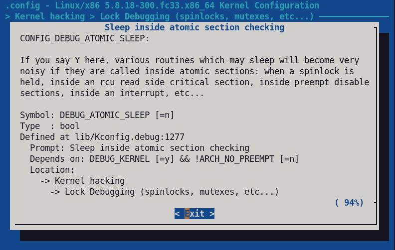

.. include:: <mmlalias.txt>

Process vs.Atomic Context (Slideshow)
=====================================

.. contents::
   :local:

Process Context
---------------

**Process context**: everything that can be identified by a *process ID*

* Processes (and threads) that execute in user mode |longrightarrow|
  process address space
* Processes (and threads) that execute in kernel mode |longrightarrow|
  kernel address space
* Kernel threads |longrightarrow| kernel address space

**Preemption** ...

* Process context is subject to *scheduling*
* Fair scheduling: *preemption* at end of time slice (or after
  voluntary sleep)
* Realtime: *preemption* when higher priority process/thread is
  runnable

Race Conditions
---------------

**When do race conditions occur?**

* Two processes/threads share the same address space
* Manipulate the same data structure

**In kernel address space?**

* Userspace processes executing a system call ("switch to kernel
  mode")
* Kernel threads

**Protection through locking**

* Mutexes: locker has to *wait* until unlocked
* Spinlocks: locker *loops* until unlocked (on different CPU
  obviously)

  * *Atomic context*

Atomic Context
--------------

**Atomic context is where code must not sleep!**

* Interrupt service routine

  * Interrupts disabled
  * No preemption, no scheduling, no nothing
  * |longrightarrow| primary source of latency

* *Bottom half* - code that runs in interrupt context (not subject to
  scheduling), but interrupts are already enabled

  * Deferred work |longrightarrow| "tasklet", "soft-IRQ"
  * Best avoided because not easily controllable, realtime-wise

* All code that holds a *spinlock*

Atomic vs. Process Context
--------------------------

**Atomic context** must not sleep

* Preemption disabled |longrightarrow| prioritization impossible
* High latency if atomic code runs for too long
* Severe restrictions

  * Paging
  * Locking is difficult
  * ...

**Process context** ...

* Subject to scheduling |longrightarrow| easily prioritized (be it
  realtime or not)
* Easy locking

**Conclusion**

* Atomic context best avoided
* ... at least when absolute control is desired

"Sleep While Atomic" Debugging
------------------------------

|longrightarrow| ``CONFIG_DEBUG_ATOMIC_SLEEP``

