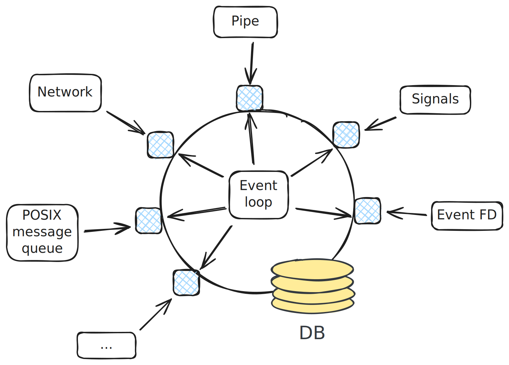

.. ot-group:: sysprog.eventloop

Event Driven Programming
========================

In this section we will develop a semi-realistic application that sits
upon a "database". The application receives input and commands from
multiple data sources - *and it is single threaded*.

Based upon our knowledge of :doc:`file descriptors <../file-io/index>`
("everything is a file"), we learn how to use advanced *I/O
multiplexing* system calls to dispatch *events* from multiple sources
inside an application that is highly reactive.

.. toctree::
   :maxdepth: 1

   problem/index
   poll/index
   poll-cpp/index
   exercise-graceful-termination/index
   exercise-commit-rollback/index

.. Exercises
.. ---------
.. 
.. .. toctree::
..    :maxdepth: 1
..
..    exercise-async-sig-to-self-pipe
..    exercise-self-pipe-to-eventloop mit stdin und pipe
..    exercise-self-pipe-to-signalfd als abkuerzung
