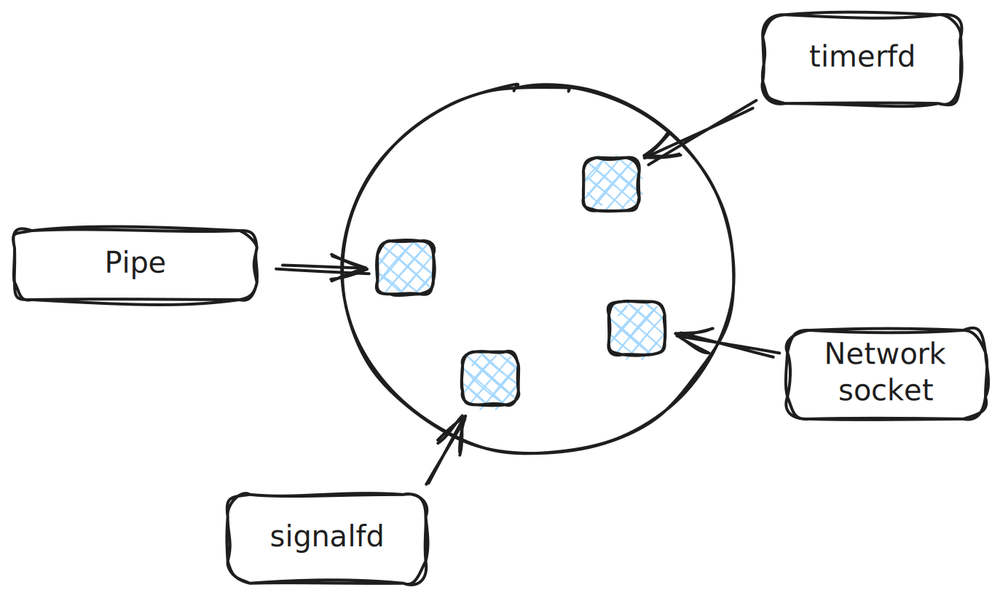

.. include:: <mmlalias.txt>

Introduction
============

* Refer to pictures in
  :doc:`/trainings/material/soup/linux/basics/io-redirection-pipes/pipes`
  and
  :doc:`/trainings/material/soup/linux/sysprog/process/unnamed-pipe-ipc/index`

.. image:: simple-pipe.svg
   :scale: 40%

* Scenario

  * Database inserts from stdin ``(svnr, firstname, lastname)``, some
    c++ trickery to split. ``auto [svrn, firstname, lastname] =
    read_record();``
  * ``SIGUSR1``: ``commit+log+debug`` request asynchronously (by the
    auditor?)
  * ``SIGUSR2``: 

* Start with ``read_record(STDIN_FILENO)``, and wonder how to react on
  signals 

  * :doc:`/trainings/material/soup/linux/sysprog/signals/intro/index`
  * :ref:`sysprog-signals-async-signal-safe`
  * :doc:`/trainings/material/soup/linux/sysprog/signals/async-self-pipe/index`

 and check on ``EINTR``?
