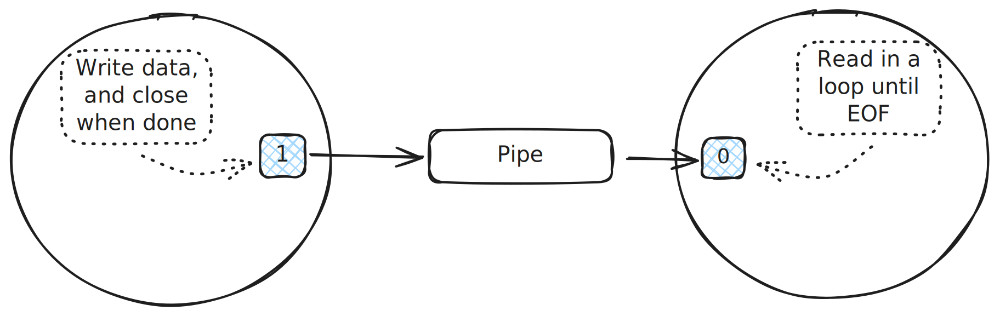
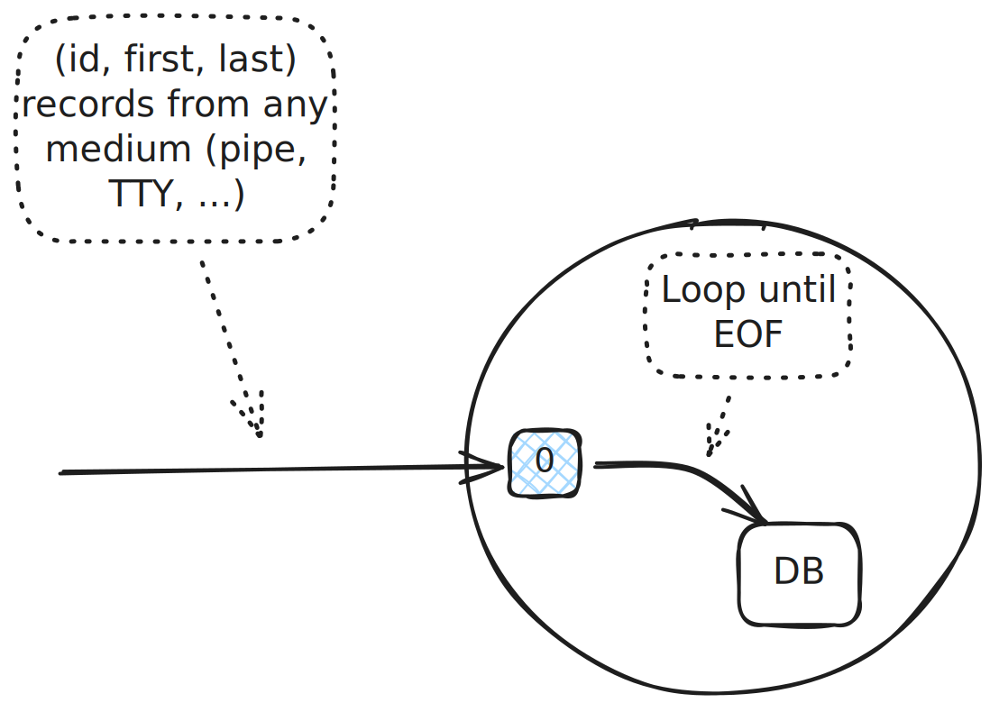

.. include:: <mmlalias.txt>

The Problem
===========

Simplest Case: One Source
-------------------------

.. topic:: See also

   * :doc:`/trainings/material/soup/linux/basics/io-redirection-pipes/pipes`
   * :doc:`/trainings/material/soup/linux/sysprog/process/unnamed-pipe-ipc/index`

.. topic:: Trainer's note

   Show three-stage pipe picture from
   :doc:`/trainings/material/soup/linux/basics/io-redirection-pipes/pipes`

* Read from file descriptor until end-of-file (see :ref:`here
  <sysprog-fileio-eof>`)
* Terminate
* File descriptor might refer to anything that lets me read from it

  * Pipe
  * TTY
  * Socket
  * Signal-FD (see
    :doc:`/trainings/material/soup/linux/sysprog/signals/signalfd/index`)
  * ... many more ...

Pipe, TTY, ...
--------------

.. code-block:: console

   $ cat /etc/passwd|grep jfasch
   jfasch:x:1000:1000:Joerg Faschingbauer:/home/jfasch:/bin/bash

.. code-block:: console

   $ grep jfasch
   pattern not on this line
   pattern (jfasch) on this line
   pattern (jfasch) on this line
   ^D

.. image:: simple-tty.svg
   :scale: 40%

A "Real Life" Example
---------------------

.. topic:: Trainer's note

   Copy program below as a start.

* Read records ``(id, firstname, lastname)`` from standard input
* Insert into database
* On EOF, commit and terminate

A "Real Life" Example: Code
---------------------------

.. literalinclude:: code/db-simple.cpp
   :language: c++
   :caption: :download:`code/db-simple.cpp`

.. literalinclude:: /trainings/material/soup/linux/sysprog/eventloop/code/database.h
   :language: c++
   :caption: :download:`/trainings/material/soup/linux/sysprog/eventloop/code/database.h`

And Multiple Sources?
---------------------

* Performing I/O on just one file descriptor at a time is fine
* How would we use *two* input sources?
* Two loops, each with a blocking read in the middle?
* Multithreading (see :doc:`here
  </trainings/material/soup/linux/sysprog/posix-threads/index>`) is
  not an option

  * Thread safety of business code (``Database``) is not always clear
  * Usually programmers don't quite understand the nature of race
    conditions (see :doc:`here
    </trainings/material/soup/linux/sysprog/posix-threads/030-exercise-pthcreate-race-condition/topic>`
    for the mother of all race conditions - *load-modify-store
    conflict*)

* Non-blocking I/O?

  * Set file descriptors to non-blocking
  * In a tight loop, see if any of them has data available
  * |longrightarrow| *No!*

.. _sysprog-eventloop-intro-problem:

The Problem
-----------

* Two file descriptors (``STDIN_FILENO`` and a UDP socket)
* ... and only one loop

.. topic:: Trainer's note

   Temporarily replace ``STDIN_FILENO`` with ``sock``, just to
   demonstrate that it's an either/or decision. *Cannot block on two
   file descriptors at once.*

.. literalinclude:: code/db-udp-incomplete.cpp
   :language: c++
   :caption: :download:`code/db-udp-incomplete.cpp`

Spoiler: The Solution
---------------------

.. topic:: Trainer's note

   Continue with :doc:`poll() <../poll/index>`

* If I knew which of the input sources has data ...
* ... then I could do I/O on it without blocking
