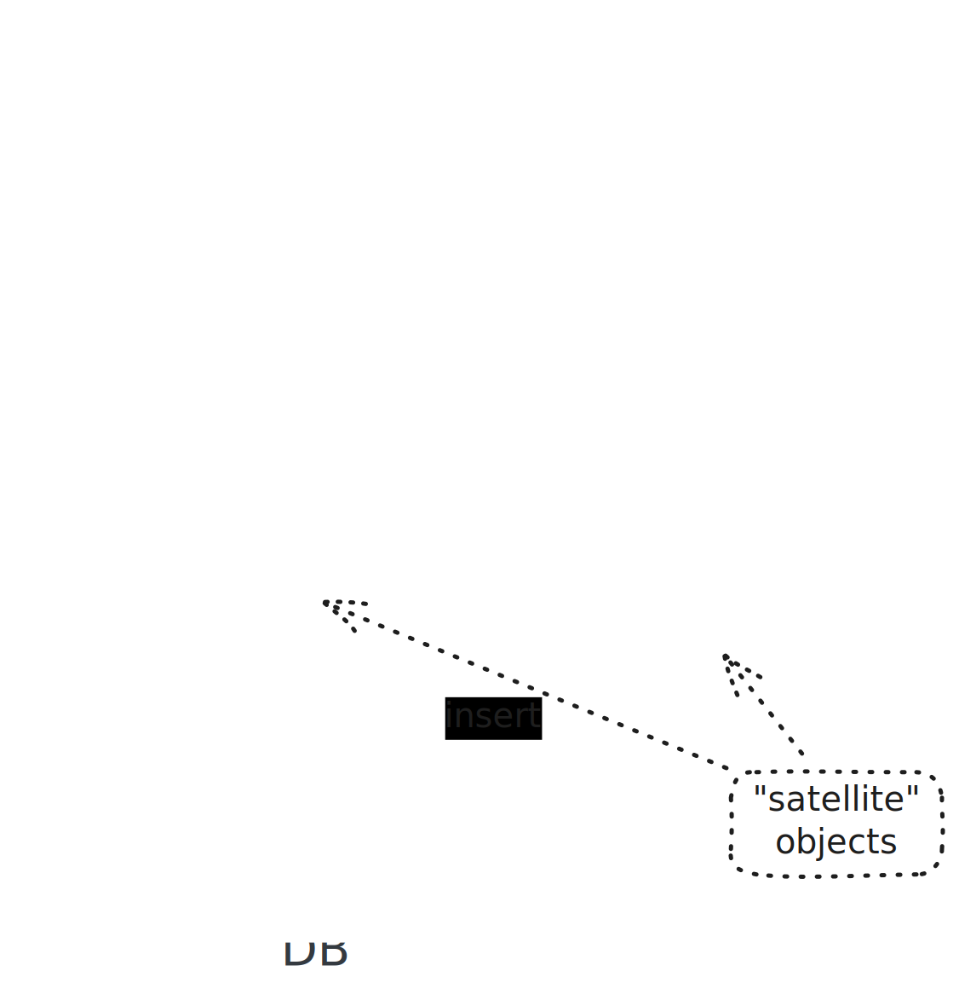

.. ot-topic:: sysprog.eventloop.poll_cpp
   :dependencies: sysprog.eventloop.poll

.. include:: <mmlalias.txt>

A Naive C++ Eventloop (``poll()``)
==================================

.. topic:: Remark: this is not a C++ course

   To fight code complexity, we are now switching to C++. We'll use
   conservative old-style C++ though, in a way that should still be
   comprehensible to those who are not so fluent in that language.

   Modern C++ would probably offer functional constructs (:doc:`here
   </trainings/material/soup/cxx/cxx11/bind-function/020-function/topic>`)
   for the loop registration, and lambdas (:doc:`here
   </trainings/material/soup/cxx/cxx11/lambda/index>`) to implement
   the satellite callbacks.

.. topic:: Other event loop implementations

   The event loop implementation that is being worked out in this
   section has educational value only - *is not meant to be used
   productively*. Once the concept of event loops, and the impact of
   using such a thing is understood, you can choose among a number of
   implementations out there. Here I list only some, all of which are
   "object oriented" in one way or the other although they might be
   implemented in C.

   * ``sd-event`` - the ``libsystemd`` event loop: `freedesktop.org
     documentation
     <https://0pointer.net/blog/introducing-sd-event.html>`__,
     `Lennart Poettering: "The Event Loop API of libsystemd"
     <https://0pointer.net/blog/introducing-sd-event.html>`__
   * `Gtk/GLib event loop
     <https://docs.gtk.org/glib/main-loop.html>`__
   * `Qt event loop <https://doc.qt.io/qt-6/qeventloop.html>`__
   * `libevent <https://libevent.org/>`__
   * `Boost.Asio
     <https://www.boost.org/doc/libs/latest/doc/html/boost_asio.html>`__

Readability, And OO
-------------------

.. topic:: See also

   * :doc:`/trainings/material/soup/linux/sysprog/signals/signalfd/index`

* In :ref:`sysprog-eventloop-poll-solution`, we react on two different
  file descriptors in two different ways
* *Two* is one representation of *many*
* |longrightarrow| Complication ahead; for example ...

  * ``signalfd()``: handle ``SIGTERM`` and ``SIGINT`` to terminate
    gracefully
  * ``signalfd()``: use ``SIGUSR1`` to commit database
  * ``signalfd()``: use ``SIGUSR2`` to rollback database
  * Timers using ``timerfd_create()``
  * More network I/O
  * ...

Eventloop, And Associated Types
-------------------------------

.. plantuml::
       
   @startuml
   
   interface InputHandler {
     + EventAction ready()
   }

   class Eventloop {
     + register_input(fd, handler)
     + run()
   }

   Eventloop -right-> InputHandler

   InputHandler <|.. UDPToDatabase 
   InputHandler <|.. StdinToDatabase
   
   @enduml

* ``Eventloop``: central "loop" object

  * Replacement for ``while`` loop in
    :ref:`sysprog-eventloop-poll-solution`
  * Uses ``poll()`` to watch registered file descriptors
  * Calls back associated ``InputHandler`` objects when it detects
    input (``POLLIN``) readiness (see
    :ref:`sysprog-eventloop-poll-events`)

* ``InputHandler``: handle input detected on a file descriptor

  * Polymorphic type: abstract base class, an *interface*
  * Usually reads from its file descriptor, and does something with
    the data

Re-Designing The Database Application
-------------------------------------

.. topic:: See also

   * :ref:`sysprog-eventloop-poll-solution`

* With the building blocks outlined above, redesign our :ref:`database
  application <sysprog-eventloop-poll-solution>`
* |longrightarrow| Abstraction is cool
* |longrightarrow| Do not need to know *everything*

Re-Writing The Database Application
-----------------------------------

* Externalize building blocks from the diagram into separate files
  (see :ref:`sysprog-eventloop-poll-building-blocks`)
* Functionality is equivalent to the spaghetti implementation
* See :ref:`here <sysprog-poll-db-testing>` for the test protocol

.. literalinclude:: code/main.cpp
   :language: c++
   :caption: :download:`code/main.cpp`

.. _sysprog-eventloop-poll-building-blocks:

Building Blocks In Detail
-------------------------

.. toctree::
   :hidden:

   eventloop-code
   udp-db-code
   stdin-db-code
   database-code

.. list-table::
   :align: left

   * * Types
     * Download
     * View
   * * ``Eventloop`` and ``InputHandler``
     * * :download:`eventloop.h <code/eventloop.h>`
       * :download:`eventloop.cpp <code/eventloop.cpp>`
     * :doc:`eventloop-code`
   * * ``UDPToDatabase``
     * * :download:`udp-db.h <code/udp-db.h>`
       * :download:`udp-db.cpp <code/udp-db.cpp>`
     * :doc:`udp-db-code`
   * * ``StdinToDatabase``
     * * :download:`stdin-db.h <code/stdin-db.h>`
       * :download:`stdin-db.cpp <code/stdin-db.cpp>`
     * :doc:`stdin-db-code`
   * * ``Database`` (unmodified)
     * * :download:`database.h <../code/database.h>`
       * :download:`database.cpp <../code/database.cpp>`
     * :doc:`database-code`

