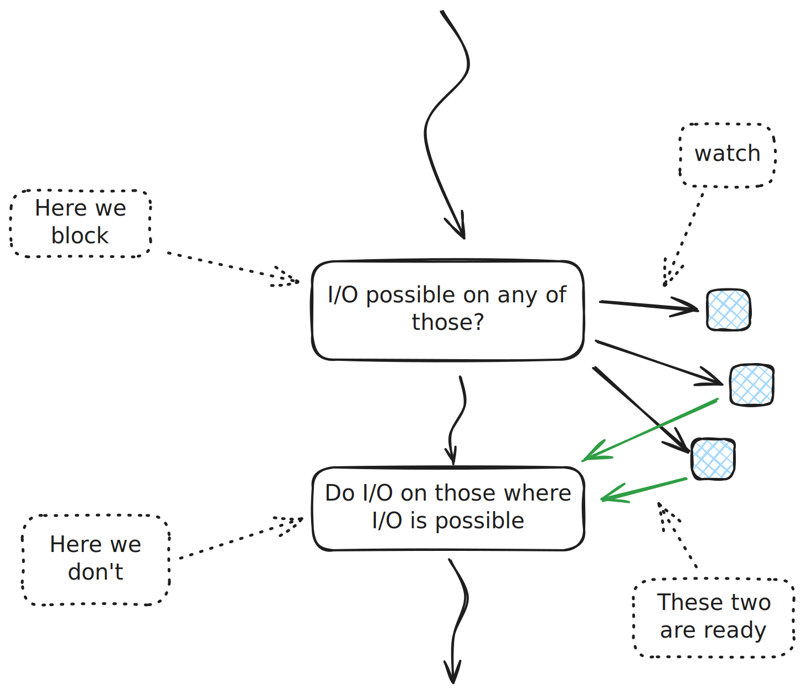

.. ot-topic:: sysprog.eventloop.poll
   :dependencies: sysprog.eventloop.problem

.. include:: <mmlalias.txt>

I/O Multiplexing
================

.. topic:: Trainer's note

   Continue with the code that we left :ref:`in the introduction
   <sysprog-eventloop-intro-problem>`

The Paradigm
------------

* Watch multiple file descriptors

  * Input
  * Output
  * Exceptional conditions

* *Block* until at least one of these conditions is true - e.g. data
  can be read from a socket *without blocking*
* Perform the desired action (read from socket)

Enter ``poll()``
----------------

.. topic:: Documentation

   * `man -s 2 poll
     <https://man7.org/linux/man-pages/man2/poll.2.html>`__

.. code-block:: console

   #include <poll.h>
   struct pollfd {
       int   fd;         /* file descriptor */
       short events;     /* requested events */
       short revents;    /* returned events */
   };
   int poll(struct pollfd *fds, nfds_t nfds, int timeout);

* ``timeout`` in milliseconds (0 for "don't block", -1 for infinite)
* Original I/O multiplexing system call: ``select()`` (`man -s 2
  select <https://man7.org/linux/man-pages/man2/select.2.html>`__)
* ``poll()`` was added to POSIX later
* |longrightarrow| More resource (and developer) friendly

Possible Events
---------------

From `man -s 2 poll
<https://man7.org/linux/man-pages/man2/poll.2.html>`__ (reformatted
and condensed):

.. list-table:: 
   :align: left

   * * ``POLLIN`` 
     * There is data to read.
   * * ``POLLOUT``
     * Writing is now possible, though a write larger than the
       available space in a socket or pipe will still block (unless
       ``O_NONBLOCK`` is set).
   * * ``POLLPRI``
     * Some exceptional condition on the file descriptor, for example
       out-of-band data on a TCP socket (`man -s 7 tcp
       <https://man7.org/linux/man-pages/man7/tcp.7.html>`__).
   * * ``POLLRDHUP``
     * Stream socket peer closed connection, or shut down writing half
       of connection.
   * * ``POLLERR``
     * Error condition (``revents`` only). For example watching the
       write-end of a pipe for input.
   * * ``POLLHUP``
     * Hang up (``revents`` only).  Note that when reading from a
       channel such as a pipe or a stream socket, this event merely
       indicates that the peer closed its end of the channel.
       Subsequent reads from the channel will return 0 (end of file)
       only after all outstanding data in the channel has been
       consumed.
   * * ``POLLNVAL``
     * Invalid request: fd not open (``revents`` only).

Solution: Read From Two Input Sources
-------------------------------------

Continuing from :ref:`where we left <sysprog-eventloop-intro-problem>` ...

* Two input sources

  * Standard input
  * UDP socket

* Use ``poll()`` to wait for both (no ``timeout`` |longrightarrow| -1)
* Multiplex on return

.. literalinclude:: code/db-poll-solution.cpp
   :language: c++
   :caption: :download:`code/db-poll-solution.cpp`

Afterword
---------

* Of course this works for more than two sources
* Many possible kinds of events
* |longrightarrow| Code complexity ahead
* |longrightarrow| best to encapsulate (see :doc:`here
  <../poll-cpp/index>` for a naive C++ eventloop implementation)
