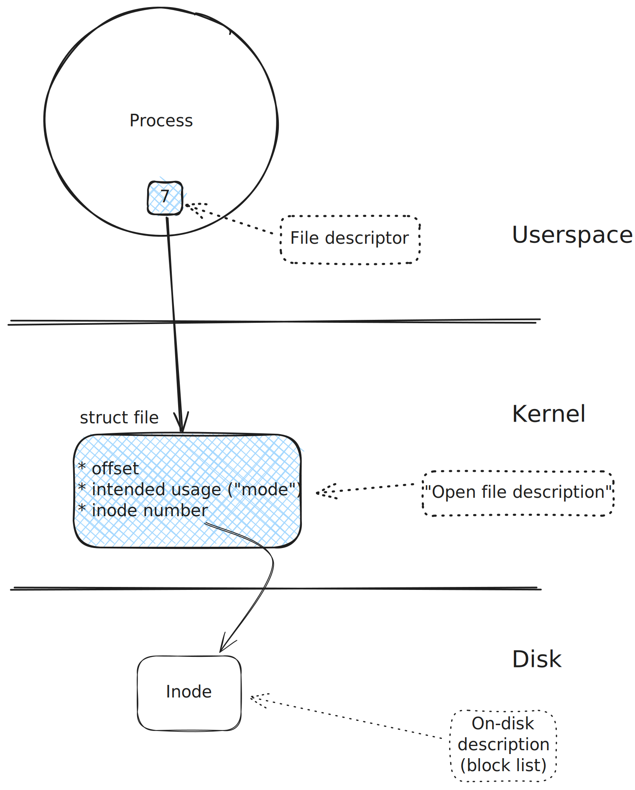

.. include:: <mmlalias.txt>

Duplicating (``dup()`` And Friends)
===================================

.. sidebar:: See also

   * :doc:`/trainings/material/soup/linux/basics/io-redirection-pipes/io-redirection`
   * :doc:`/trainings/material/soup/linux/sysprog/process/fork-basics/index`

.. sidebar:: Documentation

   * `man -s 2 dup
     <https://man7.org/linux/man-pages/man2/dup.2.html>`__

.. code-block:: c

   #include <unistd.h>

   int dup(int oldfd);
   int dup2(int oldfd, int newfd);
   int dup3(int oldfd, int newfd, int flags);

What's A File Descriptor Again?
-------------------------------

* A reference to in-kernel "open file description"
* Open file description contains all runtime information

Duplicating: Creating Another Reference
---------------------------------------

* Sometimes a second reference - a file descriptor - to an open file
  description is needed
* Example: :doc:`Shell output redirection
  </trainings/material/soup/linux/basics/io-redirection-pipes/io-redirection>`
* Operations on either file descriptor share the same underlying
  structure
* |longrightarrow| manipulate a shared offset

Here ``dup()`` is used to create a new reference to an existing open
file. ``dup()`` implicitly chooses the next free file descriptor
number - ``42`` in this case. (See :ref:`sysprog-filedesc-alloc`)

.. image:: dup.svg
   :scale: 40%

``dup()``: Program
------------------

* Create second reference using ``dup()``
* Append bytes to file via original file descriptor
* Inquire offset via dupped file descriptor

.. literalinclude:: code/dup.cpp
   :language: c++
   :caption: :download:`code/dup.cpp`

.. code-block:: console

   $ touch /tmp/somefile
   $ ./sysprog-dup-dup 
   offset: 11

Standard Output Redirection With ``dup()``
------------------------------------------

* ``println()`` (and many others) write to ``stdout`` (descriptor
  number 1)
* Want them to write to ``/tmp/somefile`` instead

Solution:

* Close ``stdout``
* Use ``dup()`` to select 1 as new file descriptor (see :ref:`here
  <sysprog-filedesc-alloc>` for why)

.. literalinclude:: code/stdout-redir.cpp
   :language: c++
   :caption: :download:`code/stdout-redir.cpp`

.. code-block:: console

   $ ./sysprog-dup-stdout-redir 
   $ cat /tmp/somefile 
   hah, this won't be seen on the terminal

Standardout Redirection With ``dup2()``
---------------------------------------

* ``dup()`` chooses *first free* file descriptor
* Fragile trickery needed when I insist in ``STDOUT_FILENO``
* |longrightarrow| ``dup2()`` lets me specify target number
* If target file descriptor is already occupied, ``dup2()`` releases
  (``close()``) it first

.. image:: dup2.svg
   :scale: 40%

.. literalinclude:: code/stdout-redir-dup2.cpp
   :language: c++
   :caption: :download:`code/stdout-redir-dup2.cpp`

.. code-block:: console

   $ ./sysprog-dup-stdout-redir-dup2 
   $ cat /tmp/somefile 
   hah, this won't be seen on the terminal

Shell IO Redirection And Pipes
------------------------------

.. sidebar:: See also

   * :doc:`/trainings/material/soup/linux/basics/io-redirection-pipes/io-redirection`
   * :doc:`/trainings/material/soup/linux/basics/io-redirection-pipes/io-redirection-swap-stdout-stderr`
   * :doc:`/trainings/material/soup/linux/basics/io-redirection-pipes/pipes`
   * :doc:`/trainings/material/soup/linux/sysprog/process/fork-basics/index`

* Together with :ref:`file descriptor inheritance
  <sysprog-process-filedesc-inher>`, ``dup()`` is at the heart of the
  shell's :doc:`redirection features
  </trainings/material/soup/linux/basics/io-redirection-pipes/index>`
* |longrightarrow| Very cool OS concepts!
