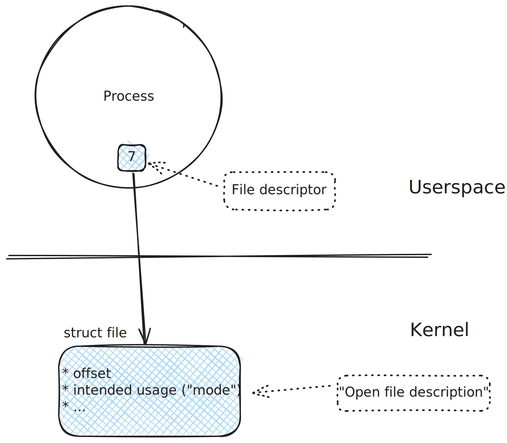

.. include:: <mmlalias.txt>

File Descriptors: Basics
========================

File Descriptors
----------------

.. jjj add link to eventfd, timerfd

* Universal *handle* for everything that's got to do with I/O. You'd
  be surprised what fits under the "I/O" hat (:doc:`signals
  </trainings/material/soup/linux/sysprog/signals/signalfd/index>`,
  for example)
* Not only files, but *any* kind of IO

  * Pipes
  * Sockets
  * FIFOs
  * Terminals
  * Device Special Files |longrightarrow| entry points into kernel
    space

* Type: ``int``

Standard Filedescriptors
------------------------

* File descriptors 0, 1, 2 are pre-allocated
* Refer to terminal ("console")

.. list-table::
   :align: left
   :widths: auto
   :header-rows: 1

   * * Number
     * POSIX Macro
     * ``stdio.h`` equivalent
   * * 0
     * ``STDIN_FILENO``
     * ``stdin``
   * * 1
     * ``STDOUT_FILENO``
     * ``stdout``
   * * 2
     * ``STDERR_FILENO``
     * ``stderr``

* Interactive shell: all three associated with terminal
* Standard input and output used for I/O redirection and pipes
* Standard error receives errors, warnings, and debug output

File Descriptor Lifecycle - ``open/read/write/close``
-----------------------------------------------------

.. sidebar:: Documentation

   * `man -s 2 open
     <https://man7.org/linux/man-pages/man2/openat.2.html>`__
   * `man -s 2 read
     <https://man7.org/linux/man-pages/man2/read.2.html>`__
   * `man -s 2 write
     <https://man7.org/linux/man-pages/man2/write.2.html>`__
   * `man -s 2 close
     <https://man7.org/linux/man-pages/man2/close.2.html>`__

* **Creation**: depends on type of medium

  * ``open()`` for files and similar (roughly: what has a name in the
    filesystem)
  * ``socket()`` for networking endpoints
  * ``pipe()`` creates a pipe |longrightarrow| *two* file descriptors
  * Many others with a more specialized background (e.g. `signalfd
    <https://man7.org/linux/man-pages/man2/signalfd.2.html>`__,
    `eventfd
    <https://man7.org/linux/man-pages/man2/eventfd.2.html>`__)

* **Usage**

  * ``read()`` and ``write()`` for typical IO scenarios
  * ``ioctl()`` for non-IO operations
  * ...

* **Cleanup**: ``close()`` must be called on all file descriptors to
  free in-kernel memory

.. _sysprog-filedesc-alloc:

How Descriptor Numbers Are Chosen
---------------------------------

