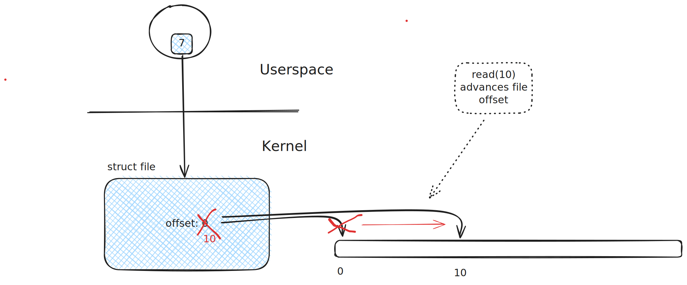

.. include:: <mmlalias.txt>

File Position/Offset (``lseek()``)
==================================

.. sidebar:: Documentation

   * `man -s 2 lseek64
     <https://man7.org/linux/man-pages/man2/lseek.2.html>`__

.. code-block:: c

   #include <sys/types.h>
   #include <unistd.h>

   off64_t lseek64(int fd, off64_t offset, int whence);

File Offset, And ``read()/write()``
-----------------------------------

* ``read()`` always reads from current file offset
* Offset is advanced as part of the read operation
* (Same with ``write()``)
* |longrightarrow| offset is part of the "open file description"
  (``struct file``) in kernel space

How ``lseek64()`` Works
-----------------------

* |longrightarrow| how to determine current offset, how to explicitly
  set offset?
* ``lseek()`` can only handle 32 bit offsets (historical baggage)
* |longrightarrow| ``lseek64()``
* Possible values for ``whence``

  .. list-table::
     :align: left
     :widths: auto
     :header-rows: 1
  
     * * Macro
       * Description
     * * ``SEEK_SET``
       * The file offset is set to ``offset`` bytes.
     * * ``SEEK_CUR``
       * The file offset is set to its current location plus ``offset``
         bytes.
     * * ``SEEK_END``
       * The file offset is set to the size of the file plus
         ``offset`` bytes.
  
Getting Current Offset
----------------------

* Use ``SEEK_CUR`` with ``offset`` 0 to get current position:
  ``lseek64(fd, 0, SEEK_CUR)``. ("Add 0 to current position, and
  return new position")
* The following program visualizes what's shown in the sketch above

.. literalinclude:: code/getpos.cpp
   :language: c++
   :caption: :download:`code/getpos.cpp`

.. code-block:: console

   $ ./sysprog-lseek-getpos
   initial offset: 0
   offset after 10 bytes read: 10

Setting File Offset
-------------------

* Use ``offset`` parameter, in combination with ``SEEK_SET``,
  ``SEEK_CUR`` and ``SEEK_END``
* The program below drops an ``'X'`` in position 2 of
  ``/tmp/somefile``

.. literalinclude:: code/setpos-write.cpp
   :language: c++
   :caption: :download:`code/setpos-write.cpp`

.. code-block:: console

   $ echo 012345 > /tmp/somefile
   $ ./sysprog-lseek-setpos-write 
   $ cat /tmp/somefile
   01X345
   
   
   

**Obscure feature**: *files with holes*

* positioning *beyond file size*
* write to that position
* |longrightarrow| *holes*, occupying no space
* ``read()`` across a hole give 0-bytes
