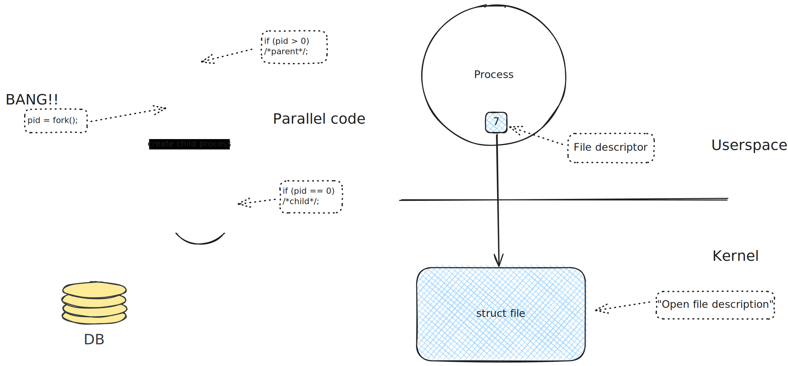

Linux Systems Programming
=========================

.. contents::
   :local:

Contents
--------

.. toctree::
   :maxdepth: 1

   syscalls-and-errors/index
   file-io/index
   process/index
   posix-threads/index
   scheduling/index
   sysprog_events/topic
   sysprog_ipc/topic
   sysprog_signals/topic
   mmap/index
   ipc-mqueue/topic

Miscellanous Live Demos (And Other Stuff)
-----------------------------------------

.. toctree::
   :maxdepth: 1

   intro-hw/index
   blocking-io/index

Building Blocks For Sketches
----------------------------

