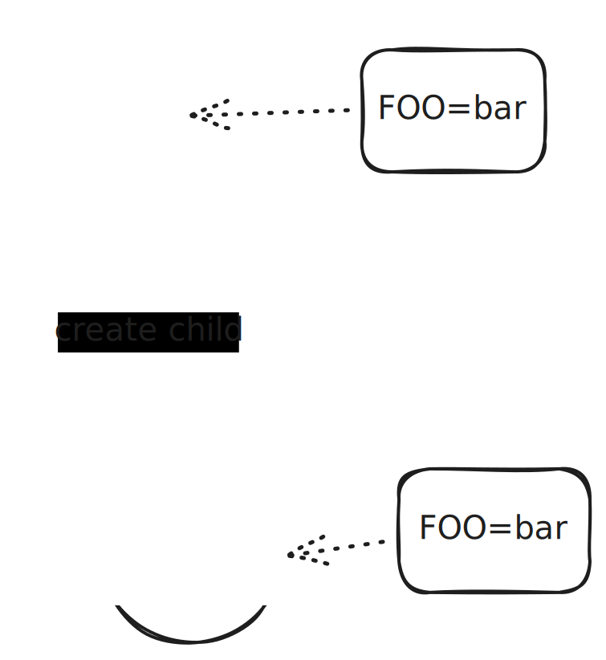

.. ot-topic:: sysprog.process.environ

.. include:: <mmlalias.txt>

Environment Variables
=====================

.. topic:: See also

   * :doc:`/trainings/material/soup/linux/basics/intro/process`
   * :doc:`/trainings/material/soup/linux/basics/intro/environment`

.. topic:: Documentation

   * `man -s 7 environ
     <https://man7.org/linux/man-pages/man7/environ.7.html>`__
   * `man -s 3 getenv
     <https://man7.org/linux/man-pages/man3/getenv.3.html>`__
   * `man -s 3 setenv
     <https://man7.org/linux/man-pages/man3/setenv.3.html>`__
   * `man -s 3 putenv
     <https://man7.org/linux/man-pages/man3/putenv.3.html>`__
   * `man -s 3 unsetenv
     <https://man7.org/linux/man-pages/man3/unsetenv.3.html>`__
   * `man -s 3 clearenv
     <https://man7.org/linux/man-pages/man3/clearenv.3.html>`__

Environment Variables
---------------------

* Environment variables are a *process attribute* (not related to any
  programming language)
* *Inherited* to child processes
* A process can use ``getenv()`` (`here
  <https://man7.org/linux/man-pages/man3/getenv.3.html>`__) to read
  its value

.. literalinclude:: code/environ.cpp
   :language: c++
   :caption: :download:`code/environ.cpp`

.. code-block:: console

   $ ./sysprog-process-environ 
   FOO is not set
   
.. code-block:: console

   $ export FOO=bar
   $ ./sysprog-process-environ 
   FOO=bar
