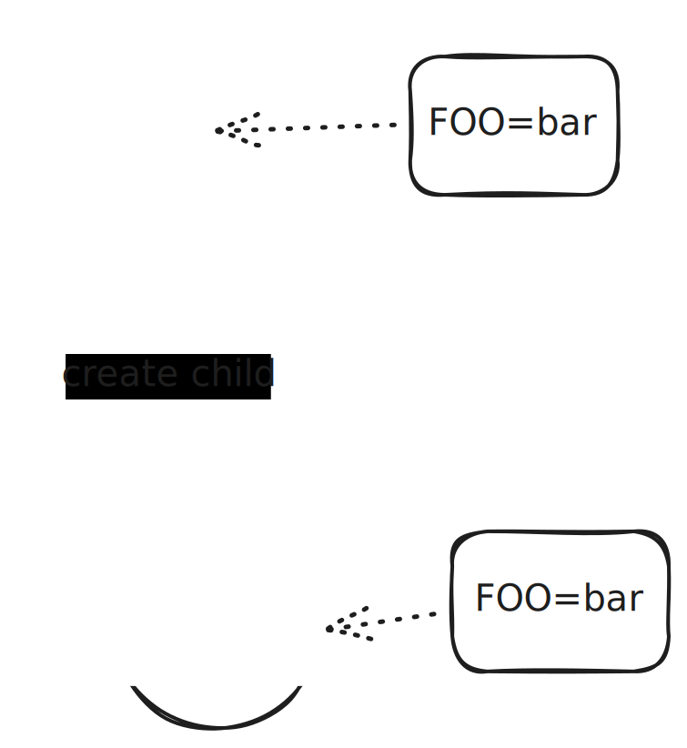

.. include:: <mmlalias.txt>

Process: Exit Status, Arguments, Environment
============================================

.. sidebar:: See also

   * :doc:`/trainings/material/soup/linux/basics/intro/process`
   * :doc:`/trainings/material/soup/c/050-pointers-and-arrays/050-command-line-arguments/topic`

The Shell: A Program Like Any Other Program
-------------------------------------------

* The shell is a program just like any other program (``/bin/bash``)
* Main purpose: start other programs, and report on their exit status

.. code-block:: console

   $ grep jfasch /etc/passwd
   jfasch:x:1000:1000:Joerg Faschingbauer:/home/jfasch:/bin/bash

* Search program ``grep`` along ``$PATH``
* Start it, passing it two arguments: ``jfasch``, ``/etc/passwd``
* Wait for it to terminate
* Examine its exit status

.. code-block:: console

   $ echo $?            # <--- $? ... exit status of last foreground process (huh?)
   0

The Shell: A Programming Language
---------------------------------

.. code-block:: console

   $ if grep jfasch /etc/passwd; then echo YAY; else echo NOPE; fi
   jfasch:x:1000:1000:Joerg Faschingbauer:/home/jfasch:/bin/bash
   YAY

* Exit status used as conditional for ``if`` (and ``while``)
* Functions, recursion, and whatnot
* |longrightarrow| Full programming language
* ... albeit a little weird

Exit Status
-----------

* An integer in the range 0-255
* In the simplest case, a ``return`` from the program's main function
  is its exit status
* Otherwise (exiting deeper in a process's call chain), see `man -s 3
  exit <https://man7.org/linux/man-pages/man3/exit.3.html>`__

Exit Status: ``0`` is "OK"
--------------------------

.. literalinclude:: code/exit-ok.cpp
   :language: c++
   :caption: :download:`code/exit-ok.cpp`

* In the sunny case, an exit status of *zero* is returned.
* The truth value of *zero* is ``true``, paradoxically. This makes
  sense though: *there is only one* sunny case, but many opportunities
  to get into trouble.

.. code-block:: console

   $ ./exit-ok 
   $ echo $?
   0

* Or, programmatically ...

.. code-block:: console

   $ if ./exit-ok; then echo YAY; else echo NOPE; fi
   YAY

Exit Status: ``!= 0`` is "Not OK"
---------------------------------

.. literalinclude:: code/exit-nok.cpp
   :language: c++
   :caption: :download:`code/exit-nok.cpp`

* In any error case, an exit status of *non-zero* is returned.
* The truth value of *non-zero* is ``false``. Again, this makes sense
  because there are possibly many things why a program might fail.

.. code-block:: console

   $ ./exit-nok 
   $ echo $?
   42

* Or, programmatically ...

.. code-block:: console

   $ if ./exit-nok; then echo YAY; else echo NOPE; fi
   NOPE

Argument Vector (``int argc, char** argv``)
-------------------------------------------

* Passing parameters to programs
* ``argc``: number of arguments
* ``argv``: string array - the "argument vector"
* ``argv[0]``: how the command was invoked (unused, mostly)

.. image:: argv.dia
   :scale: 40%

.. literalinclude:: code/argv.cpp
   :language: c++
   :caption: :download:`code/argv.cpp`

.. code-block:: console

   $ ./argv
   argc: 1
   argv[0]: ./argv
   
.. code-block:: console

   $ ./argv hello sweetheart
   argc: 3
   argv[0]: ./argv
   argv[1]: hello
   argv[2]: sweetheart

Environment Variables
---------------------

.. sidebar:: See also

   * :doc:`/trainings/material/soup/linux/basics/intro/environment`

.. sidebar:: Documentation

   * `man -s 7 environ
     <https://man7.org/linux/man-pages/man7/environ.7.html>`__
   * `man -s 3 getenv
     <https://man7.org/linux/man-pages/man3/getenv.3.html>`__
   * `man -s 3 setenv
     <https://man7.org/linux/man-pages/man3/setenv.3.html>`__
   * `man -s 3 putenv
     <https://man7.org/linux/man-pages/man3/putenv.3.html>`__
   * `man -s 3 unsetenv
     <https://man7.org/linux/man-pages/man3/unsetenv.3.html>`__
   * `man -s 3 clearenv
     <https://man7.org/linux/man-pages/man3/clearenv.3.html>`__

* Environment variables are a *process attribute* (not related to any
  programming language)
* *Inherited* to child processes
* A process can use ``getenv()`` (`here
  <https://man7.org/linux/man-pages/man3/getenv.3.html>`__) to read
  its value

.. literalinclude:: code/environ.cpp
   :language: c++
   :caption: :download:`code/environ.cpp`

.. code-block:: console

   $ ./sysprog-process-environ 
   FOO is not set
   
.. code-block:: console

   $ export FOO=bar
   $ ./sysprog-process-environ 
   FOO=bar
