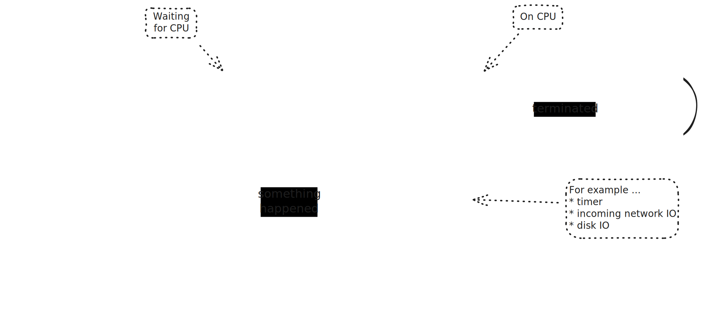
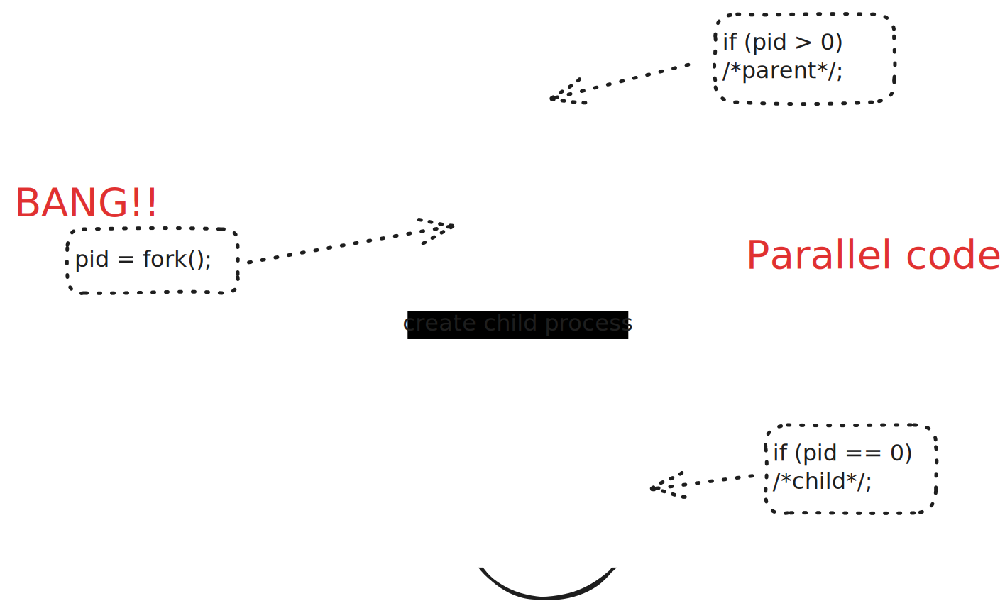
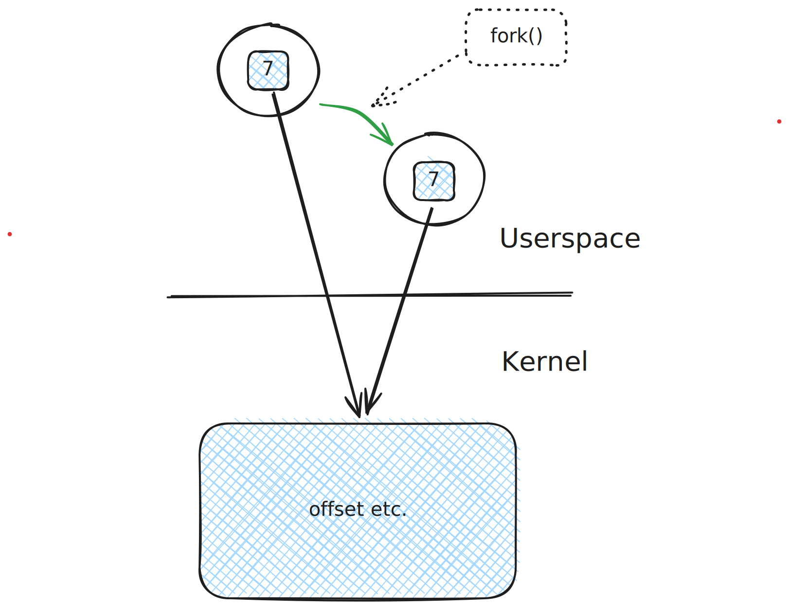

.. ot-topic:: sysprog.process.fork
   :dependencies: sysprog.process.tree

.. include:: <mmlalias.txt>

Basic Process Creation
======================

.. sidebar:: See also

   * :doc:`/trainings/material/soup/linux/sysprog/file-io/dup/index`

.. sidebar:: Documentation

   * `man -s 2 fork
     <https://man7.org/linux/man-pages/man2/fork.2.html>`__

Process States
--------------

* Many of the states reflect the process's runtime behavior: does it
  wait for something, or has it expired its timeslice, ...
* Much more complex than can be shown on a sketch
* |longrightarrow| Uninterruptible vs. interruptible sleep
* |longrightarrow| Various ways to terminate a process
* ...

Creative Weirdness: ``fork()``
------------------------------

.. sidebar:: Documentation

   * `man -s 2 fork
     <https://man7.org/linux/man-pages/man2/fork.2.html>`__

* Creates a child process
* Exact copy of the calling process
* On return - **returns twice** - both parent and child continue where
  they left off, **independently**

  * *Parent's return value*: PID of the newly created child process
  * *Child's return value*: 0 - can use ``getpid()`` if needed
    (:doc:`here <../tree/index>`)

(Live demo start ...)

.. literalinclude:: code/basic.cpp
   :language: c++
   :caption: :download:`code/basic.cpp`

``return`` From ``main()``, And ``exit()``
------------------------------------------

* ``main()`` is special (entry point from C startup/runtime)
* Return statement in ``main()`` is special

  * Terminates process
  * Return value is *exit status* of the process
  * **Only one byte**: 0-255

* Return from ``main()`` has the same effect as calling ``exit()``
  instead

.. literalinclude:: code/basic-exit.cpp
   :language: c++
   :caption: :download:`code/basic-exit.cpp`

Bugs Ahead: Code Flow Leakage
-----------------------------

* Attention ``fork()`` returns twice
* |longrightarrow| two code flow paths
* *Usually it is a good idea to keep them separate!*

.. literalinclude:: code/leak-code-flow.cpp
   :language: c++
   :caption: :download:`code/leak-code-flow.cpp`

.. _sysprog-process-filedesc-inher:

File Descriptors Are Inherited
------------------------------

.. sidebar:: See also

   * :doc:`/trainings/material/soup/linux/sysprog/file-io/dup/index`

* Parent opens a file
* Creates child process
* |longrightarrow| file descriptor is inherited
* Semantics just like ``dup()`` (see :doc:`here
  </trainings/material/soup/linux/sysprog/file-io/dup/index>`

.. literalinclude:: code/fd-inher.cpp
   :language: c++
   :caption: :download:`code/fd-inher.cpp`

.. code-block:: console

   $ echo abc > /tmp/somefile 
   $ ./sysprog-fork-fd-inher 
   parent pid = 267811, child pid = 267812
   parent has read one byte: a/0x61
   child has read one byte: b/0x62

Care For Your Children - *Waiting*
----------------------------------

.. sidebar:: Documentation

   * `man -s 2 wait
     <https://man7.org/linux/man-pages/man2/wait.2.html>`__

* Parents must care - *wait* - for their children
* If they don't, kids become zombies (see :ref:`below
  <sysprog-process-zombie>`)
* |longrightarrow| retrieve the child's termination status (see
  :ref:`below <sysprog-process-status>`)
* If child has not yet terminated, parent blocks in ``wait()``

.. literalinclude:: code/wait.cpp
   :language: c++
   :caption: :download:`code/wait.cpp`

Copy-On-Write Memory (COW)
--------------------------

* Parent and child run the same code |longrightarrow| share code
  memory pages
* They do so read-only (code cannot be written to)
* Question: how about data? Do they share data?
* Answer: No!
* Share data pages initially; copy is made at first write
* |longrightarrow| Copy On Write (COW)

.. literalinclude:: code/cow.cpp
   :language: c++
   :caption: :download:`code/cow.cpp`

.. _sysprog-process-status:

Waiting, And Exit Status
------------------------

* Now what about status?
* |longrightarrow| More information than just the exit value (7 in
  this case)
* Exit status: ``WIFEXITED()``, ``WEXITSTATUS()``

.. literalinclude:: code/wait-status.cpp
   :language: c++
   :caption: :download:`code/wait-status.cpp`

More Exit Information
---------------------

More state changes than simple exit:

* Signaled, e.g.

  * ``SIGINT``: Ctrl-C from terminal
  * ``SIGTERM``: similar, but explicitly sent by another process
  * ``SIGSEGV``, ``SIGBUS``: software memory error (likely a pointer
    bug)
  * More, see `man -s 7 signal
    <https://man7.org/linux/man-pages/man7/signal.7.html>`__

* Stopped and continued

  * Have to use ``waitpid()`` (``wait()`` does not give that
    information)
  * ``SIGTSTP``: Ctrl-Z from terminal
  * ``SIGSTOP``: explicitly sent
  * ``SIGCONT``: request to continue

.. literalinclude:: code/wait-status-more-info.cpp
   :language: c++
   :caption: :download:`code/wait-status-more-info.cpp`

.. _sysprog-process-zombie:

Zombies: Consequences Of Not Caring For Children
------------------------------------------------

* Terminated process are still there - shown in ``ps`` as ``<defunct>``
* |longrightarrow| Carry information for parents
* "Zombie"
* "Reaped" by their parents when they call ``wait()``

.. sidebar:: Trainer's note

   * See how child pid still there ``ps -fl <CHILDPID>``
   * |longrightarrow| ``<defunct>``
   * Kill incompetent parent
   * |longrightarrow| Reparented (see below)

.. literalinclude:: code/zombie.cpp
   :language: c++
   :caption: :download:`code/zombie.cpp`

Orphanage (Parent's Death)
--------------------------

.. sidebar:: Trainer's note

   * The program will terminate immediately
   * Child keeps running, deteched from terminal
   * ``ps -fl <CHILDPID>`` |longrightarrow| A-ha, new parent

* Final question: what if a process's parent terminates? 
* Nobody can then reap the zombie!
* |longrightarrow| Parentless child is *reparented* to PID 1
  (according to good ol' UNIX)
* On modern Linux, one can set a dedicated reaper process (`man -s 2
  PR_SET_CHILD_SUBREAPER
  <https://man7.org/linux/man-pages/man2/PR_SET_CHILD_SUBREAPER.2const.html>`__)
* Normally the login session leader (``systemd --user``)

.. literalinclude:: code/reparenting.cpp
   :language: c++
   :caption: :download:`code/reparenting.cpp`
