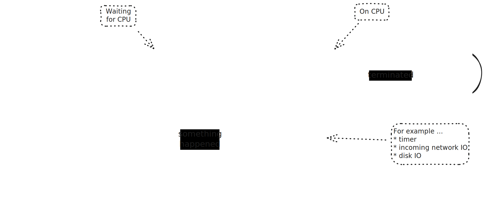

.. include:: <mmlalias.txt>

Basic Process Creation
======================

Process States
--------------

* Much more complex than can be shown on a paper sketch
* |longrightarrow| Uninterruptible vs. interruptible sleep
* |longrightarrow| Various way to terminate a process
* ...

Creative Weirdness
------------------

.. # basic fork: blah returns twice. warning about code flow; everything
.. # is possible.

.. literalinclude:: code/basic.cpp
   :language: c++
   :caption: :download:`code/basic.cpp`

Bugs Ahead: Code Leakage
------------------------

.. literalinclude:: code/leak-code-flow.cpp
   :language: c++
   :caption: :download:`code/leak-code-flow.cpp`

File Descriptors Are Inherited
------------------------------

* jjj see file IO chapter

.. # omit output in child. parent is sufficient to get hold of both pids.

.. # what if both read from the same fd? (e.g. STDIN_FILENO)
.. # * fd inheritance semantics
.. # * -> see dup, dup2
.. # * which one wakes up is UNDEFINED
.. 
.. # show 
.. # $ echo -n ab > /tmp/input-file
.. # $ ./sysprog-fork-stdin-inherited-undefined < /tmp/input-file 

.. literalinclude:: code/stdin-inherited-undefined.cpp
   :language: c++
   :caption: :download:`code/stdin-inherited-undefined.cpp`

Copy-On-Write Memory (COW)
--------------------------

.. # temporarily pull out one_byte into main() scope. what does that
.. # mean? do we share one_byte in two different processes?
.. 
.. # * short overview of COW (private memory)
.. # * -> see mmap, and shared memory in general
.. 
.. # SKETCH!!

Care For Your Children - *Waiting*
----------------------------------

.. # --- Caring for the kids: wait (and friends)
.. 
.. # let child wait for input on STDIN_FILENO, and parent do a wait on
.. # child

.. literalinclude:: code/wait.cpp
   :language: c++
   :caption: :download:`code/wait.cpp`

Waiting, And Exit Status
------------------------

.. # modify child "return 42 from mainP" to exit(42)
.. # * see what wait(&status) is
.. # * -> print bitmask
.. # * next step: use macros

.. literalinclude:: code/wait-status.cpp
   :language: c++
   :caption: :download:`code/wait-status.cpp`

More Exit Information: Why Exit? How Exit?
------------------------------------------

.. # modify wait() -> waitpid(-1 (or child pid), &status, WUNTRACED|WCONTINUED)
.. 
.. # * waitpid
.. 
.. #   * explicit pid (-1 for any)
.. #   * options
.. 
.. # * WIFSIGNALED
.. 
.. #   show
.. #   $ kill -TERM ...
.. #   $ kill -SEGV ...     (128 is true)
.. 
.. # * WIFSTOPPED
.. # * WIFCONTINUED
.. 
.. #   both in a loop:
.. #   $ kill -STOP ...
.. #   $ kill -CONT ...

.. literalinclude:: code/wait-status-alternatives.cpp
   :language: c++
   :caption: :download:`code/wait-status-alternatives.cpp`

.. # --- list of signals (from PDFs?)

Zombies: Consequences Of Not Caring For Children
------------------------------------------------

.. # let child terminate
.. # see how child pid still there in ps
.. # -> <defunct>
.. # kill incompetent parent
.. # -> reparented
.. # -> zombie reaped by new parent

.. literalinclude:: code/zombie.cpp
   :language: c++
   :caption: :download:`code/zombie.cpp`

Orphanage (Parent's Death)
--------------------------

.. # * until now we have taken care of child termination
.. # * what if parent terminates? child without parent? 
.. # * reparenting (c/v orphanage)
.. 
.. # * let parent process terminate
.. # * see how child is still alive
.. # * has been reparented to some systemd session manager (who is already responsible for many children)
.. 
.. # history -> pid 1
.. # nowadays (linux specific) -> child reaper
.. # https://man7.org/linux/man-pages/man2/PR_SET_CHILD_SUBREAPER.2const.html

.. literalinclude:: code/reparenting.cpp
   :language: c++
   :caption: :download:`code/reparenting.cpp`
