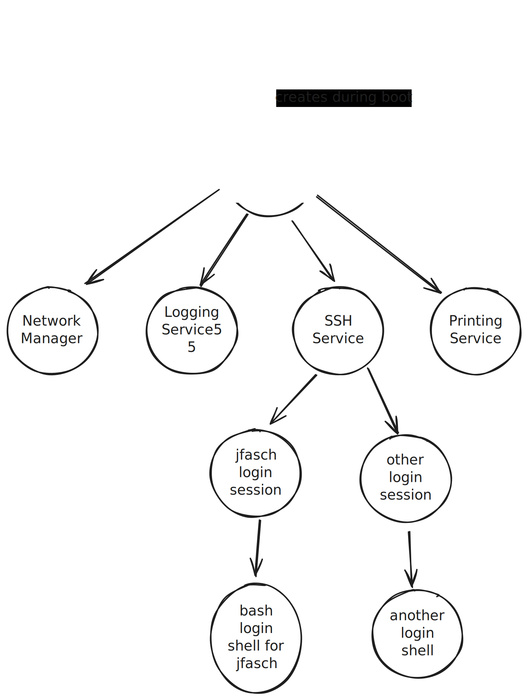

.. ot-topic:: sysprog.process.tree

.. include:: <mmlalias.txt>

The Process Tree
================

Process ID (PID) And Parent Process ID (PPID)
---------------------------------------------

.. topic:: See also

   * :doc:`/trainings/material/soup/linux/basics/intro/process-tree`

* Every process has an ID (PID ... Process ID)
* Every process but the first (PID 1) has a parent process
* |longrightarrow| process tree

A typical distro's process tree (simplified)

* ``init`` (PID 1): created by kernel |longrightarrow| no parent
* Nowadays mostly ``systemd``
* "Service manager"
* User login sessions (console, graphical, network ...)

   A typical distro's process tree

System Calls: ``getpid()``, ``getppid()``
-----------------------------------------

Technically ...

* A process can ask the kernel about its parent process
* A process *cannot ask* the kernel about its children
  |longrightarrow| has to take care itself

.. topic:: Documentation

   * `man -s 2 getpid
     <https://man7.org/linux/man-pages/man2/getpid.2.html>`__
   * `man -s 2 getppid
     <https://man7.org/linux/man-pages/man2/getpid.2.html>`__

.. literalinclude:: code/tree.cpp
   :language: c++
   :caption: :download:`code/tree.cpp`

.. code-block:: console

   $ echo $$                                           # <-- PID of the shell itself
   33634
   $ ./code/sysprog-process-tree 
   PID: 115971
   PPID: 33634
