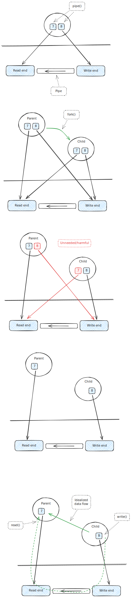

.. include:: <mmlalias.txt>

Case Study: IPC (Parent/Child) Over Unnamed Pipe
================================================

Pipe Creation
-------------

.. literalinclude:: code/creation.cpp
   :language: c++
   :caption: :download:`code/creation.cpp`

Child Creation
--------------

.. literalinclude:: code/fork.cpp
   :language: c++
   :caption: :download:`code/fork.cpp`

Close Unneeded Ends
-------------------

.. literalinclude:: code/close-unneeded.cpp
   :language: c++
   :caption: :download:`code/close-unneeded.cpp`

Data Flow (Infinite)
--------------------

.. literalinclude:: code/flow-infinite.cpp
   :language: c++
   :caption: :download:`code/flow-infinite.cpp`

XXX
---

* What if parent hadn't closed write end?
* See what happens when child closes after, say, 7 writes
* -> parent does not notice
