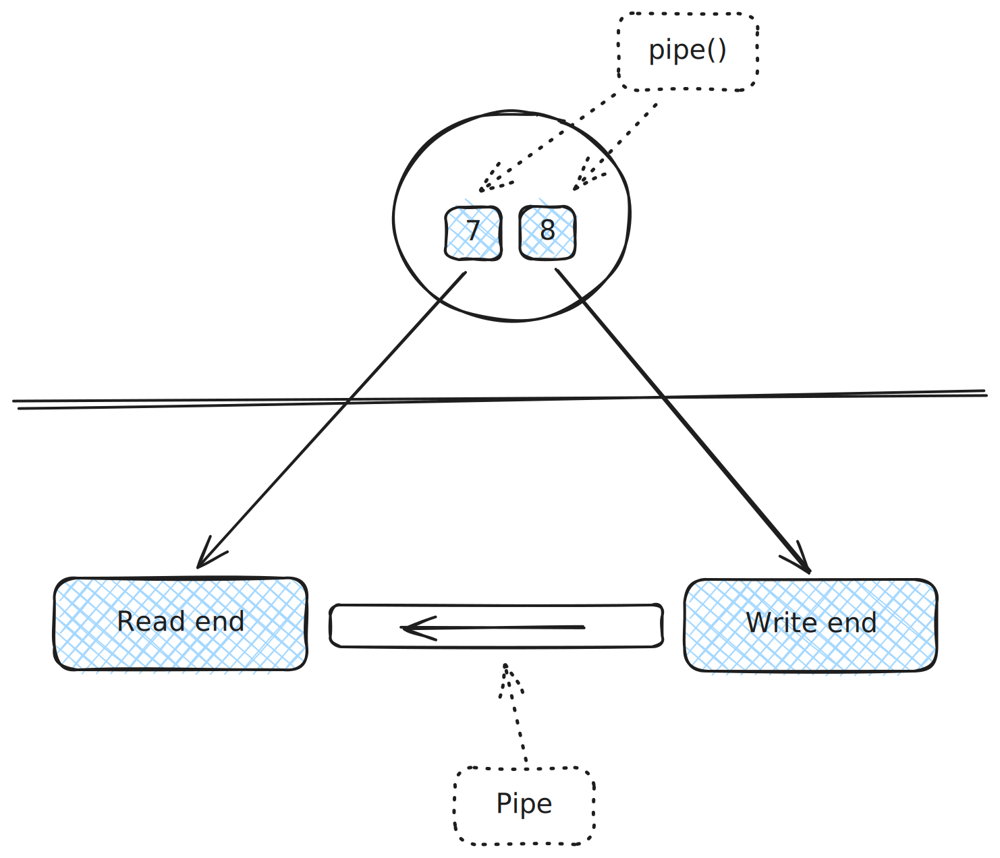
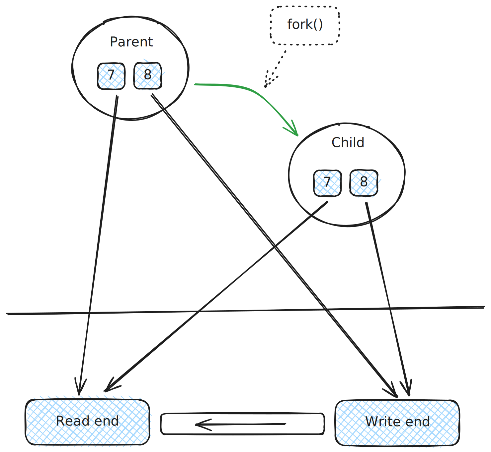
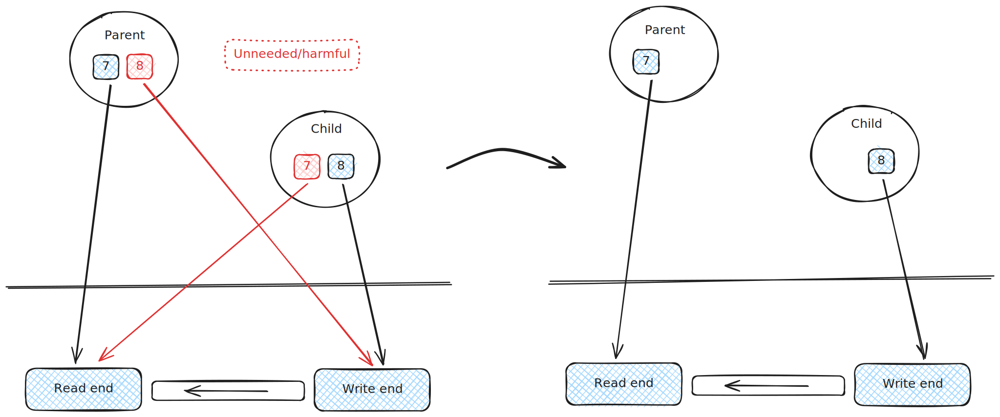
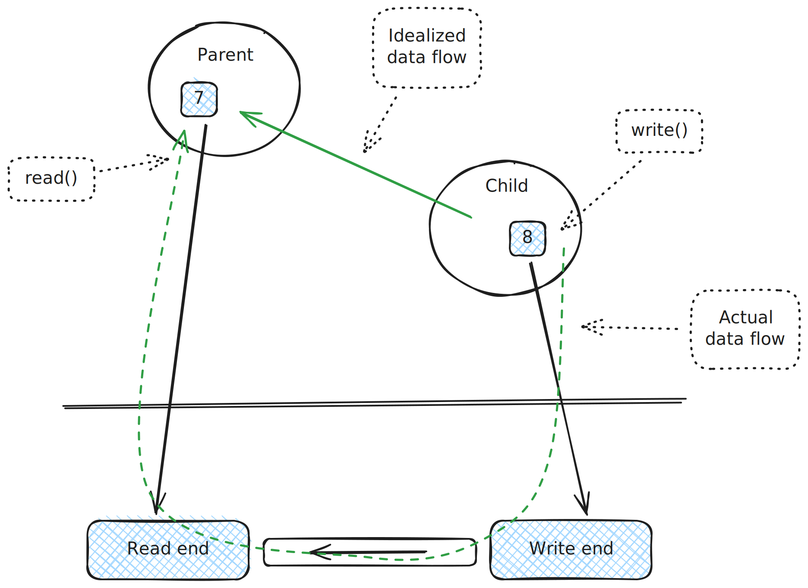
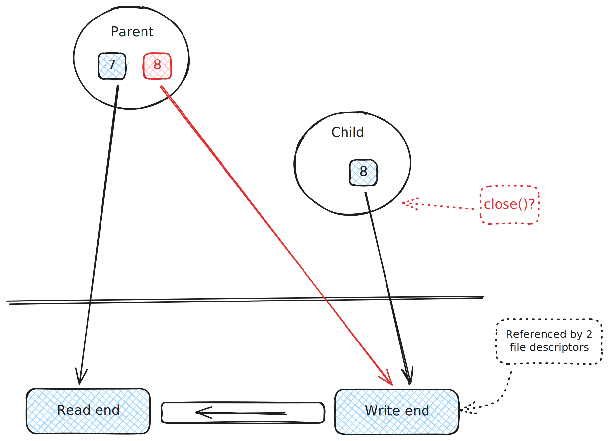

.. ot-topic:: sysprog.process.unnamed_pipe_ipc
   :dependencies: sysprog.process.fork, sysprog.fileio.dup

.. include:: <mmlalias.txt>

Case Study: IPC (Parent/Child) Over Unnamed Pipe
================================================

Pipe Creation
-------------

.. sidebar:: Documentation

   * Overview: `man -s 7 pipe
     <https://man7.org/linux/man-pages/man7/pipe.7.html>`__
   * System call: `man -s 2 pipe
     <https://man7.org/linux/man-pages/man2/pipe.2.html>`__

**Pipe**

* Buffer of limited capacity
* Unidirectional communication channel
* Two ends: *read* and *write*
* |longrightarrow| described by file descriptors (``read_end`` and
  ``write_end`` in the remainder code)

.. literalinclude:: code/creation.cpp
   :language: c++
   :caption: :download:`code/creation.cpp`

Child Creation
--------------

.. sidebar:: See also

   * :doc:`../fork-basics/index`
   * Especially: :ref:`sysprog-process-filedesc-inher`

* Process has two file descriptors
* At ``fork()``, these are inherited by the child

.. literalinclude:: code/fork.cpp
   :language: c++
   :caption: :download:`code/fork.cpp`

Close Unneeded Ends
-------------------

* In our program, communication direction will be *from child to
  parent*
* |longrightarrow| Parent only reads, child only writes
* Unneeded file descriptors; parent closes ``write_end``, child closes
  ``read_end``

.. literalinclude:: code/close-unneeded.cpp
   :language: c++
   :caption: :download:`code/close-unneeded.cpp`

Implementing Infinite Data Flow
-------------------------------

* Child infinitely writes into the pipe's ``write_end``
* Parent infinitely reads from ``read_end``

.. literalinclude:: code/flow-infinite.cpp
   :language: c++
   :caption: :download:`code/flow-infinite.cpp`

Finite Data Flow
----------------

* Child only produces, say, 5 items
* How to notify parent, over the pipe, that no data will come anymore?
* |longrightarrow| Child closes ``write_end``
* |longrightarrow| Parent then sees an *end-of-file* condition
  (``read()`` returns 0)

.. note::

   Technically, the child does not need to close ``write_end``. This
   is done by the system, implicitly, when the child calls ``exit()``.

.. image:: flow-finite.svg
   :scale: 40%

.. literalinclude:: code/flow-finite.cpp
   :language: c++
   :caption: :download:`code/flow-finite.cpp`

Unneeded |longrightarrow| Harmful!
----------------------------------

**Yes, closing unneeded file descriptors is mandatory!**

* What if parent hadn't closed its write-end file descriptor?
* |longrightarrow| Pipe's write-end is referenced twice: once from
  parent and once from child
* |longrightarrow| When child closes its ``write_end``, the pipe's
  in-kernel write-end is still referenced by the parent
* |longrightarrow| Pipe is not shutdown

.. literalinclude:: code/flow-harmful.cpp
   :language: c++
   :caption: :download:`code/flow-harmful.cpp`

What If Receiver (Parent) Terminates?
-------------------------------------

* A process that writes to a pipe (or a socket, for that matter) whose
  receiver end is closed is delivered a ``SIGPIPE``
* |longrightarrow| Default action: *terminate*

This means that the child will terminate at its next ``write()``
operation.
