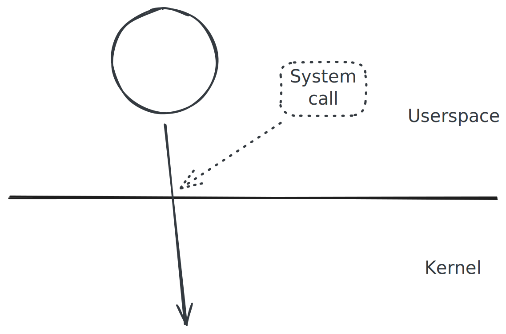

.. ot-topic:: sysprog.syscalls.overview

.. include:: <mmlalias.txt>

System Calls: Overview
======================

.. topic:: Documentation

   * Big Picture: `man -s 2 intro
     <https://man7.org/linux/man-pages/man2/intro.2.html>`__
   * Syscall overview page: `man -s 2 syscalls
     <https://man7.org/linux/man-pages/man2/syscalls.2.html>`__
   * Syscall macro: `man -s 2 syscall
     <https://man7.org/linux/man-pages/man2/syscall.2.html>`__

System Call? Function?
----------------------

* The kernel is not a library |longrightarrow| no direct function
  calls, but rather *System Calls*.
* Entry points into the kernel
* Every system call has a unique number and a fixed set of parameters
  and registers (ABI)
* Changes context from user mode to kernel mode
* Implementation is CPU specific (software interrupt ...)
* Numbers, parameters, etc. are Linux specific
* |longrightarrow| "kernel acts on behalf of a process", but with a
  different address space

Syscall Wrappers (C-Library)
----------------------------

* Most system calls are wrapped by thin functions provided by the
  C-library (``libc.so``)

.. literalinclude:: code/open-example.cpp
   :language: c++
   :caption: :download:`code/open-example.cpp`

* Except there is no wrapper |longrightarrow| use ``syscall`` macro
  directly

.. literalinclude:: code/syscall-example.cpp
   :language: c++
   :caption: :download:`code/syscall-example.cpp`

Return Value, And Errors
------------------------

* Return type is ``int``, mostly (`mmap()
  <https://man7.org/linux/man-pages/man2/mmap.2.html>`__ is one
  exception)
* Return value ``>= 0`` |longrightarrow| no error
* Return value ``== 0`` |longrightarrow| error

  * Global variable ``errno`` is set to indicate the cause

.. topic:: See also

   See :doc:`../errorhandling/index` for more about ``errno``.

.. literalinclude:: code/syscall-error.cpp
   :language: c++
   :caption: :download:`code/syscall-error.cpp`

.. code-block:: console

   $ ./sysprog-syscall-error 
   open failed with errno 13

.. code-block:: c
   :caption: ``#include <errno.h>``

   ...
   #define	EACCES		13	/* Permission denied */
   ...

``strace``: System Call Tracer
------------------------------

.. topic:: Documentation

   * `man -s 1 strace
     <https://man7.org/linux/man-pages/man1/strace.1.html>`__

* Traces system calls (and the opposite direction, :doc:`signals
  </trainings/material/soup/linux/sysprog/signals/index>`)
* |longrightarrow| "sniffer" at the user/kernel boundary
* *Very informative*, especially when something goes wrong

.. code-block:: console

   $ strace ./sysprog-syscall-open-example 
   ...
   brk(NULL)                               = 0x2da92000   # <-- 
   brk(0x2dab3000)                         = 0x2dab3000   # <-- end of program loading
   openat(AT_FDCWD, "/etc/passwd", O_RDONLY) = 3          # <-- open("/etc/passwd", O_RDONLY)
   close(3)                                = 0            # <-- close(fd)
   exit_group(0)                           = ?            # <-- program teardown
   +++ exited with 0 +++

System Call Wrappers, And "Normal" Library Functions
----------------------------------------------------

* For example, what is the difference between ``open()`` and
  ``fopen()``?
* Answer:

  * ``open()`` is documented in section 2 of the manual
    |longrightarrow| system call wrapper
  * ``fopen()`` is documented in section 3 of the manual
    |longrightarrow| library function

* One shows up in ``strace`` output, the other doesn't

From `man -s 1 man <https://man7.org/linux/man-pages/man1/man.1.html>`__ ...

.. code-block:: text

   1   Executable programs or shell commands
   2   System calls (functions provided by the kernel)
   3   Library calls (functions within program libraries)
   4   Special files (usually found in /dev)
   5   File formats and conventions, e.g. /etc/passwd
   6   Games
   7   Miscellaneous (including macro packages and conventions), e.g. man(7), groff(7), man-pages(7)
   8   System administration commands (usually only for root)
   9   Kernel routines [Non standard]
