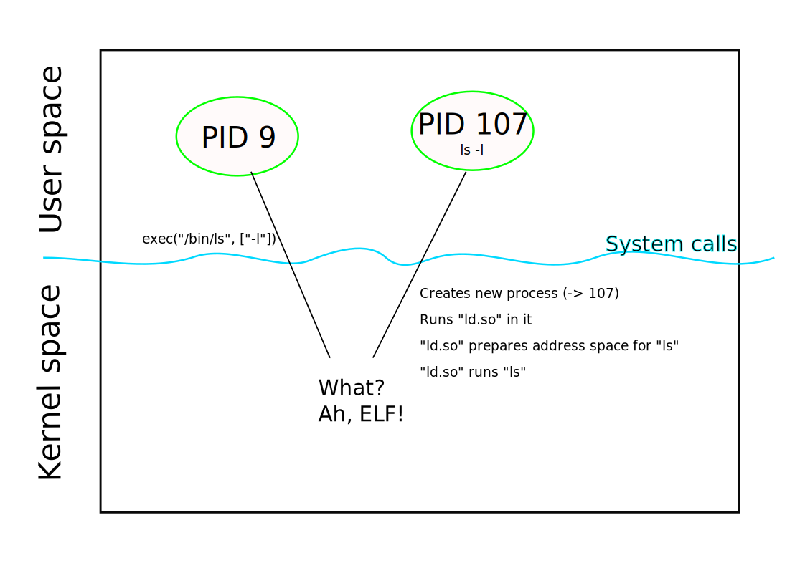

.. ot-topic:: linux.toolchain.basics

.. include:: <mmlalias.txt>

Basics
======

.. contents::
   :local:

GCC - GNU Compiler Collection
-----------------------------

* GCC - `GNU Compiler Collection <http://gcc.gnu.org/>`__
* Started by Richard Stallman in the 1980's
* Part of the `GNU Project <http://www.gnu.org/>`__, along with other
  basic technology

  * `GNU Make <https://www.gnu.org/software/make/>`__
  * `GNU Bash <https://www.gnu.org/software/bash/>`__
  * `GNU Emacs <https://www.gnu.org/software/emacs/>`__

* Frontends for a number of programming languages
* |longrightarrow| most popular: C and C++
* Supports a large number of architectures

  * `All that Linux runs on
    <https://en.wikipedia.org/wiki/List_of_Linux-supported_computer_architectures>`__
    (`Intel <https://en.wikipedia.org/wiki/X86-64>`__, `ARM
    <https://en.wikipedia.org/wiki/ARM_architecture_family>`__,
    `RISC-V <https://en.wikipedia.org/wiki/RISC-V>`__)
  * Many tiny to middle-sized embedded processors

* Alternative to GCC: `LLVM <https://llvm.org/>`__

  * Backed by Apple to a certain extent
  * Modern design |longrightarrow| modular, clean interfaces, etc.
  * |longrightarrow| `Rust <https://www.rust-lang.org/>`__ (e.g.) is
    based on it

All-In-One Usage: Single File
-----------------------------

* "Monolithic" program

  .. literalinclude:: hello-single.c
     :caption: :download:`hello-single.c`
     :language: c

* All-in-one: convert C to executable (seemingly directly)

  .. code-block:: console
  
     $ gcc hello-single.c

* Produces an *executable program*

  .. code-block:: console
  
     $ ls -l a.out 
     -rwxrwxr-x. 1 jfasch jfasch 24360 Mar 25 11:14 a.out
     $ ./a.out 
     Hello World

* Changing the output file's name (``a.out`` is not very expressive)

  .. code-block:: console

     $ gcc -o hello-single hello-single.c
     $ ls -l hello-single 
     -rwxrwxr-x. 1 jfasch jfasch 24360 Mar 25 11:39 hello-single
     $ ./hello-single 
     Hello World

* *A lot going on behind the scenes!*

All-In-One Usage: Multiple Files
--------------------------------

* "Modular" program

  .. list-table::
     :align: left
     :widths: auto
     :header-rows: 1

     * * Main
       * "Modularized" out
     * * .. literalinclude:: hello-main.c
            :caption: :download:`hello-main.c`
            :language: c
       * .. literalinclude:: hello.h
            :caption: :download:`hello.h`
            :language: c

         .. literalinclude:: hello.c
            :caption: :download:`hello.c`
            :language: c

* All-in-one: convert *multiple C files* to executable
  |longrightarrow| simply list them along with the main file

  .. code-block:: console
  
     $ gcc -o hello-modular hello-main.c hello.c

* Output as before ...

  .. code-block:: console

     $ ls -l hello-modular 
     -rwxrwxr-x. 1 jfasch jfasch 24416 Mar 25 11:42 hello-modular
     $ ./hello-modular 
     Hello World

This Is Not Simple!
-------------------

.. sidebar:: Documentation

   * `Executable and Linkable Format (ELF)
     <https://en.wikipedia.org/wiki/Executable_and_Linkable_Format>`__
   * Format definition: `man -s 5 elf
     <https://man7.org/linux/man-pages/man5/elf.5.html>`__
   * `man -s 1 readelf
     <https://man7.org/linux/man-pages/man1/readelf.1.html>`__
   * `man -s 2 execve
     <https://man7.org/linux/man-pages/man2/execve.2.html>`__
   * `man -s 8 ld.so
     <https://man7.org/linux/man-pages/man8/ld.so.8.html>`__

* Linux executables are in `Executable and Linkable Format
  <https://en.wikipedia.org/wiki/Executable_and_Linkable_Format>`__

  * |longrightarrow| Complicated but extensible and flexible
  * "Sections"

* Linux kernel starts programs *on behalf of a user*

  * User (the shell, for example, when you type the program's name on
    the commandline) calls system call ``execve()``
  * Kernel: "Ah yes, someone wants me to run a program" |:thumbsup:|
  * Kernel starts the *dynamic loader* instead, telling it to start the
    program to be exec'd

* Dynamic Loader (commonly called ``ld.so``)

  * *The* program that interprets the program's content and sets up
    the address space

    .. code-block:: console

       $ ls -l /lib64/ld-linux-x86-64.so.2
       lrwxrwxrwx. 1 root root 10 Jan 26 02:53 /lib64/ld-linux-x86-64.so.2 -> ld-2.33.so

  * Prior to starting the program, shared (dynamic) libraries must be
    found and loaded
  * And much much more |longrightarrow| `man -s 8 ld.so
    <https://man7.org/linux/man-pages/man8/ld.so.8.html>`__

What's In A Program? |longrightarrow| Symbols (``nm``)
------------------------------------------------------

.. sidebar:: Documentation

   * `man -s 1 nm <https://man7.org/linux/man-pages/man1/nm.1.html>`__
   * `man -s 1 strip
     <https://man7.org/linux/man-pages/man1/strip.1.html>`__

**Symbols**

* Global variables
* Functions
* Contributed from a *very wide variety* of programs and precompiled
  object code

.. code-block:: console

   $ nm hello-single
   ...
   0000000000401040 T _start
   0000000000401000 T _init
   00000000004011b8 T _fini

   ...

Overview: Where Do Which Symbols Come From (|longrightarrow| The Toolchain)
---------------------------------------------------------------------------

.. list-table::
   :align: left
   :widths: auto
   :header-rows: 1

   * * Symbol
     * Where from
     * Purpose
     * Source
   * * 
       * ``0000000000401040 T _start``
       * ``0000000000401000 T _init``
       * ``00000000004011b8 T _fini``

     * .. code-block:: console

          $ ls -l /usr/lib64/crt*.o
          -rw-r--r--. 1 root root 18384 Jan 26 02:55 /usr/lib64/crt1.o
          -rw-r--r--. 1 root root  1800 Jan 26 02:55 /usr/lib64/crti.o
          -rw-r--r--. 1 root root  1536 Jan 26 02:55 /usr/lib64/crtn.o

     * Startup code
     * Contributed by OS; remains the same over ages. Calls ``main()``
       after process initialization, and tears down process after
       ``main()`` returns.

   * * 
       * ``0000000000404000 d _GLOBAL_OFFSET_TABLE_``
     * Generated
     * Used for *relocation* of shared libraries into the process
       address space.
     * Linker. Part of toolchain; *binds* objects and libraries
       together. Resolves open references (e.g. ``puts`` below).

       .. code-block:: console

          $ ls -l /usr/bin/ld
	  -rwxr-xr-x. 1 root root 1762320 Sep 16  2021 /usr/bin/ld

   * * 
       * ``0000000000401126 T main``
     * Generated binary code ("Text", hence the ``T``)
     * ``main()`` function from our code, generated by the compiler
     * Compiler

       .. code-block:: console

          $ ls -l /usr/bin/gcc
          -rwxr-xr-x. 3 root root 1224008 Jan 27 12:29 /usr/bin/gcc

   * * 
       * ``U puts@GLIBC_2.2.5``
     * *Unresolved symbol*, generated by linker who has found it in C
       library. Obviously ``printf()`` expands to that. Dynamically
       taken from the *shared*
     * Reference for the *loader*, who will find it in ``libc`` when
       it loads the program
     * Will be resolved by the *loader* when it finds and loads
       ``libc``

       .. code-block:: console

	  $ ls -l /lib64/libc.so.6
	  lrwxrwxrwx. 1 root root 12 Jan 26 02:53 /lib64/libc.so.6 -> libc-2.33.so
