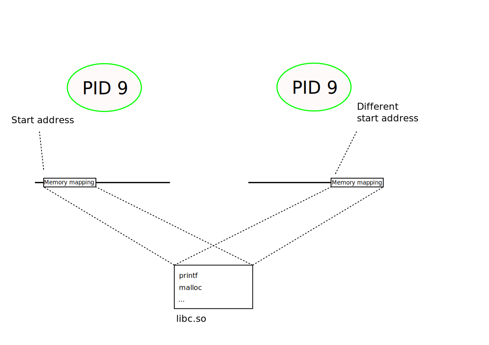
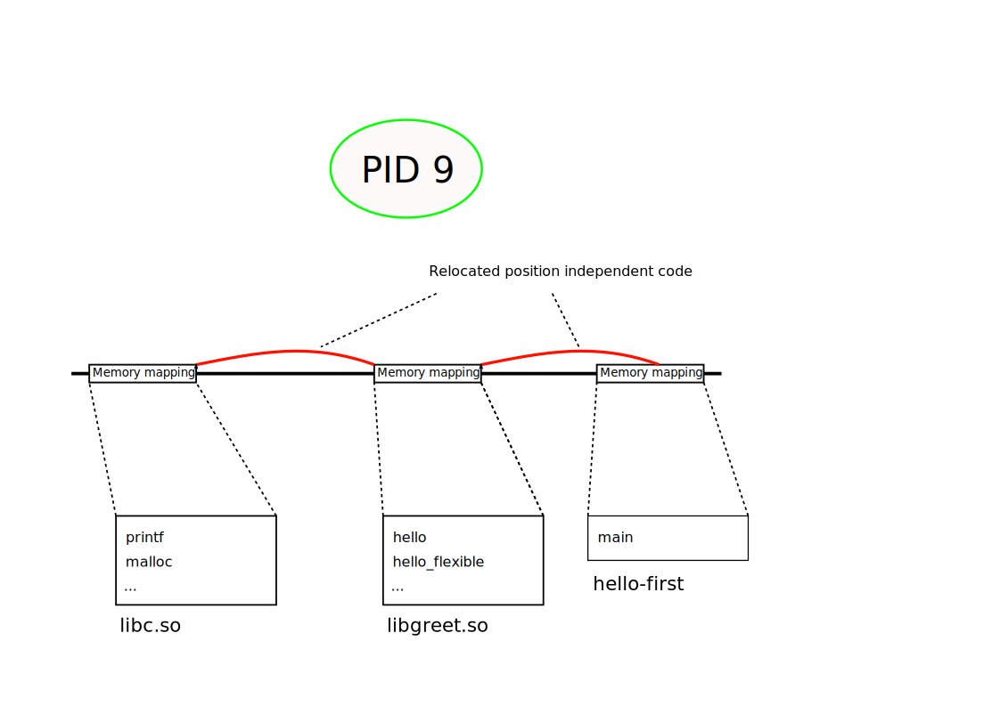

.. include:: <mmlalias.txt>

Shared Libraries (Shared Objects)
=================================

.. sidebar:: 

   **Source Code**

   The example code in this section is maintained on `Github
   <https://github.com/jfasch/jfasch-home-linux-toolchain>`__

.. contents::
   :local:

Problems With Static Libraries
------------------------------

* Only origanizational measure

  * |longrightarrow| Copy of the code exists in every executable that
    links against the library
  * |longrightarrow| Size of executable larger than necessary
  * Convenience operation: *linker* can look into an archive, and pick
    things out accordingly

* Maintainability

  * A fix in the library requires relinking all users
  * |longrightarrow| no central update of code

And Dynamic Libraries?
----------------------

.. sidebar:: 

   **Documentation**

   * ELF Loader: `man -s 8 ld.so
     <https://man7.org/linux/man-pages/man8/ld.so.8.html>`__
   * `man -s 1 ldd
     <https://man7.org/linux/man-pages/man1/ldd.1.html>`__

   **See also**

   * :doc:`../basics/topic`

C Library is always linked dynamically for those reasons

* What does an executable *need*?

  .. code-block:: console
  
     $ readelf --dynamic hello-first
     
     Dynamic section at offset 0x2e20 contains 24 entries:
       Tag        Type                         Name/Value
      0x0000000000000001 (NEEDED)             Shared library: [libc.so.6]
      ...

* Where would ``libc.so`` be found once I ran the program?

  .. code-block:: console
  
     $ ldd hello-first
   	linux-vdso.so.1 (0x00007fffe9fa7000)
   	libc.so.6 => /lib64/libc.so.6 (0x00007f75ca289000)
   	/lib64/ld-linux-x86-64.so.2 (0x00007f75ca46d000)

Relocations
-----------

* *Loader* composes address space
* Finds shared libraries that the executable depends on
* Loads them into process's memory/*address space*
* |longrightarrow| at different positions

  * Different executables depend on different libraries
  * Security: *what if an attacker knew the absolute positions of
    executable code?*

Building A Shared Library: Position Independent Code (PIC)
----------------------------------------------------------

* Shared libraries are not archives
* |longrightarrow| *Linked* |longrightarrow| ``gcc``

  .. code-block:: console

     $ gcc -shared -o libgreet.so hello.o hello-flexible.o 

But ... |:face_with_raised_eyebrow:|

.. code-block:: console

   $ gcc -shared -o libgreet.so hello.o hello-flexible.o 
   /usr/bin/ld: hello.o: relocation R_X86_64_32 against `.rodata' can not be used when making a shared object; recompile with -fPIC
   /usr/bin/ld: hello-flexible.o: relocation R_X86_64_32 against `.rodata' can not be used when making a shared object; recompile with -fPIC
   collect2: error: ld returned 1 exit status

* Code needs to be prepared to be loaded at varying positions 
* |longrightarrow| *Position independent code (PIC)*
* ``hello.o`` and ``hello-flexible.o`` require special treatment to go
  into a shared library

  .. code-block:: console

     $ gcc -fPIC -c -o hello.o hello.c
     $ gcc -fPIC -c -o hello-flexible.o hello-flexible.c 

* And finally ...

  .. code-block:: console
  
     $ gcc -shared -o libgreet.so hello.o hello-flexible.o 

Linking Executables Against Shared Libraries
--------------------------------------------

This is relatively easy, as opposed to building shared libraries ...

.. code-block:: console

   $ gcc -o hello-first hello-first.o libgreet.so 

And Build Dependencies?
-----------------------

Graph and ``Makefile`` basically unchanged ...

.. list-table::
   :align: left
   :widths: auto

   * * 

       .. graphviz::

          digraph foo {
             "hello.o" -> "hello.c";
             "hello-flexible.o" -> "hello-flexible.c";
             "libgreet.so" -> "hello.o";
             "libgreet.so" -> "hello-flexible.o";
             "hello-first.o" -> "hello-first.c";
             "hello-second.o" -> "hello-second.c";
             "hello-first" -> "hello-first.o";
             "hello-first" -> "libgreet.so";
             "hello-second" -> "hello-second.o";
             "hello-second" -> "libgreet.so";
             "all" -> "hello-first";
             "all" -> "hello-second";
          }

     * 

       .. literalinclude:: ../jfasch-home-linux-toolchain/shared-libraries/Makefile
          :caption: :download:`../jfasch-home-linux-toolchain/shared-libraries/Makefile`
          :language: c

And Runtime Dependencies?
-------------------------

* Executable is not *self-contained* anymore. It *needs* ...

  .. code-block:: console

     $ readelf --dynamic hello-first
     
     ...
      Tag        Type                         Name/Value
     0x0000000000000001 (NEEDED)             Shared library: [libgreet.so]
     0x0000000000000001 (NEEDED)             Shared library: [libc.so.6]
     ...
  
* Who *has* ``libgreet.so`` and ``libc.so.6``?

  .. code-block:: console

     $ readelf --dynamic libgreet.so 

     ...
     Tag        Type                         Name/Value
     0x0000000000000001 (NEEDED)             Shared library: [libc.so.6]
     ...

* |longrightarrow| Runtime dependencies

  .. graphviz::

     digraph foo {
         "hello-first" -> "libgreet.so";
         "hello-first" -> "libc.so.6";
	 "libgreet.so" -> "libc.so.6";
     }

And Starting An Executable Having External Dependencies?
--------------------------------------------------------

.. sidebar::

   **Topics**

   * Loader, ELF: :doc:`../basics/topic`

The *loader* ...

* Reads the executable (an ELF file)
* Determines list of dependencies (shared libraries)
* Searches for dependencies
* Places them into the address space
* Applies indirections |longrightarrow| *relocations*

This Is Not Simple: *Library Search Path*
-----------------------------------------

.. sidebar::

   **Documentation**

   * `man -s 8 ld.so
     <https://man7.org/linux/man-pages/man8/ld.so.8.html>`__

   **Topics**

   * :doc:`/trainings/material/soup/linux/basics/intro/environment`

.. code-block:: console

   $ ./hello-first 
   ./hello-first: error while loading shared libraries: libgreet.so: cannot open shared object file: No such file or directory

* Shared library search fails
* Loader does not look in the current working directory (for
  security!)
* |longrightarrow| ``LD_LIBRARY_PATH`` environment variable

.. code-block:: console

   $ LD_LIBRARY_PATH=$(pwd)
   $ export LD_LIBRARY_PATH
   $ ./hello-first 
   Hello World

Summary: Static Versus Dynamic Libraries
----------------------------------------

.. list-table::
   :align: left
   :widths: auto
   :header-rows: 1

   * * Type
     * Pros
     * Cons
   * * Static library
     * * Easy to maintain
       * Executable do not have external dependencies
       * Versioning is not a problem
     * * No single-file bug fix updates
       * Needs more disk space and memory
   * * Shared library
     * * Single-file bug fix updates
       * Saves disk space and memory
       * Cool in production
     * * Maintenance nightmare during development

|longrightarrow| in larger code bases

* Build static libraries during development
* Switch to shared libraries for release
