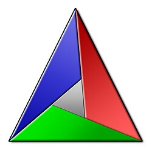

.. include:: <mmlalias.txt>

CMake: Introduction
===================

.. sidebar::

   .. list-table::
      :align: left

      * * **Duration**
	* * One day
      * * **Course Language**
	* * Course material language is English
	  * Trainer language is English or German
      * * **Booking**
	* training@faschingbauer.co.at
      * * **See also**
	* :doc:`../advanced/index`
      

.. toctree::
   :maxdepth: 1

   basics
   libraries
   shared-libraries
   installation
   structure
   cxx-and-rants
