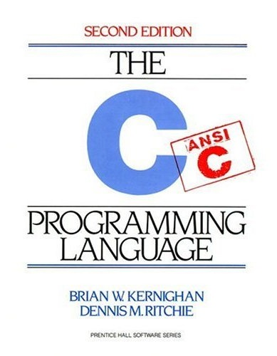

.. meta::
   :description: Dieses einwöchige Training versucht, trotz aller
                 Widernisse der Sprache, C näherzubringen und seine
                 Beweggründe verstehen zu lernen
   :keywords: schulung, training, programming, c, linker, toolchain,
              kernighan, ritchie, linux, embedded, pointer, memory

C: Introduction
===============

.. sidebar::
   :class: jf-course-description-sidebar

   .. grid:: 1

      .. grid-item-card:: Duration: 5 Days
      .. grid-item-card:: :doc:`/trainings/info`
      .. grid-item-card:: 
   
	 .. dropdown:: Related Courses

            * :doc:`c-advanced`
            * :doc:`/trainings/repertoire/misc/unittests`

	 .. dropdown:: Slide Material

            * :doc:`/trainings/material/soup/c/index`

Der `Bibel von Brian Kernighan und Dennis Ritchie
<http://de.wikipedia.org/wiki/The_C_Programming_Language>`__ kann man
nichts hinzufügen. Der "Erfinder" von C, Dennis Ritchie, kann wohl am
besten erklären, wie C tickt, wozu man es verwendet, und wo seine
Grenzen sind.

Der Kurs nimmt das Buch als Vorlage für die Didaktik und ergänzt es
durch Übungen und etwas Kontext aus der heutigen Zeit. Sollte der Kurs
als Vorbereitung für den :doc:`C++-Kurs <cxx>` dienen, macht es
Sinn, nur den Sprachkern zu unterrichten und auf die Standardlibrary
zugunsten der bequemeren C++-Werkzeuge zu verzichten.

Inhalt
------

C ist eine sehr kleine Sprache. Beim Sprachdesign hat man offenbar
darauf geachtet, dass der Sprachkern isoliert verwendet werden kann
und man alles, was C abseits davon mitbringt, optional hält. Dadurch
eignet sich C hervorragend für Systemprogrammierung - man kann
optionale Features wie zum Beispiel File I/O weglassen, wenn File I/O
keinen Sinn macht (zum Beispiel weil man ein Embedded OS
programmiert).

Der Kurs ist dementsprechend sinngemäss in zwei separate Kapitel
aufgeteilt - Sprachkern und Standardlibrary.

* **Grundlagen**. C ist eine Sprache, um nackten Speicher zu
  manipulieren. Maschineninstruktionen werden direkt ausgeführt. Das
  bringt einen erheblichen Geschwindigkeitsvorteil gegenüber
  interpretierten Sprachen - aber auch den Nachteil, dass man zu jeder
  Zeit genau wissen muss, was man tut. In diesem Kapitel werden
  Grundlagen erklärt, die für das Verständnis der Speicherverwaltung
  eines Programmes zu tun haben.

  * *Integrale und zusammengesetzte Datentypen*
  * *Pointer*
  * *Speicherlayout*

* **Kontrollkonstrukte**. Das wenigste, worin sich C von anderen
  Sprachen unterscheidet, sind Kontrollstrukturen.

  * `if`
  * `switch`
  * `while`

* **Funktionen** sind *das* Mittel zur Programmstrukturierung und
  Modularisierung.

  * *Definition vs. Deklaration*
  * *Parameter*
  * *Returnwerte*

* **Pointer** sind das Beliebteste an C, da sie eine Unmenge an
  Flexibilität einbringen. Sie sind auch das Unbeliebteste an C, da
  sie eine Unmenge an Fehlermöglichkeiten einbringen.

  * *Grundlagen* - ein typische verkettete Liste
  * *Fehlerszenarien*: Absturz und stilles Dahinsiechen
  * *Debugginghilfen*: ``valgrind``

* **Implizite Typumwandlungen**. Ein Hauptkritikpunkt an C ist die
  sorglose Konvertierung zwischen signed und unsigned Integertypen,
  zwischen Integertypen verschiedener Breite, und zwischen Floating
  Point Zahlen und Integers. Die Konvertierungen folgen
  nichtsdestotrotz einem Regelwerk, das man verstanden haben sollte,
  um korrekte Programme schreiben zu können.

  * *Historische Aufarbeitung*. C ist eine sehr alte Sprache mit sehr
    viel historischem Ballast.
  * *Fehlerszenarien*
  * *Compileroptionen*

* **Der C-Präprozessor**. So leid es mir tut, er ist Teil der Sprache,
  und muss zumindest in Grundzügen gezeigt werden.

  * *Macros*
  * *Bedingte Compilierung*
  * *Fortgeschrittenes*: Token Pasting, Stringification

* **Modularisierung** ist heutzutage aus der Programmierung nicht mehr
  wegzudenken. Ein Grund für den Erfolg von C war damals die
  Möglichkeit, Teile von Programmen separat zu bauen und sie erst
  später zu verbinden. Hier gibt es einiges zu erzählen, und leider
  spielt der Präprozessor eine nicht zu kleine Rolle.

  * *Keywords*: ``static``, ``extern``
  * *Definition vs. Deklaration*
  * *Compilieren*
  * *Archivieren*
  * *Linken*

* **Programmgesundheit**.

  * *Debugginghilfen* wie das ``assert()`` Macro
  * *Sichtbarkeit*, oder die verschiedenen Bedeutungen des Wortes
    ``static``
  * *Toolchain*: Compiler und Linker, Optimierungsmöglichkeiten, ...
  * *valgrind*: Analyse von Memoryfehlern

* **Dynamischer Speicher**. ``malloc()`` und ``free()``, und verwandte
  Funktionen, um explizit Speicher zu verwalten.
* **Standard I/O**. Formatierte _und_ komfortable Ein- und Ausgabe ist
  nicht gerade eine der Stärken von C. C hat mächtige Werkzeuge der
  Ein- und Ausgabe, jedoch sind diese weit weg von Komfort und
  Fehlerimmunität - schon alleine deswegen verdienen sie mehr als nur
  eine Erwähnung.
* **Stringbearbeitung**. Strings sind in C aus heutiger Sicht etwas
  eigenwillig definiert. Die Standard-Library bringt eine Fülle von
  Funktionen mit, die Stringbearbeitung erleichtern. Hier lauern
  wieder Gefahren (alle Arten von Memoryfehlern).
