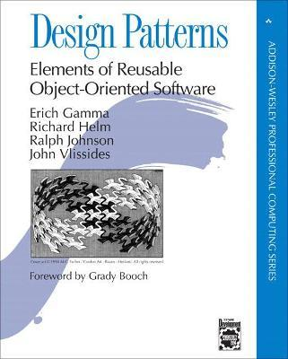

.. meta::
   :description: Gang of four patterns for C++ developers
   :keywords: schulung, training, programming, c, c++, architecture,
	      design, patterns, oo, object, object oriented

Design Patterns For C++ Developers
==================================

.. contents::
   :local:

.. sidebar::

   .. list-table::
      :align: left

      * * **Duration**
	* 2-3 days
      * * **Language**
	* Trainer language is English or German
      * * **Material**
	* * :doc:`/trainings/material/soup/cxx-design-patterns/index`
      * * **Related**
	* * :doc:`../cxx`
	  * :doc:`../cxx11`
	  * :doc:`../../misc/unittests`
      * * **Booking**
	* :doc:`/trainings/booking`

Goal
----

Software in embedded systems is not generally known to be
overengineered. Embedded hardware, though, is becoming more and more
capable, and software has to follow suit. Internet connectivity, for
example, brings requirements of its own - there are entire new
dimensions of configurability and variability.

.. sidebar::

   .. figure:: 15-electrical-nonsolution.jpg
      :align: left
      :scale: 50%
   
      Non-obvious solution to obvious problem
   
   .. figure:: 15-gsellmanns-weltmaschine.jpg
      :align: left
      :scale: 40%
   
      Non-obvious solution to non-obvious problem

*Software Design Patterns* give names to a variety of methods that
software developers have used for decades, to attack the problem of
increasing software complexity and gravity. Though often associated
with overengineering [#luke]_, those methods solve real problems. This
course gives an overview of the problems, the methods, and most of
all, it establishes a common vocabulary. It looks at the whole
overengineering topic from the angle of embedded developers who are
confronted with their own set of problems.

Course Outline
--------------

Based on the classic book "Design Patterns: Elements of Reusabe Object
Oriented Software" (nicknamed "Gang Of Four"), an overview of the most
popular patterns is given. While the book is a catalog of patterns,
the course gives a different view of the matter.

**Exercises** With *many practical exercises*, the focus is on
recognizing problems, coming up with solutions, and *communicating
solutions using design patterns*.

**C++** Course language is Modern C++; an overview of "The Newer C++"
is given on a case-by-case basis as needed - e.g., *smart pointers*
when ownership discussion is appropriate; the Command pattern is sure
an opportunity for a *threading* intro. (See :doc:`here for a
description of a dedicated course
</trainings/repertoire/c-like/cxx11>`).

**Unit Testing and Test Driven Development** While testing sure is not
the central topic of the course, the exercises are formulated using
unit tests. This gives us room for discussion about how to attack the
problem of software complexity from another front.

**Patterns Covered** A variety of patterns is covered in the course,
in a sequence that makes didactical sense. Among those are,

.. list-table::
   :align: left
   :widths: auto

   * * * *Singleton* (to start with the worst)
       * *Adapter*
       * *Proxy* (local and remote)
       * *Decorator*
       * *Composite*
       * *Command*
       * *Interpreter*
       * *Observer*
       * *Factory*
       * *Abstract Factory*
     * .. image:: design-patterns-flipchart.jpg
          :align: left
          :scale: 60%

.. rubric:: Footnotes
.. [#luke] While some say that polymorphism has been invented by the
	   indecisive, others say that architecture is the art of
	   making decisions late.

